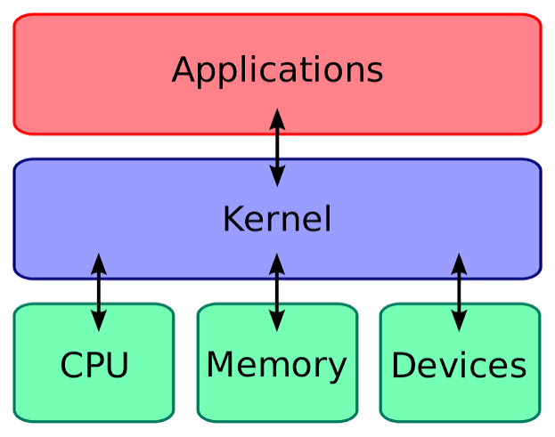
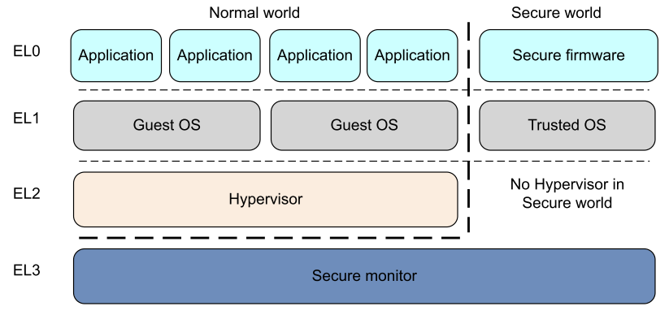
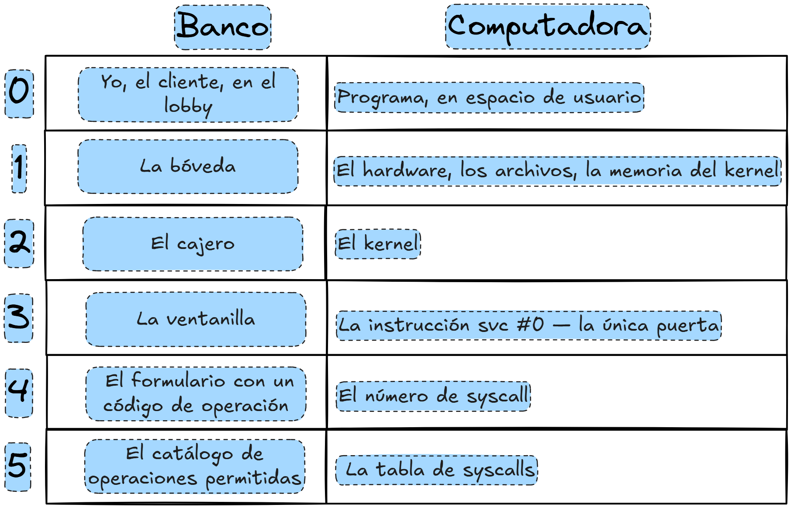
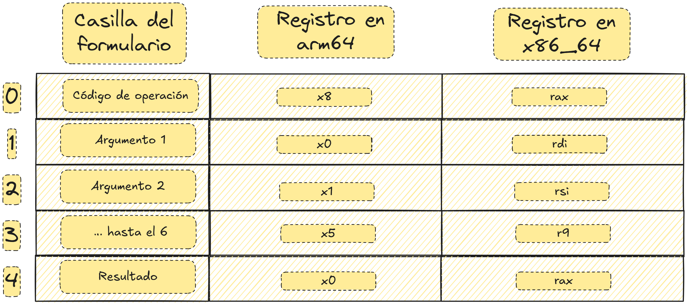
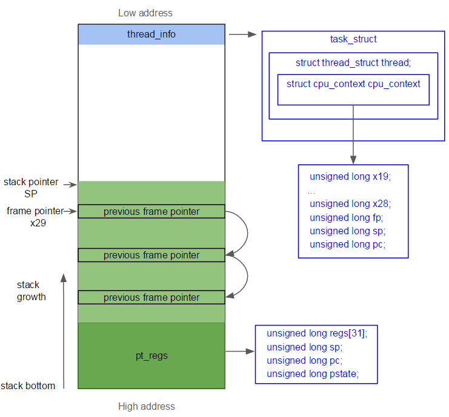
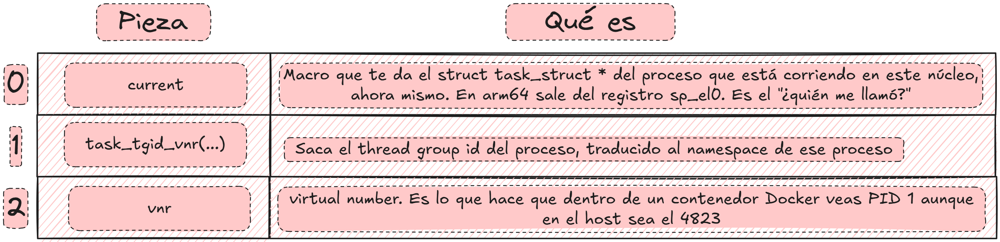
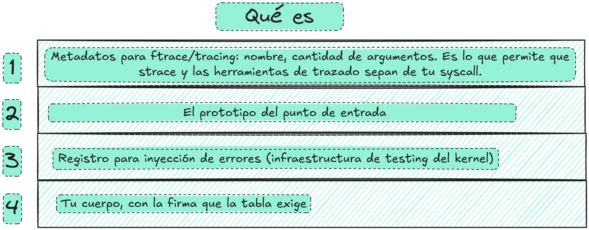
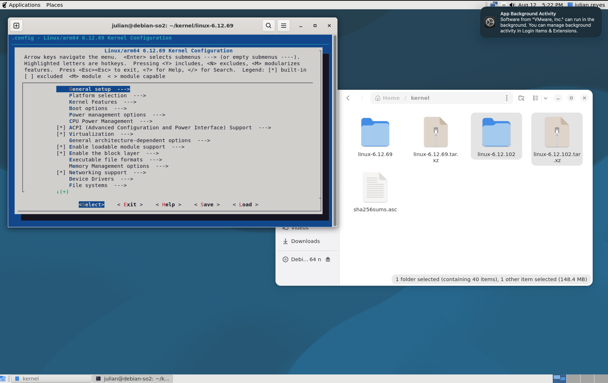

# Manual Técnico — Modificación de funciones del kernel

---

# PARTE I · MARCO TEÓRICO

> **Fundamentos del mecanismo de llamadas al sistema en AArch64.**
> Secciones 1 a 8.

---

Esta parte describe el mecanismo de llamadas al sistema en Linux sobre la arquitectura AArch64 (ARM64), que es la base sobre la cual se implementa la syscall `getpid_counter` documentada en la Parte II.



*Figura 1. Ubicación del kernel entre las aplicaciones de usuario y el hardware.*

## 1. Definición de llamada al sistema

Un programa escrito en C se ejecuta en **espacio de usuario**, que en ARM64 corresponde al nivel de excepción **EL0**. El kernel se ejecuta en **espacio de kernel**, nivel **EL1**. Ambos contextos poseen privilegios distintos y la separación entre ellos la impone el **hardware**, no el software.

### Niveles y tipos de excepción (Arquitectura AArch64)

| Nivel | Componente que se ejecuta en él |
|---|---|
| EL0 | Aplicaciones de usuario. |
| EL1 | Kernel del sistema operativo (nivel privilegiado). |
| EL2 | Hipervisor. |
| EL3 | Firmware de bajo nivel, incluido el Monitor Seguro. |



*Figura 2. Niveles de excepción EL0–EL3 en AArch64.*

Mientras la CPU opera en EL0, el hardware impide las siguientes operaciones:

- ejecución de instrucciones privilegiadas (modificación de tablas de páginas, deshabilitación de interrupciones);
- lectura o escritura de memoria marcada como perteneciente al kernel;
- acceso directo al hardware.

Bajo estas restricciones, un programa no puede leer por sí mismo su PID, dado que ese dato reside en una estructura interna del kernel. La única alternativa disponible es **solicitar al kernel que realice la lectura en su nombre**.

Esa solicitud constituye la llamada al sistema: **la única vía legítima de transición de EL0 a EL1**. La interfaz es deliberadamente restringida, ya que no permite saltar a una dirección arbitraria del kernel, sino únicamente indicar la ejecución de la operación número N. El kernel valida ese número contra su tabla de syscalls y ejecuta exclusivamente las rutinas registradas en ella.

> **Nota.** Una syscall no es una llamada a función convencional, sino una **excepción controlada**: se solicita al hardware que eleve el nivel de privilegio y transfiera el control a un punto de entrada fijo del kernel. Su comportamiento es análogo al de una interrupción, no al de una instrucción `call`.

### Analogía: la atención en una agencia bancaria

El mecanismo descrito admite una analogía con la atención al público en una agencia bancaria. El cliente permanece del lado del mostrador destinado al público y no accede a la bóveda ni a los sistemas internos; para obtener un dato de su cuenta debe solicitarlo a un cajero, quien lo consulta en su nombre. El mostrador cumple la misma función que la frontera EL0/EL1: delimita dos zonas con privilegios distintos y concentra en un único punto todas las solicitudes autorizadas.



*Figura 3. Analogía entre la atención en una agencia bancaria y el mecanismo de llamadas al sistema.*

La figura siguiente establece la correspondencia entre cada elemento de la analogía y su equivalente técnico:


*Figura 4. Equivalencia entre los elementos de la analogía y los componentes del mecanismo de syscalls.*

Aplicada al caso concreto de esta práctica, la correspondencia se expresa de la siguiente forma:


*Figura 5. Aplicación de la analogía al recorrido de la llamada `getpid()`.*

## 2. Recorrido de la llamada `getpid()`

### En código

```c
pid_t p = getpid();
```

`getpid()` **no es una función del kernel**: es una función de `glibc`, la biblioteca de C. Reside en `/lib/aarch64-linux-gnu/libc.so.6`, en espacio de usuario.

### `glibc` rellena el formulario

```asm
mov  x8, #172      ; número de la operación solicitada
svc  #0            ; supervisor call: se solicita atención al kernel
```

#### Contrato ABI (Application Binary Interface)

En términos de la analogía bancaria, el formulario tiene casillas fijas que no pueden intercambiarse de lugar: cada dato debe escribirse en la casilla que le corresponde para que el cajero lo interprete de forma correcta.



*Figura 6. Registros definidos por el contrato ABI: `x8` transporta el número de syscall y `x0`–`x5` los argumentos.*

`getpid` no recibe argumentos, por lo que únicamente se rellena `x8`.

> **Nota.** Esta correspondencia explica el `0` de `SYSCALL_DEFINE0`: indica cero argumentos, es decir, cero casillas de datos rellenas.

#### El hardware conmuta

`svc #0` no constituye un salto, sino una **excepción sincrónica**. Al ejecutarla, el procesador realiza las siguientes acciones por hardware, sin intervención de software alguno:

1. Guarda la dirección de retorno en `ELR_EL1`.
2. Guarda el estado de los flags en `SPSR_EL1`.
3. Eleva el nivel de ejecución a EL1, con privilegios totales.
4. Transfiere el control a una dirección fija que el kernel escribió en `VBAR_EL1` durante el arranque.

El destino de esa transferencia no puede alterarse desde espacio de usuario, dado que `svc` no recibe una dirección como argumento: no existe forma de indicarle un destino. El punto de entrada quedó fijado antes de que el programa iniciara su ejecución. El programa únicamente toca el timbre; el lugar donde ese timbre suena lo determinó el kernel al arrancar.

> **Nota.** En este punto se aprecia la diferencia entre una llamada a función y una syscall. Una llamada a función expresa la instrucción "transferir el control a esta dirección". Una syscall expresa "ocurrió un evento, atiéndase".

#### El kernel ordena la casa

El punto de entrada reside en `arch/arm64/kernel/entry.S`, escrito íntegramente en ensamblador.

La primera acción que ejecuta el kernel es guardar todos los registros en una estructura denominada `struct pt_regs`, ubicada en la pila del kernel.



*Figura 7. Preservación de los registros del usuario en `struct pt_regs` sobre la pila del kernel.*

El motivo de esta operación es que el kernel utilizará esos mismos registros físicos para su propio trabajo y, al finalizar, debe restituirlos en el estado exacto en que los recibió; de lo contrario el contexto del programa de usuario queda corrupto. En términos de la analogía, equivale a que el cajero resguarde las pertenencias del cliente en una bandeja numerada antes de atenderlo.

Lo anterior explica por qué `SYSCALL_DEFINE0` genera una función que recibe `const struct pt_regs *`: en esa estructura se encuentran guardados los argumentos del usuario. El punto de entrada recibe la bandeja completa y la macro extrae de ella los argumentos que requiere la función. Se declara `SYSCALL_DEFINE0(getpid)` sin parámetros y la macro construye el puente correspondiente.

#### El kernel valida y despacha

Con los registros ya resguardados, el kernel determina qué rutina debe ejecutar. La operación reside en `arch/arm64/kernel/syscall.c`, en la función `invoke_syscall()`, cuya lógica es, en esencia, la siguiente:

```c
if (scno < sc_nr) {                       /* el número está en rango */
        syscall_fn = syscall_table[scno]; /* se obtiene el puntero a función */
        ret = __invoke_syscall(regs, syscall_fn);
} else {
        ret = -ENOSYS;                    /* la operación no existe */
}
```

De este fragmento se desprenden tres consecuencias:

1. **Función de `__NR_syscalls`.** Representa el tamaño del catálogo de llamadas y es el valor que recibe `sc_nr`. La comparación `scno < sc_nr` impide que se solicite una operación inexistente, como la número 99999, y que el kernel lea un puntero fuera de los límites del arreglo, lo que constituiría una vulnerabilidad grave.
2. **Origen del error `ENOSYS`.** Si el número solicitado no está registrado en la tabla, la ejecución cae en la rama `else`. La función puede existir y estar compilada dentro del binario del kernel y, aun así, resultar inalcanzable: la tabla no declara la syscall, la hace alcanzable.
3. **`sys_call_table` es un arreglo de punteros a función.** Corresponde al mismo arreglo que en el fragmento aparece como `syscall_table`, que es el nombre del parámetro que lo recibe. La syscall de esta práctica será la entrada 463 de ese arreglo.

#### El cuerpo de la syscall

La entrada `sys_call_table[172]` apunta a `__arm64_sys_getpid`, función generada por la macro, que a su vez invoca el cuerpo real definido en `kernel/sys.c`:

```c
SYSCALL_DEFINE0(getpid)
{
        return task_tgid_vnr(current);
}
```

`task_tgid_vnr(current)` obtiene el identificador del grupo de hilos del proceso solicitante, expresado en el espacio de nombres de PID que le corresponde. Es el valor que finalmente recibe el programa de usuario.

Esta función es el punto de instrumentación de la práctica: dentro de este cuerpo se incrementa el contador de llamadas, según se detalla en los apartados posteriores.



*Figura 8. Piezas que intervienen en el cuerpo de `sys_getpid`: la macro `current`, la función `task_tgid_vnr()` y el sufijo `vnr`.*

> **Nota.** Lo anterior explica el comentario que acompaña a esta función en el código del kernel: *"despite the name, this returns the tgid not the pid"*. Si un programa contiene varios hilos, cada hilo posee su propio PID interno, pero todos comparten un mismo TGID. Lo que habitualmente se denomina "el PID del proceso" corresponde en realidad al TGID.

#### Retorno a espacio de usuario

El valor de retorno se coloca en `x0`, el kernel restaura todos los registros desde `struct pt_regs` y ejecuta la instrucción `eret` (*exception return*), que reduce el nivel de ejecución de EL1 a EL0 y retoma la ejecución en la instrucción siguiente a `svc`, cuya dirección quedó almacenada en `ELR_EL1`. El programa de usuario no percibe haber estado suspendido.

Ya en espacio de usuario, `glibc` verifica si el resultado devuelto es negativo, condición que indica error, para asignar el valor correspondiente a `errno`, y devuelve el control al programa que originó la llamada.

La Figura 9 muestra la secuencia completa que se ejecuta al invocar `getpid()` desde un programa en C.


*Figura 9. Trayecto de una llamada al sistema, de espacio de usuario a espacio de kernel.*

| Paso | Descripción |
|---|---|
| 1 | El programa invoca la función `getpid()` de la biblioteca estándar. |
| 2 | El **número de syscall** se coloca en un registro (`x8` en ARM64, `rax` en x86_64) y los argumentos en `x0`–`x5`. Esta correspondencia constituye una **ABI**, es decir, un contrato binario. A continuación se ejecuta `svc #0` (*supervisor call*), instrucción que dispara el cambio de nivel de privilegio; su equivalente en x86_64 es `syscall`. |
| 3 | El control llega al punto de entrada único del kernel. El kernel no acepta destinos de salto provenientes de espacio de usuario. |
| 4 | Se valida que el número recibido cumpla `nº < __NR_syscalls`. Esta comprobación impide solicitar índices fuera de rango y acceder a memoria arbitraria. |
| 5 | Se indexa `sys_call_table`, un **arreglo de punteros a función**. La syscall implementada en esta práctica se agrega como una entrada adicional de dicho arreglo. |
| 6 | Se ejecuta el cuerpo de la syscall, que es una función en C ordinaria pero que corre con privilegios completos. |

> **Nota.** La macro **`current`**, utilizada en el paso 6, devuelve el `struct task_struct *` del proceso que originó la llamada. En ARM64 se obtiene a partir del registro reservado `sp_el0`. Es el mecanismo que permite al kernel identificar al proceso solicitante y, por lo tanto, determinar qué PID debe devolver.

## 3. Restricciones para invocar funciones del kernel de forma directa

1. **La función no está en el espacio de direcciones del proceso.** Cada proceso posee su propia tabla de páginas. Las direcciones del kernel están mapeadas, pero marcadas como accesibles únicamente desde EL1. Un intento de salto hacia ellas provoca un fallo en la MMU y la entrega de la señal `SIGSEGV`.
2. **Su dirección no es conocida por el programa.** No forma parte de ninguna biblioteca enlazable y, con **KASLR** habilitado, el kernel se carga en una dirección distinta en cada arranque.
3. **Aun siendo posible, constituiría una vulnerabilidad.** Si el espacio de usuario pudiera saltar a cualquier dirección del kernel, podría hacerlo hacia el interior de una función y omitir sus validaciones previas. La tabla de syscalls existe precisamente para restringir el ingreso a puntos de entrada aprobados.

## 4. Comportamiento de la macro `SYSCALL_DEFINE0`

Al declarar la syscall de la siguiente forma:

```c
SYSCALL_DEFINE0(getpid_counter)
{
        return 42;
}
```

no se define una única función con ese nombre. El preprocesador genera varias construcciones adicionales. Su expansión exacta se presenta en el apartado *Expansión aplicada a la syscall de esta práctica*, más adelante en esta misma sección, una vez expuesto el problema de diseño que la macro resuelve.

Consideraciones derivadas de este comportamiento:

- **El dígito `0` en `SYSCALL_DEFINE0` indica la cantidad de argumentos.** La syscall implementada no recibe parámetros, por lo que corresponde `DEFINE0`. Una syscall con dos argumentos se declararía como `SYSCALL_DEFINE2(nombre, tipo1, arg1, tipo2, arg2)`.
- **El prefijo `__arm64_` lo agrega la arquitectura.** En x86_64 el prefijo equivalente es `__x64_`. Por esa razón en la tabla se declara `sys_getpid_counter` y es el sistema de compilación el que aplica el prefijo correspondiente: **el prefijo nunca se escribe manualmente**.
- **El especificador `asmlinkage`** indica al compilador que la función será invocada desde código ensamblador, por lo que no debe aplicar convenciones optimizadas de paso de parámetros.
- **El nombre declarado en la tabla y el indicado en `SYSCALL_DEFINE0` deben coincidir exactamente**: `SYSCALL_DEFINE0(getpid_counter)` ↔ `sys_getpid_counter`. Una discrepancia en este punto produce un error de enlazado al final de la compilación, caso que se detalla más adelante en este documento.

### Problema que resuelve el despachador

```c
syscall_fn = syscall_table[scno];   /* se extrae un puntero del arreglo */
ret = __invoke_syscall(regs, syscall_fn);
```

`syscall_table` es un arreglo y, en C, un arreglo admite un único tipo, por lo que todas sus entradas deben poseer exactamente la misma firma. Las syscalls, en cambio, no se parecen entre sí:

```c
getpid()                                   /* 0 argumentos */
write(int fd, const void *buf, size_t n)   /* 3 argumentos, de tipos distintos */
mmap(void *, size_t, int, int, int, off_t) /* 6 argumentos */
```

**¿Cómo se almacenan funciones de firmas distintas en un arreglo homogéneo?**

La solución adoptada por el kernel consiste en que ninguna de ellas reciba sus argumentos de forma directa: todas reciben el mismo parámetro, el puntero a `pt_regs`, es decir, la bandeja con los registros guardados del usuario.

```c
long (*)(const struct pt_regs *)     /* firma única de toda entrada de la tabla */
```

Cada función extrae de esa estructura los argumentos que requiere; las que no reciben ninguno simplemente ignoran el parámetro.

Escribir ese puente a mano para cada entrada de la tabla resultaría inviable, y es precisamente la tarea que automatiza la macro.

**La macro real**

Se encuentra definida en `arch/arm64/include/asm/syscall_wrapper.h` en los siguientes términos:

```c
#define SYSCALL_DEFINE0(sname)                                       \
SYSCALL_METADATA(_##sname, 0);                                       \
asmlinkage long __arm64_sys_##sname(const struct pt_regs *__unused); \
ALLOW_ERROR_INJECTION(__arm64_sys_##sname, ERRNO);                   \
asmlinkage long __arm64_sys_##sname(const struct pt_regs *__unused)
```

Conviene recordar que una macro es texto: el preprocesador la sustituye antes de que el compilador procese el archivo. El operador `##` concatena identificadores, de modo que `sname = getpid_counter` produce `__arm64_sys_getpid_counter`.

### Expansión aplicada a la syscall de esta práctica

El código de la syscall implementada es el siguiente:

```c
SYSCALL_DEFINE0(getpid_counter)
{
        int count = atomic_read(&getpid_call_count);
        pr_info("...", count);
        return count;
}
```

Tras la expansión de la macro, el compilador procesa el siguiente texto:

```c
SYSCALL_METADATA(_getpid_counter, 0); /* 1 */
asmlinkage long __arm64_sys_getpid_counter(const struct pt_regs *__unused); /* 2 */
ALLOW_ERROR_INJECTION(__arm64_sys_getpid_counter, ERRNO); /* 3 */
asmlinkage long __arm64_sys_getpid_counter(const struct pt_regs *__unused) /* 4 */
{
        int count = atomic_read(&getpid_call_count);
        pr_info("...", count);
        return count;
}
```

La interpretación de cada una de las construcciones generadas es la siguiente:



*Figura 10. Desglose de las cuatro construcciones que genera `SYSCALL_DEFINE0` al expandirse.*

El parámetro se denomina `__unused` por una razón concreta: la función recibe la bandeja de registros aunque en el código fuente no se haya declarado ningún parámetro, y simplemente la ignora, dado que esta syscall no recibe argumentos. Es precisamente ese mecanismo el que le permite encajar en un arreglo homogéneo.

> **Nota.** `SYSCALL_DEFINE0` corresponde al caso más simple. Para uno o más argumentos, la macro genera tres funciones encadenadas, ya que en esos casos sí existe trabajo efectivo de extracción de argumentos desde `pt_regs`.

## 5. Tabla de syscalls: el número como parte de la API

Los números de syscall son **permanentes e inmutables**. El número 172 corresponde a `getpid` en ARM64 y debe conservar ese significado de forma indefinida, ya que existen binarios compilados años atrás con la instrucción `mov x8, #172` fijada en su código. Modificar un número asignado rompería la compatibilidad de todo el espacio de usuario.

De esa propiedad se derivan dos reglas de asignación:

1. **Las entradas nuevas se agregan únicamente al final de la tabla.** No se insertan en posiciones intermedias ni se reutilizan números liberados.
2. **La syscall implementada en esta práctica es local al kernel compilado.** El número asignado (463) es válido solo en esta compilación; en versiones oficiales posteriores del kernel ese número corresponderá a otra llamada.

En la versión 6.12 la última entrada asignada en la ABI común es:


*Figura 11. Última entrada asignada en la tabla y posición donde se agrega la syscall nueva.*

Por lo tanto, a la syscall de esta práctica le corresponde el número **463**. Este valor debe verificarse directamente sobre la tabla del árbol de fuentes descargado antes de editarla, no asumirse a partir de esta documentación.

Cada entrada de la tabla se compone de cuatro columnas:


*Figura 12. Estructura de una entrada de `syscall.tbl` y significado de cada columna.*

| Columna | Contenido | Función |
|---|---|---|
| 1 | `463` | Número de syscall; es el valor que el programa de usuario coloca en `x8`. |
| 2 | `common` | ABI a la que pertenece la entrada. `common` la habilita para 64 y 32 bits. |
| 3 | `getpid_counter` | Nombre expuesto a espacio de usuario; a partir de él se genera la macro `__NR_getpid_counter`. |
| 4 | `sys_getpid_counter` | Función del kernel que atenderá la llamada, declarada sin prefijo de arquitectura. |

> **Nota.** El valor de `__NR_syscalls` se recalcula de forma automática. Durante la compilación, el script `scripts/syscallhdr.sh` procesa la tabla y genera `include/generated/asm/unistd_64.h` con las macros `#define __NR_*` y el total de llamadas registradas. **No se debe editar ningún contador de forma manual**; las referencias que indican lo contrario corresponden a versiones antiguas del kernel.

## 6. Archivos del árbol de fuentes que se intervienen

La implementación requiere modificar dos archivos de código y una tabla de definición. Las modificaciones se detallan en la siguiente tabla.

| # | Archivo | Modificación | Justificación |
|---|---|---|---|
| 1 | `kernel/sys.c` | Declaración de la variable contador | Debe conservar su valor entre llamadas, por lo que requiere duración de almacenamiento estática. |
| 2 | `kernel/sys.c` | Invocación de `atomic_inc()` dentro de `SYSCALL_DEFINE0(getpid)` | Es el punto de instrumentación solicitado por la práctica. |
| 3 | `kernel/sys.c` | Definición `SYSCALL_DEFINE0(getpid_counter)` | Contiene el cuerpo de la syscall nueva. |
| 4 | `include/linux/syscalls.h` | Prototipo `asmlinkage long sys_getpid_counter(void);` | Convención del kernel: toda llamada al sistema declara su prototipo en ese encabezado con el nombre genérico `sys_*`. |
| 5 | `scripts/syscall.tbl` (arm64) | Entrada `463 common getpid_counter sys_getpid_counter` | Sin esta entrada la función existe en el binario pero resulta inalcanzable desde espacio de usuario. |

Las modificaciones 1, 2 y 3 se concentran en el mismo archivo de forma deliberada. Al ubicar el contador y la syscall que lo consulta en una misma unidad de compilación se evita el uso de `extern` y la creación de un encabezado adicional, lo que reduce la superficie de error durante el enlazado.

> **Nota sobre la ubicación de la tabla en ARM64.** El enunciado de la práctica hace referencia al archivo `syscall_64.tbl`. En ARM64 ese archivo existe como `arch/arm64/tools/syscall_64.tbl`, pero se trata de un **enlace simbólico** hacia `../../../scripts/syscall.tbl`. Editar cualquiera de las dos rutas modifica el mismo archivo real; sin embargo, `git status` reporta como modificado `scripts/syscall.tbl` y no el enlace simbólico. Esta condición debe verificarse en el árbol de fuentes antes de realizar la edición.

## 7. Consideraciones de concurrencia en el contador

La implementación directa del contador consiste en una variable entera incrementada con el operador de posincremento:

```c
static int getpid_call_count = 0;    /* implementación incorrecta */
...
getpid_call_count++;                 /* implementación incorrecta */
```

Esta versión compila y produce resultados aparentemente válidos, pero **pierde incrementos de forma silenciosa**.

La expresión `getpid_call_count++` no constituye una operación indivisible; el compilador la traduce a tres instrucciones independientes:

```asm
ldr  w0, [x1]      ; 1. lectura de memoria hacia un registro
add  w0, w0, #1    ; 2. incremento del valor en el registro
str  w0, [x1]      ; 3. escritura del resultado en memoria
```

En un sistema con varios núcleos, `getpid` es invocada de forma simultánea por múltiples procesos. La siguiente secuencia de ejecución es posible:

| Tiempo | CPU 0 | CPU 1 | Valor en memoria |
|---|---|---|---|
| t1 | lee → 100 | | 100 |
| t2 | | lee → 100 | 100 |
| t3 | suma → 101 | | 100 |
| t4 | | suma → 101 | 100 |
| t5 | escribe 101 | | **101** |
| t6 | | escribe 101 | **101** |

Se registraron dos llamadas y un solo incremento efectivo. Esta situación constituye una **condición de carrera** (*race condition*) y representa un defecto funcional real dentro del kernel.

La solución consiste en emplear el tipo `atomic_t` y sus operaciones asociadas:

```c
static atomic_t getpid_call_count = ATOMIC_INIT(0);
...
atomic_inc(&getpid_call_count);
```

`atomic_inc()` no se traduce como una función convencional, sino como una operación atómica soportada por el hardware. En ARMv8.1 y versiones posteriores se compila a la instrucción `LDADD`, que ejecuta la secuencia lectura-suma-escritura de forma indivisible. En ARMv8.0 se genera un ciclo `LDXR`/`STXR` (*load-exclusive* / *store-exclusive*) que reintenta la operación si otro núcleo modificó la dirección durante el intervalo. En ambos casos se garantiza que ningún incremento se pierda.

| Operación | Descripción |
|---|---|
| `ATOMIC_INIT(0)` | Inicializador estático del tipo `atomic_t`. |
| `atomic_inc(&v)` | Incrementa el valor de forma atómica; no retorna resultado. |
| `atomic_read(&v)` | Lee el valor almacenado y lo devuelve como `int`. |
| `atomic_inc_return(&v)` | Incrementa el valor y devuelve el resultado de la operación. |

> **Nota sobre el especificador `static`.** El requisito aplicable a la variable es que conserve su valor durante toda la ejecución del kernel, es decir, que posea **duración de almacenamiento estática**; no que tenga enlazado externo. El especificador `static` a nivel de archivo satisface esa condición y además evita contaminar el espacio de nombres global del kernel. En caso de requerirse enlazado externo, debe retirarse el especificador y declarar la variable como `extern` en un encabezado, manteniendo la consistencia entre ambas declaraciones.

## 8. `printk`, niveles de log y ring buffer

`printk()` es la función de registro del kernel y cumple el papel equivalente a `printf` en espacio de usuario. No es posible utilizar `printf` dentro del kernel debido a que dicha función reside en glibc, que pertenece al espacio de usuario, y el kernel no se enlaza contra bibliotecas de ese ámbito.

`printk()` escribe sus mensajes en un **ring buffer** circular ubicado en memoria del kernel. Su tamaño es fijo y se determina mediante el parámetro de configuración `CONFIG_LOG_BUF_SHIFT`, con valores típicos entre 128 KB y 1 MB. El comando `dmesg` lee el contenido de ese buffer. Cuando el buffer alcanza su capacidad máxima, **los mensajes más antiguos se sobrescriben**.

Los ocho niveles de severidad disponibles son los siguientes:

| Nivel | Macro | Nº | Uso |
|---|---|---|---|
| Emergency | `KERN_EMERG` | 0 | El sistema se encuentra en estado inoperante. |
| Alert | `KERN_ALERT` | 1 | Requiere acción inmediata. |
| Critical | `KERN_CRIT` | 2 | Fallo crítico de hardware o software. |
| Error | `KERN_ERR` | 3 | Condición de error. |
| Warning | `KERN_WARNING` | 4 | Advertencia. |
| Notice | `KERN_NOTICE` | 5 | Condición normal pero significativa. |
| **Info** | **`KERN_INFO`** | **6** | **Mensaje informativo; nivel utilizado en esta práctica.** |
| Debug | `KERN_DEBUG` | 7 | Depuración; puede estar filtrado. |

Existen dos formas equivalentes de emitir un mensaje con nivel informativo:

```c
printk(KERN_INFO "SO2-P1: contador = %d\n", count);   /* forma clásica */
pr_info("SO2-P1: contador = %d\n", count);            /* forma moderna */
```

`pr_info()` es una macro definida sobre `printk(KERN_INFO ...)`. Las versiones actuales del kernel favorecen el uso de la familia `pr_*`.

**Criterio de selección del nivel.** Se utiliza `KERN_INFO` y no `KERN_DEBUG` porque el nivel 7 puede quedar por debajo del umbral de impresión en consola y, si el kernel fue compilado con `CONFIG_DYNAMIC_DEBUG`, requiere habilitación explícita en tiempo de ejecución. `KERN_INFO` garantiza la presencia del mensaje en la salida de `dmesg`, que es el mecanismo de validación exigido por la práctica.

**No debe colocarse ninguna llamada a `printk` dentro de `sys_getpid()`.**

`getpid` es invocada de forma continua por el sistema: cada `fork`, cada intérprete de comandos, `systemd` y cualquier script en ejecución la utilizan, lo que resulta en cientos o miles de llamadas por segundo incluso en un sistema en reposo. Introducir un `printk` en esa ruta produce los siguientes efectos:

1. El ring buffer se satura en cuestión de segundos y **sobrescribe la evidencia registrada**.
2. `printk` serializa la escritura hacia la consola, lo que degrada el rendimiento general del sistema.
3. Si la consola es serial o de renderizado lento, el arranque puede volverse inutilizable y obliga a restaurar el snapshot de la máquina virtual.

El criterio de implementación es el siguiente: el contador se **incrementa** dentro de `sys_getpid()` sin emitir salida alguna, y la llamada a `printk` se realiza **exclusivamente** dentro de `getpid_counter()`, que se invoca de forma controlada desde el programa de prueba.

Una variable de tipo `atomic_t` no puede pasarse directamente como argumento a `printk`. Su valor debe leerse previamente mediante `atomic_read()`, que devuelve un `int`:

```c
int count = atomic_read(&getpid_call_count);
pr_info("... %d ...\n", count);               /* correcto */
pr_info("... %d ...\n", getpid_call_count);   /* incorrecto: no compila */
```

---

# PARTE II · MARCO PRÁCTICO

> **Implementación, compilación y validación de la syscall `getpid_counter`.**
> Secciones 9 a 19.

---

Esta parte documenta la implementación efectiva de la práctica: la preparación del entorno, las modificaciones aplicadas al árbol de fuentes, el proceso de compilación e instalación, y la validación de los resultados.

### Entorno de desarrollo utilizado

| Componente | Especificación |
|---|---|
| Equipo anfitrión | Apple Mac (Apple Silicon) |
| Virtualizador | VMware Fusion |
| Sistema operativo huésped | Debian 13 (Trixie) |
| Arquitectura | `aarch64` (ARM64) |
| Kernel base de compilación | `6.12.101+deb13-arm64` (kernel de la distribución) |
| Kernel objetivo | `linux-6.12.69` (versión indicada por el laboratorio) |
| Identificador del kernel compilado | `6.12.69-jbarrera-201905884` |
| Compilador | GCC (`build-essential`) |
| Espacio en disco disponible | 39 GB |
| Partición `/boot` | No independiente (integrada en `/`) |

> **Nota sobre el kernel base.** La compilación se realizó desde el kernel de la distribución (`6.12.101+deb13-arm64`) y no desde un kernel compilado previamente. El criterio responde a que `make localmodconfig`, en caso de requerirse, inspecciona los módulos cargados en tiempo de ejecución; ejecutarlo bajo un kernel previamente reducido produciría un recorte acumulativo del conjunto de módulos y podría omitir controladores necesarios para el arranque.

> ### 💾 PUNTO DE COMMIT 0 — estructura del repositorio
> *Bloque de trabajo. **Eliminar antes de entregar.***
>
> Crear la estructura **antes** de empezar, no al final: las capturas de la compilación y de `dmesg` no se pueden recrear.
>
> ```bash
> export DEST="$HOME/Practica_1_2S2026"
> export CARNE="201905884"
> mkdir -p "$DEST"/{kernel,include/linux,scripts,Programa_Intermedio,img,evidencias}
> cd "$DEST"
> git init -q
> git checkout -b "$CARNE"          # la rama DEBE ser el carné
> git add -A && git commit -qm "Estructura inicial de la practica"
> ```

## 9. Preparación del entorno de desarrollo

### 9.1 Obtención y verificación del código fuente

El laboratorio establece el uso de la versión `linux-6.12.69`. Las versiones estables anteriores permanecen disponibles de forma permanente en el CDN de kernel.org, aun cuando la portada del sitio publique únicamente la más reciente de cada serie.

```bash
mkdir -p ~/kernel && cd ~/kernel
wget https://cdn.kernel.org/pub/linux/kernel/v6.x/linux-6.12.69.tar.xz
curl -sO https://cdn.kernel.org/pub/linux/kernel/v6.x/sha256sums.asc
grep " linux-6.12.69.tar.xz$" sha256sums.asc | sha256sum -c -
```

Resultado obtenido:

```
linux-6.12.69.tar.xz: OK
```

Descompresión y verificación de la versión del árbol:

```bash
tar -xf linux-6.12.69.tar.xz
cd linux-6.12.69
head -5 Makefile
```

```
# SPDX-License-Identifier: GPL-2.0
VERSION = 6
PATCHLEVEL = 12
SUBLEVEL = 69
```

El valor `SUBLEVEL = 69` confirma que el árbol corresponde a la versión exigida.

### 9.2 Herencia de la configuración del kernel

Se reutilizó la configuración de una compilación previa de la serie 6.12 verificada como funcional en la máquina virtual, en lugar de generar una configuración nueva. El criterio evita repetir la resolución de las opciones de firma de módulos, la selección de controladores del virtualizador y la ejecución de `localmodconfig`, procedimientos ya validados en el entorno.

```bash
cp ~/kernel/linux-6.12.102/.config .config
make olddefconfig
```

> **Nota.** Se utilizó `make olddefconfig` y no `make oldconfig`. La segunda variante opera en modo interactivo y formula una consulta por cada opción de configuración nueva; el ingreso accidental de texto durante esas consultas corrompe el archivo `.config`. `olddefconfig` acepta los valores predeterminados sin interacción.

### 9.3 Verificación de las opciones de firma de módulos

`make olddefconfig` puede reactivar opciones de firma que impiden completar la compilación. Se aplicaron las siguientes directivas de forma preventiva, dado que son idempotentes:

```bash
scripts/config --set-str SYSTEM_TRUSTED_KEYS ""
scripts/config --set-str SYSTEM_REVOCATION_KEYS ""
scripts/config --disable MODULE_SIG_ALL
scripts/config --disable MODULE_SIG_FORCE
scripts/config --disable SYSTEM_REVOCATION_LIST
make olddefconfig
```

Verificación:

```bash
grep -E 'CONFIG_SYSTEM_TRUSTED_KEYS|CONFIG_MODULE_SIG_FORCE|CONFIG_MODULE_SIG_ALL' .config
```

```
CONFIG_SYSTEM_TRUSTED_KEYS=""
# CONFIG_MODULE_SIG_FORCE is not set
# CONFIG_MODULE_SIG_ALL is not set
```

`CONFIG_MODULE_SIG` puede permanecer habilitado sin afectar la compilación: al estar desactivadas las variantes `FORCE` y `ALL`, y vacías las rutas a los almacenes de certificados, el sistema de compilación firma los módulos con una clave generada localmente.

### 9.4 Configuración del identificador de versión local

La configuración heredada presentaba `CONFIG_LOCALVERSION` vacío, dado que en la compilación anterior el identificador se había suministrado por línea de comandos y ese valor no se persiste en el archivo `.config`.

```bash
scripts/config --set-str LOCALVERSION "-jbarrera-201905884"
scripts/config --disable LOCALVERSION_AUTO
make olddefconfig
```

> **Criterio de implementación.** El identificador se fijó en el archivo `.config` en lugar de suministrarlo por línea de comandos en cada invocación de `make`. Si el valor se pasa como argumento durante la compilación pero se omite en `make modules_install`, la imagen se instala como `6.12.69-jbarrera-201905884` mientras que los módulos se depositan en `/lib/modules/6.12.69/`. La discrepancia entre ambos nombres provoca que el kernel arranque sin los controladores necesarios. Al establecer el valor en la configuración, todas las etapas del proceso leen el mismo identificador y esa inconsistencia no puede producirse.

**Incidencia detectada.** Tras aplicar la configuración, `make -s kernelrelease` continuaba reportando el identificador anterior:

```bash
make -s kernelrelease
```

```
6.12.69
```

La causa es que el script `scripts/setlocalversion` no lee el archivo `.config`, sino `include/config/auto.conf`, que es un archivo generado. `make olddefconfig` actualiza `.config` pero no regenera `auto.conf`. La resolución consiste en sincronizar ambos archivos:

```bash
make syncconfig
make -s kernelrelease
```

```
6.12.69-jbarrera-201905884
```

### 9.5 Verificación mediante la interfaz de configuración

Se verificó el estado de la configuración mediante la interfaz `menuconfig`, sin aplicar modificaciones adicionales:

```bash
make menuconfig
```

<!-- ═══════════════════════════════════════════════════════════════════════
     FIGURA 13 · archivo: img/13-menuconfig.png
     CONTENIDO: la interfaz de make menuconfig abierta, con el menú
                principal visible (General setup, Kernel Features, etc.).
     ¿RECUPERABLE?: SÍ — se puede volver a abrir menuconfig en cualquier momento.
     ═══════════════════════════════════════════════════════════════════════ -->



*Figura 13. Interfaz `menuconfig` sobre el árbol de fuentes `linux-6.12.69`.*

> ### 💾 PUNTO DE COMMIT 1 — configuración y captura de `menuconfig`
> *Bloque de trabajo. **Eliminar antes de entregar.***
>
> ```bash
> cp "$KDIR/.config" "$DEST/evidencias/config-6.12.69"
> # colocar 13-menuconfig.png en $DEST/img/
> cd "$DEST"
> git add -A && git commit -qm "Configuracion del kernel 6.12.69 heredada y verificada"
> ```

## 10. Reconocimiento del árbol de fuentes

Previo a cualquier modificación se verificó sobre el árbol descargado la ubicación real de los elementos a intervenir, en lugar de asumirla a partir de documentación externa. Las rutas y los números de syscall difieren entre arquitecturas y entre versiones del kernel.

### 10.1 Ubicación de la tabla de syscalls en ARM64

```bash
readlink arch/arm64/tools/syscall_64.tbl
```

```
../../../scripts/syscall.tbl
```

Se confirma que el archivo referido en el enunciado como `syscall_64.tbl` es, en ARM64, un enlace simbólico. **El archivo real que debe editarse es `scripts/syscall.tbl`.**

### 10.2 Último número de syscall asignado

```bash
tail -3 scripts/syscall.tbl
```

```
460	common	lsm_set_self_attr		sys_lsm_set_self_attr
461	common	lsm_list_modules		sys_lsm_list_modules
462	common	mseal				sys_mseal
```

La última entrada asignada corresponde al número **462** (`mseal`). Por consiguiente, la syscall implementada en esta práctica recibe el número **463**.

### 10.3 Ubicación de `sys_getpid`

```bash
grep -n "SYSCALL_DEFINE0(getpid)" -A 3 kernel/sys.c
```

```
967:SYSCALL_DEFINE0(getpid)
968-{
969-	return task_tgid_vnr(current);
970-}
```

La función se encuentra en la línea **967** del archivo `kernel/sys.c`, y su cuerpo corresponde al descrito en el marco teórico.

### 10.4 Ubicación del prototipo de referencia

```bash
grep -n "asmlinkage long sys_getpid(void);" include/linux/syscalls.h
```

<!-- ⬜ PENDIENTE: pegar el número de línea obtenido -->

```
[número de línea]:asmlinkage long sys_getpid(void);
```

## 11. Modificación del código fuente

Se intervinieron tres archivos del árbol de fuentes. Las modificaciones se presentan en el orden en que fueron aplicadas.

### 11.1 `kernel/sys.c` — declaración de la variable contador

Se insertó la declaración inmediatamente antes del bloque de comentario que documenta `sys_getpid`:

```c
/* ==========================================================================
 * Práctica 1 - Sistemas Operativos 2 - 2S2026 - Carné 201905884
 *
 * Contador global de invocaciones a sys_getpid().
 *
 * Se usa atomic_t y no un int porque sys_getpid() se ejecuta
 * concurrentemente en todos los núcleos: un "contador++" plano es una
 * secuencia load-add-store no atómica y perdería incrementos.
 * ========================================================================== */
static atomic_t getpid_call_count = ATOMIC_INIT(0);
```

La justificación del tipo `atomic_t` y del especificador `static` se desarrolla en la sección 7 del marco teórico.

### 11.2 `kernel/sys.c` — instrumentación de `sys_getpid()`

Se agregó la operación de incremento antes de la instrucción de retorno:

```c
SYSCALL_DEFINE0(getpid)
{
	atomic_inc(&getpid_call_count);

	return task_tgid_vnr(current);
}
```

**Consideraciones de ubicación.** La invocación a `atomic_inc()` debe preceder a la instrucción `return`; ubicada después constituiría código inalcanzable. Asimismo, no se incorporó ninguna llamada a `printk` en esta función, por las razones expuestas en la sección 8 del marco teórico.

### 11.3 `kernel/sys.c` — implementación de `getpid_counter()`

La definición se incorporó a continuación del cierre de `SYSCALL_DEFINE0(gettid)`, dentro del bloque de llamadas relativas a la identidad de proceso:

```c
/**
 * sys_getpid_counter - Práctica 1 SO2 2S2026 - Carné 201905884
 *
 * Syscall nueva (nº 463). Imprime en el log del kernel cuántas veces se
 * ha invocado sys_getpid() desde el arranque, y devuelve ese valor a
 * espacio de usuario para que el programa de prueba pueda validarlo.
 */
SYSCALL_DEFINE0(getpid_counter)
{
	int count = atomic_read(&getpid_call_count);

	pr_info("SO2-P1 [201905884]: sys_getpid() invocada %d veces (consultado por PID %d)\n",
		count, task_tgid_vnr(current));

	return count;
}
```

Decisiones de diseño aplicadas:

| Decisión | Justificación |
|---|---|
| Lectura mediante `atomic_read()` hacia una variable local | Un valor de tipo `atomic_t` no admite paso directo a `printk`. Una única lectura garantiza que el valor registrado en el log y el devuelto a espacio de usuario sean idénticos. |
| Retorno del valor del contador | Permite que el programa de prueba valide el resultado directamente, sin depender del análisis textual de la salida de `dmesg`. |
| Nivel `pr_info` (`KERN_INFO`) | Garantiza la presencia del mensaje en `dmesg`. Véase sección 8. |
| Prefijo `SO2-P1` en el mensaje | Permite aislar los registros propios del resto de mensajes del kernel mediante filtrado. |
| Inclusión del PID solicitante | Amplía la información registrada, al identificar el proceso que originó la consulta. |

Verificación de las tres modificaciones:

```bash
grep -n "getpid_call_count\|SYSCALL_DEFINE0(getpid" kernel/sys.c
```

<!-- ⬜ PENDIENTE: pegar la salida real (deben aparecer 4 líneas) -->

```
[salida del comando]
```

### 11.4 `include/linux/syscalls.h` — declaración del prototipo

Se agregó la declaración a continuación del prototipo de `sys_getpid`:

```c
asmlinkage long sys_getpid(void);
/* Práctica 1 SO2 2S2026 - Carné 201905884 */
asmlinkage long sys_getpid_counter(void);
asmlinkage long sys_getppid(void);
```

El nombre se declara sin prefijo de arquitectura; el prefijo `__arm64_` lo aplica la macro, según se detalla en la sección 4.

### 11.5 `scripts/syscall.tbl` — registro de la syscall

Se agregó la entrada correspondiente al número 463 a continuación de la última entrada asignada:

```
462	common	mseal				sys_mseal
463	common	getpid_counter			sys_getpid_counter
```

> **Requisito de formato: separadores de tabulación.** El script `scripts/syscalltbl.sh`, encargado de procesar esta tabla, utiliza el carácter de tabulación como delimitador de campos. Una entrada separada por espacios se ignora sin generar mensaje de error alguno: la compilación finaliza correctamente y la syscall devuelve `ENOSYS` en tiempo de ejecución. Por tratarse de un fallo silencioso, la entrada se agregó mediante `printf` con secuencias de escape explícitas:

```bash
printf '463\tcommon\tgetpid_counter\t\t\tsys_getpid_counter\n' >> scripts/syscall.tbl
```

Verificación del formato:

```bash
tail -2 scripts/syscall.tbl | cat -A
```

<!-- ⬜ PENDIENTE: pegar la salida real. Deben aparecer secuencias ^I (tabuladores) -->

```
[salida del comando: deben verse ^I entre columnas y $ al final]
```

<!-- ═══════════════════════════════════════════════════════════════════════
     FIGURA 14 · archivo: img/14-tabla-tabuladores.png
     CONTENIDO: terminal con la salida de `tail -2 scripts/syscall.tbl | cat -A`,
                donde se aprecien los ^I que confirman el uso de tabuladores.
     ¿RECUPERABLE?: SÍ
     ═══════════════════════════════════════════════════════════════════════ -->


*Figura 14. Verificación del uso de tabuladores como separadores en `scripts/syscall.tbl`.*

> ### 💾 PUNTO DE COMMIT 2 — los archivos del kernel modificados ⭐
> *Bloque de trabajo. **Eliminar antes de entregar.***
>
> **El más importante.** Se hace **antes de compilar**: si el build falla o hay que revertir, queda registrado el estado exacto de los tres archivos. Son los entregables de código de la práctica.
>
> ```bash
> cp "$KDIR/kernel/sys.c"             "$DEST/kernel/"
> cp "$KDIR/include/linux/syscalls.h" "$DEST/include/linux/"
> cp "$KDIR/scripts/syscall.tbl"      "$DEST/scripts/"
> # colocar 14-tabla-tabuladores.png en $DEST/img/
> cd "$DEST"
> git add -A
> git commit -qm "Contador atomico en sys_getpid() y syscall getpid_counter() (nro 463)"
> ```

## 12. Compilación del kernel

### 12.1 Compilación previa de la unidad modificada

Antes de iniciar la compilación completa se compiló de forma aislada el único archivo de código modificado. El procedimiento requiere segundos y permite detectar errores de sintaxis sin incurrir en el tiempo de una compilación total.

```bash
make kernel/sys.o
```

<!-- ⬜ PENDIENTE: pegar la salida real -->

```
[salida del comando: debe finalizar con "CC kernel/sys.o" y sin errores]
```

### 12.2 Compilación completa

```bash
mkdir -p ~/evidencias/practica1
time make -j$(nproc) 2>&1 | tee ~/evidencias/practica1/log-compilacion.txt
```

<!-- ═══════════════════════════════════════════════════════════════════════
     FIGURA 15 · archivo: img/15-compilacion.png
     CONTENIDO: la terminal DURANTE la compilación, con líneas CC / LD / AR
                visibles en pantalla.
     ⚠️ NO RECUPERABLE: una vez finalizada la compilación esas líneas ya no
        están en pantalla, y una recompilación posterior es incremental y
        produce una salida distinta. DEBE capturarse mientras el proceso corre.
     ═══════════════════════════════════════════════════════════════════════ -->


*Figura 15. Compilación del kernel `6.12.69` con las modificaciones aplicadas.*

Tiempo total de compilación registrado:

<!-- ⬜ PENDIENTE: pegar la salida del comando `time` -->

```
[salida de time: real / user / sys]
```

**Observación.** Durante la compilación puede presentarse el mensaje `libfakeroot internal error: payload not recognized!`. Corresponde a un defecto conocido de `libfakeroot` en Debian 13 sobre ARM64 al interceptar llamadas al sistema durante el enlazado de `vmlinux`. Si el proceso continúa avanzando con etapas posteriores (`LD`, `AR`, `BTF`), el mensaje no afecta el resultado.

### 12.3 Verificación de los encabezados generados

Esta verificación determina si la entrada agregada a la tabla fue efectivamente procesada por el sistema de compilación. Constituye el control más importante de todo el procedimiento: si la entrada no se procesó, la syscall devolverá `ENOSYS` en tiempo de ejecución sin que la compilación haya reportado ningún error.

```bash
grep -rn "getpid_counter" include/generated/
```

<!-- ⬜ PENDIENTE: pegar la salida real -->

```
[salida esperada: include/generated/asm/unistd_64.h con #define __NR_getpid_counter 463]
```

Verificación de ausencia de advertencias atribuibles a las modificaciones:

```bash
grep -i "warning" ~/evidencias/practica1/log-compilacion.txt | grep -i "getpid\|sys\.c"
```

<!-- ⬜ PENDIENTE: la salida debe ser vacía -->

> ### 💾 PUNTO DE COMMIT 3 — evidencias de compilación
> *Bloque de trabajo. **Eliminar antes de entregar.***
>
> ```bash
> cp ~/evidencias/practica1/log-compilacion.txt "$DEST/evidencias/"
> grep -rn "getpid_counter" "$KDIR/include/generated/" \
>      > "$DEST/evidencias/unistd-generado.txt"
> # colocar 15-compilacion.png en $DEST/img/  (⚠️ NO recuperable)
> cd "$DEST"
> git add -A && git commit -qm "Evidencias de compilacion y encabezados generados"
> ```

## 13. Instalación y arranque del kernel modificado

### 13.1 Resguardo previo

Previo a la instalación se generó un snapshot de la máquina virtual, denominado `pre-practica1-syscall`. La instalación es la única etapa del procedimiento con capacidad de impedir el arranque del sistema; las etapas de edición y compilación no modifican el sistema en ejecución.

### 13.2 Instalación

```bash
KREL=$(make -s kernelrelease)
echo "$KREL"
sudo make modules_install
sudo make install
```

Verificación de los archivos depositados en `/boot`:

```bash
ls -lh /boot/ | grep "$KREL"
```

<!-- ⬜ PENDIENTE: pegar la salida real -->

```
[salida del comando]
```

> **Nota sobre la nomenclatura de la imagen en ARM64.** El procedimiento de instalación depositó la imagen del kernel con el nombre `vmlinux-6.12.69-jbarrera-201905884`, sin la letra `z` final. Los kernels provistos por la distribución utilizan el prefijo `vmlinuz-`, que por convención designa la imagen comprimida. La verificación de los archivos instalados debe realizarse considerando el nombre `vmlinux-`; buscar `vmlinuz-` conduciría a concluir erróneamente que la instalación no se completó.

### 13.3 Selección del kernel en el gestor de arranque

```bash
sudo update-grub
sudo reboot
```

GRUB selecciona por omisión la primera entrada de su lista, que no corresponde al kernel recién instalado. Durante el arranque se accedió al menú mediante la tecla **ESC** —en configuraciones UEFI sobre ARM64— y se seleccionó la entrada correspondiente en *Advanced options for Debian GNU/Linux*.

Verificación del kernel en ejecución:

```bash
uname -r
```

<!-- ═══════════════════════════════════════════════════════════════════════
     FIGURA 16 · archivo: img/16-uname.png
     CONTENIDO: terminal con la salida de `uname -r` mostrando
                6.12.69-jbarrera-201905884
     ¿RECUPERABLE?: SÍ
     RELEVANCIA: acredita simultáneamente el uso de la versión exigida (69)
                 y que el kernel modificado arranca — requisito para optar
                 a la calificación.
     ═══════════════════════════════════════════════════════════════════════ -->


*Figura 16. Kernel `6.12.69-jbarrera-201905884` en ejecución.*

### 13.4 Verificación de los símbolos en el kernel en ejecución

El archivo `/proc/kallsyms` expone la tabla de símbolos del kernel en ejecución. Consultarlo permite confirmar que la función generada por la macro existe efectivamente en la imagen cargada:

```bash
sudo grep " __arm64_sys_getpid_counter$" /proc/kallsyms
```

<!-- ⬜ PENDIENTE: pegar la salida real -->

```
[dirección] T __arm64_sys_getpid_counter
```

El símbolo aparece con el prefijo `__arm64_` aplicado por la macro, conforme a lo descrito en la sección 4, y no con el nombre declarado en la tabla.

> ### 💾 PUNTO DE COMMIT 4 — instalación y arranque
> *Bloque de trabajo. **Eliminar antes de entregar.***
>
> ```bash
> uname -r                                    > "$DEST/evidencias/uname.txt"
> ls -lh /boot/ | grep "$(uname -r)"         >> "$DEST/evidencias/uname.txt"
> sudo grep " __arm64_sys_getpid_counter$" /proc/kallsyms \
>      > "$DEST/evidencias/kallsyms.txt"
> # colocar 16-uname.png en $DEST/img/
> cd "$DEST"
> git add -A && git commit -qm "Kernel modificado instalado y arrancando"
> ```

## 14. Programa de prueba en espacio de usuario

### 14.1 Código fuente

El programa se ubica en el directorio `Programa_Intermedio` del repositorio, según lo establecido en los entregables.

```c
/* ==========================================================================
 * Práctica 1 - Sistemas Operativos 2 - 2S2026
 * Carné: 201905884
 *
 * Valida la instrumentación de sys_getpid() y la nueva syscall
 * getpid_counter() (nº 463) agregadas al kernel.
 *
 * Compilar:  gcc -Wall -Wextra -o test_getpid test_getpid.c
 * Ejecutar:  ./test_getpid 10
 * ========================================================================== */

#define _GNU_SOURCE
#include <stdio.h>
#include <stdlib.h>
#include <unistd.h>
#include <errno.h>
#include <string.h>
#include <sys/syscall.h>

#define SYS_GETPID_COUNTER 463

static long leer_contador(void)
{
        return syscall(SYS_GETPID_COUNTER);
}

int main(int argc, char *argv[])
{
        int n = (argc > 1) ? atoi(argv[1]) : 10;
        long antes, despues;

        if (n <= 0)
                n = 10;

        printf("=== Práctica 1 SO2 - Validación de syscalls ===\n");
        printf("PID de este proceso: %d\n\n", getpid());

        antes = leer_contador();
        if (antes < 0) {
                fprintf(stderr, "ERROR: syscall(%d) falló: %s (errno=%d)\n",
                        SYS_GETPID_COUNTER, strerror(errno), errno);
                if (errno == ENOSYS)
                        fprintf(stderr,
                                "  ENOSYS = la syscall no existe en este kernel.\n");
                return EXIT_FAILURE;
        }
        printf("[1] Contador ANTES de las llamadas: %ld\n", antes);

        /* Se invoca syscall(SYS_getpid) y no getpid() de glibc de forma
         * deliberada: el wrapper de la biblioteca almacenó en caché el PID
         * en espacio de usuario durante varias versiones. La invocación
         * directa garantiza que cada iteración cruce a espacio de kernel. */
        printf("[2] Invocando sys_getpid() %d veces...\n", n);
        for (int i = 0; i < n; i++) {
                if (syscall(SYS_getpid) < 0) {
                        perror("syscall(SYS_getpid)");
                        return EXIT_FAILURE;
                }
        }

        despues = leer_contador();
        printf("[3] Contador DESPUÉS de las llamadas: %ld\n", despues);

        printf("\n=== Resultado ===\n");
        printf("Incremento observado : %ld\n", despues - antes);
        printf("Incremento esperado  : >= %d\n", n);

        if (despues - antes >= n) {
                printf("\nCORRECTO: el contador incrementa de forma acumulativa.\n");
                return EXIT_SUCCESS;
        }

        printf("\nFALLO: el contador no incrementó lo esperado.\n");
        return EXIT_FAILURE;
}
```

### 14.2 Compilación y ejecución

```bash
gcc -Wall -Wextra -o test_getpid test_getpid.c
./test_getpid 10
```

<!-- ═══════════════════════════════════════════════════════════════════════
     FIGURA 17 · archivo: img/17-programa.png
     CONTENIDO: la salida completa del programa, con los valores del contador
                antes y después, el incremento observado y el mensaje CORRECTO.
     ¿RECUPERABLE?: SÍ
     ═══════════════════════════════════════════════════════════════════════ -->


*Figura 17. Ejecución del programa de validación en espacio de usuario.*

Salida registrada:

<!-- ⬜ PENDIENTE: pegar la salida real del programa -->

```
[salida completa de ./test_getpid 10]
```

### 14.3 Interpretación del resultado

El incremento observado resulta **superior** al número de invocaciones realizadas por el programa. El comportamiento es el esperado y no constituye un defecto: el contador es global al sistema y no por proceso, dado que la instrumentación se aplicó dentro del kernel, que constituye un recurso único compartido por todos los procesos. Entre las dos lecturas del contador, otros procesos del sistema —el intérprete de comandos, `systemd`, servicios en ejecución— también invocaron `sys_getpid()`, y esas invocaciones quedaron igualmente registradas.

Este resultado constituye la evidencia empírica de que la instrumentación se aplicó en espacio de kernel y no en la biblioteca de espacio de usuario: una instrumentación en `glibc` habría contabilizado únicamente las llamadas del propio proceso, dado que cada proceso posee su propia copia de la biblioteca.

> ### 💾 PUNTO DE COMMIT 5 — programa de prueba
> *Bloque de trabajo. **Eliminar antes de entregar.***
>
> ```bash
> cp test_getpid.c "$DEST/Programa_Intermedio/"
> ./test_getpid 20 > "$DEST/evidencias/salida-programa.txt" 2>&1
> # colocar 17-programa.png en $DEST/img/
> cd "$DEST"
> git add -A && git commit -qm "Programa de prueba en espacio de usuario y su salida"
> ```

## 15. Validación mediante `dmesg`

```bash
sudo dmesg | grep "SO2-P1"
```

Para acreditar el incremento secuencial y acumulativo del contador se limpió el buffer y se ejecutó el programa de forma repetida:

```bash
sudo dmesg -C
for i in 1 2 3 4 5; do ./test_getpid 100; done > /dev/null
sudo dmesg | grep "SO2-P1"
```

<!-- ═══════════════════════════════════════════════════════════════════════
     FIGURA 18 · archivo: img/18-dmesg.png  ← LA MÁS IMPORTANTE
     CONTENIDO: la salida de `sudo dmesg | grep "SO2-P1"` con VARIAS líneas
                visibles simultáneamente y valores estrictamente crecientes.
     ⚠️ EVIDENCIA FRÁGIL: el ring buffer es circular y se sobrescribe. Si
        transcurre tiempo con la máquina en ejecución, los mensajes propios
        pueden ser desplazados por otros del kernel. Capturar en el momento.
     RELEVANCIA: corresponde al criterio "Uso de comando dmesg para
                 verificación de syscall" de la rúbrica.
     ═══════════════════════════════════════════════════════════════════════ -->


*Figura 18. Registros del kernel que evidencian el incremento acumulativo del contador.*

Salida registrada:

<!-- ⬜ PENDIENTE: pegar la salida real de dmesg (varias líneas crecientes) -->

```
[salida de sudo dmesg | grep "SO2-P1"]
```

Los valores presentan un crecimiento estrictamente monótono entre invocaciones consecutivas, lo que acredita que el contador acumula correctamente y que su valor no se reinicia entre llamadas.

> ### 💾 PUNTO DE COMMIT 6 — validación con `dmesg`
> *Bloque de trabajo. **Eliminar antes de entregar.***
>
> ```bash
> sudo dmesg | grep "SO2-P1" > "$DEST/evidencias/dmesg-contador.txt"
> # colocar 18-dmesg.png en $DEST/img/  (⚠️ evidencia frágil)
> cd "$DEST"
> git add -A && git commit -qm "Validacion del contador mediante dmesg"
> ```

## 16. Resultados obtenidos

| Criterio de la práctica | Resultado | Evidencia |
|---|---|---|
| Modificación de la syscall `getpid()` | <!-- ⬜ --> | Sección 11.2 |
| Implementación de la syscall `getpid_counter()` | <!-- ⬜ --> | Sección 11.3 |
| Declaración de variable global persistente | <!-- ⬜ --> | Sección 11.1 |
| Compilación del kernel sin errores | <!-- ⬜ --> | Figura 15 |
| Arranque del kernel modificado | <!-- ⬜ --> | Figura 16 |
| Uso de `printk` con nivel de severidad adecuado | <!-- ⬜ --> | Sección 11.3 |
| Validación mediante programa en espacio de usuario | <!-- ⬜ --> | Figura 17 |
| Verificación del contador mediante `dmesg` | <!-- ⬜ --> | Figura 18 |

<!-- ═══════════════════════════════════════════════════════════════════════
     FIGURA 19 · archivo: img/19-diff.png
     CONTENIDO: la salida de `git diff --stat` sobre el árbol del kernel, o
                bien `grep -n "getpid_call_count\|getpid_counter" kernel/sys.c`,
                acreditando qué archivos fueron intervenidos.
     ¿RECUPERABLE?: SÍ
     ═══════════════════════════════════════════════════════════════════════ -->


*Figura 19. Archivos del árbol de fuentes intervenidos durante la práctica.*

## 17. Incidencias durante el desarrollo

Se documentan las incidencias efectivamente encontradas y su resolución.

| # | Incidencia | Causa | Resolución |
|---|---|---|---|
| 1 | `arch/arm64/tools/syscall_64.tbl` no es el archivo real | En ARM64 es un enlace simbólico hacia `../../../scripts/syscall.tbl` | Editar `scripts/syscall.tbl`. Verificado con `readlink` antes de modificar. |
| 2 | `CONFIG_LOCALVERSION` vacío tras heredar la configuración | En la compilación previa el identificador se pasó por línea de comandos, valor que no se persiste en `.config` | Fijarlo con `scripts/config --set-str LOCALVERSION` |
| 3 | `make -s kernelrelease` reportaba el identificador anterior | `scripts/setlocalversion` lee `include/config/auto.conf`, archivo generado que `olddefconfig` no regenera | `make syncconfig` |
| 4 | Imagen instalada como `vmlinux-`, no `vmlinuz-` | Comportamiento del procedimiento de instalación en ARM64 | Verificar los archivos de `/boot` considerando el nombre `vmlinux-` |
| 5 | `libfakeroot internal error: payload not recognized!` | Defecto conocido de `libfakeroot` en Debian 13 sobre ARM64 | Sin efecto sobre el resultado si la compilación continúa avanzando |

<!-- ⬜ AGREGAR aquí cualquier otra incidencia que surja durante la ejecución -->

## 18. Conclusiones y lecciones aprendidas

<!-- ⬜ PENDIENTE: redactar tras completar la ejecución.
     Desarrollar los siguientes ejes, que responden al criterio de la rúbrica
     "análisis profundo sobre la diferencia entre espacios de memoria": -->

**Sobre la separación entre espacios de memoria.** La frontera EL0/EL1 la impone el hardware y no el software. La comprobación práctica de esta afirmación es que la variable `getpid_call_count` resulta inaccesible desde espacio de usuario por cualquier medio: fue necesario implementar una llamada al sistema completa —con su registro en la tabla, su prototipo y su recompilación del kernel— con el único propósito de leer el valor de un entero. Un acceso directo a esa dirección desde EL0 produce la señal `SIGSEGV`, generada por la unidad de gestión de memoria y no por el programa.

**Sobre la inmutabilidad de la ABI.** Los números de syscall no admiten reordenamiento ni reutilización, dado que existen binarios compilados que los tienen fijados en su código máquina. De esa restricción se deriva que las entradas nuevas solo puedan agregarse al final de la tabla. El número 463 asignado en esta práctica es válido exclusivamente en el kernel compilado; en versiones oficiales posteriores corresponderá a otra llamada.

**Sobre el costo del cambio de contexto.** Cada invocación de `syscall(SYS_getpid)` constituye una excepción sincrónica que implica el resguardo de registros, la elevación del nivel de privilegio, la validación del número solicitado, la ejecución del cuerpo y el retorno mediante `eret`. La existencia del mecanismo **vDSO** —que resuelve llamadas como `clock_gettime()` en espacio de usuario sin transición de privilegio— responde precisamente a ese costo. `getpid` no forma parte del vDSO, condición que hace posible la instrumentación realizada.

**Sobre la concurrencia en espacio de kernel.** La programación en el kernel se realiza en un entorno multihilo por definición, sin posibilidad de eludirlo. Un defecto de condición de carrera en `sys_getpid()` afectaría de forma simultánea a todos los procesos del sistema. La elección de `atomic_t` sobre un `int` no constituye una optimización sino un requisito de corrección; y la elección de `atomic_t` sobre un spinlock responde a un criterio de contención: una operación atómica de hardware no obliga a los demás núcleos a esperar, mientras que un cerrojo en una ruta invocada miles de veces por segundo degradaría el rendimiento del sistema completo.

**Sobre el carácter compartido del kernel.** Que el contador registre incrementos originados en procesos distintos del programa de prueba constituye la demostración empírica de que existe una única instancia del kernel para la totalidad de los procesos del sistema.

<!-- ⬜ AGREGAR: lecciones aprendidas de carácter procedimental, p. ej.
     la conveniencia de compilar la unidad modificada de forma aislada antes
     de la compilación completa, o la verificación de los encabezados
     generados como control previo a la instalación. -->

## 19. Referencias

- The Linux Kernel documentation. *Agregando una Nueva Llamada del Sistema*. https://docs.kernel.org/translations/sp_SP/process/adding-syscalls.html
- The Linux Kernel documentation. https://www.kernel.org/doc/html/latest/
- Love, R. (2010). *Linux Kernel Development* (3.ª ed.). Addison-Wesley.
- Corbet, J., Rubini, A., & Kroah-Hartman, G. (2005). *Linux Device Drivers* (3.ª ed.). O'Reilly Media.
- Código fuente de Linux 6.12.69: `kernel/sys.c`, `include/linux/syscalls.h`, `scripts/syscall.tbl`, `arch/arm64/include/asm/syscall_wrapper.h`.

> ### 💾 PUNTO DE COMMIT 7 — informe final y PUSH ⭐
> *Bloque de trabajo. **Eliminar antes de entregar.***
>
> ```bash
> # 1. Este informe, ya depurado (sin los bloques de trabajo)
> cp Manual-Tecnico.md "$DEST/"
> cd "$DEST"
>
> # 2. Verificaciones OBLIGATORIAS antes de subir
> git branch --show-current      # ⛔ tiene que ser tu CARNÉ
> ls -1 img/                     # ⛔ las 7 capturas (13 a 19)
> git status                     # ⛔ nada sin agregar
>
> # 3. Commit final
> git add -A
> git commit -qm "Informe tecnico completo con evidencias y capturas"
> git log --oneline              # deberian verse los 8 commits
>
> # 4. PUSH
> git remote add origin <URL_DE_TU_REPO_GITLAB>
> git push -u origin "$CARNE"
> ```
>
> **Si la rama no es tu carné**, corregila antes del push — es requisito de entrega:
> ```bash
> git branch -m "$CARNE"
> ```

---

<!-- ═══════════════════════════════════════════════════════════════════════
     ⬜ LISTA DE PENDIENTES — ELIMINAR ESTE BLOQUE ANTES DE ENTREGAR

     DEPURACIÓN FINAL (buscar y borrar)
       [ ] los 8 bloques "💾 PUNTO DE COMMIT"  → buscar: PUNTO DE COMMIT
       [ ] los comentarios "⬜ PENDIENTE"       → buscar: PENDIENTE
       [ ] los bloques de instrucciones de figura (FIGURA nn · archivo:)
       [ ] este bloque

     CAPTURAS A COLOCAR EN ./img/
       [ ] 13-menuconfig.png        (§9.5)  recuperable
       [ ] 14-tabla-tabuladores.png (§11.5) recuperable
       [ ] 15-compilacion.png       (§12.2) ⚠️ NO RECUPERABLE - capturar durante el make
       [ ] 16-uname.png             (§13.3) recuperable
       [ ] 17-programa.png          (§14.2) recuperable
       [ ] 18-dmesg.png             (§15)   ⚠️ evidencia frágil - capturar en el momento
       [ ] 19-diff.png              (§16)   recuperable

     SALIDAS DE COMANDOS A PEGAR
       [ ] §10.4  número de línea del prototipo
       [ ] §11.3  grep de verificación (4 líneas)
       [ ] §11.5  tail | cat -A con los ^I
       [ ] §12.1  make kernel/sys.o
       [ ] §12.2  salida de time
       [ ] §12.3  grep en include/generated/  ← control crítico
       [ ] §12.3  grep de warnings (debe ser vacío)
       [ ] §13.2  ls -lh /boot
       [ ] §13.4  grep en /proc/kallsyms
       [ ] §14.2  salida del programa
       [ ] §15    salida de dmesg

     REDACCIÓN
       [ ] §16  completar la columna "Resultado" de la tabla
       [ ] §17  agregar incidencias nuevas si surgen
       [ ] §18  revisar y ampliar conclusiones tras la ejecución
     ═══════════════════════════════════════════════════════════════════════ -->
