# Manual Técnico — Proyecto 1: SmartCity Tech Park

**Universidad de San Carlos de Guatemala** · Facultad de Ingeniería\
**Curso:** Redes de Computadoras 1 — Segundo Semestre 2026\
**Estudiante:** Santiago Barrera\
**Carné:** 201905884\
**Archivo de simulación:** `Proyecto1_201905884.pkt` (Cisco Packet Tracer 8.x)\

---

<!--
PLANTILLA. Cómo usarla:
- Los comentarios HTML como este son guías de redacción; no se ven en GitHub. Borrarlos al cerrar cada sección.
- Parte I (Marco Teórico): la teoría que sustenta cada decisión; se redacta con definiciones, comparaciones y referencias, ANTES de configurar.
- Parte II (Marco Práctico): la implementación con evidencia; cada decisión cita la sección teórica que la respalda (ej. "véase §6.2").
- Capturas: capturas/topologia/, capturas/areas/, capturas/evidencias/, capturas/laboratorio/ (índice en capturas/EVIDENCIAS.md).
- Configs completas por dispositivo: configs/<hostname>.txt.
- Valores por carné ya sustituidos: NO cambiarlos (penaliza -50 % a -100 %).
-->

## Índice

**Parte I — Marco Teórico**

1. [Introducción y alcance](#1-introducción-y-alcance)
2. [El problema de la red plana](#2-el-problema-de-la-red-plana)
3. [Dominios de colisión y dominios de broadcast](#3-dominios-de-colisión-y-dominios-de-broadcast)
4. [VLANs y enlaces troncales IEEE 802.1Q](#4-vlans-y-enlaces-troncales-ieee-8021q)
5. [VLAN Trunking Protocol (VTP)](#5-vlan-trunking-protocol-vtp)
6. [Spanning Tree Protocol y PVST+](#6-spanning-tree-protocol-y-pvst)
7. [EtherChannel y LACP](#7-etherchannel-y-lacp)
8. [Medios de transmisión: cobre y fibra óptica](#8-medios-de-transmisión-cobre-y-fibra-óptica)
9. [Seguridad básica en Capa 2](#9-seguridad-básica-en-capa-2)

**Parte II — Marco Práctico**

10. [Parámetros de diseño derivados del carné](#10-parámetros-de-diseño-derivados-del-carné)
11. [Topología general](#11-topología-general)
12. [Diseño por área](#12-diseño-por-área)
13. [Tabla de VLANs](#13-tabla-de-vlans)
14. [Asignación de puertos por switch](#14-asignación-de-puertos-por-switch)
15. [Dominios de colisión de la red](#15-dominios-de-colisión-de-la-red)
16. [Dominios de broadcast de la red](#16-dominios-de-broadcast-de-la-red)
17. [VTP: servidor, modos y propagación](#17-vtp-servidor-modos-y-propagación)
18. [STP: Root Bridge por VLAN](#18-stp-root-bridge-por-vlan)
19. [EtherChannel implementados](#19-etherchannel-implementados)
20. [Medios de transmisión por segmento](#20-medios-de-transmisión-por-segmento)
21. [Segmento Legacy: impacto y contención](#21-segmento-legacy-impacto-y-contención)
22. [Seguridad básica aplicada](#22-seguridad-básica-aplicada)
23. [Comandos de configuración por dispositivo](#23-comandos-de-configuración-por-dispositivo)
24. [Evidencia de pruebas](#24-evidencia-de-pruebas)
25. [Parte física: laboratorio](#25-parte-física-laboratorio)
26. [Presupuesto estimado](#26-presupuesto-estimado)
27. [Análisis de PDUs en Modo Simulación (opcional)](#27-análisis-de-pdus-en-modo-simulación-opcional)
28. [Conclusiones](#28-conclusiones)
29. [Referencias](#29-referencias)

---

## Índice de figuras y evidencias

El manual usa **dos series numeradas**. Las **Figuras (F)** son diagramas propios hechos en
Excalidraw (`diagrama/*.svg`) y las vistas de la topología en Packet Tracer. Las **Evidencias (E)**
son las salidas de comandos y pruebas del simulador (`capturas/evidencias/`), indexadas en
[`capturas/EVIDENCIAS.md`](capturas/EVIDENCIAS.md).

**Figuras del Marco Teórico** — Excalidraw, exportadas a SVG en `diagrama/`

| Fig. | § | Archivo | Qué ilustra |
|---|---|---|---|
| F1 | 2 | `diagrama/01-red-plana-problema.svg` | La red plana actual y sus cuatro síntomas |
| F2 | 3.1 | `diagrama/02-dominios-colision.svg` | Hub (1 dominio compartido) vs. switch (1 por puerto) |
| F3 | 3.2 | `diagrama/03-dominios-broadcast.svg` | Red plana = 1 dominio · con VLANs = 1 por VLAN |
| F4 | 4.2 | `diagrama/04-access-vs-trunk.svg` | Puerto access y puerto trunk lado a lado |
| F5 | 4.3 | `diagrama/05-trama-8021q.svg` | Trama Ethernet con el tag de 4 bytes y la nativa sin etiquetar |
| F6 | 5.2 | `diagrama/06-vtp-modos.svg` | Propagación de anuncios entre Server, Client y Transparent |
| F7 | 6.1 | `diagrama/07-bucle-capa2.svg` | Tormenta de broadcast en un triángulo de switches |
| F8 | 6.2 | `diagrama/08-eleccion-root-bridge.svg` | Bridge ID, costos por enlace y el puerto que queda bloqueado |
| F9 | 7.1 | `diagrama/09-etherchannel-lacp.svg` | Enlaces físicos agrupados en un port-channel lógico |
| F10 | 8 | `diagrama/10-medios-transmision.svg` | Alcance y ancho de banda de UTP vs. fibra en el campus |
| F11 | 9.1 | `diagrama/11-seguridad-capa2.svg` | VLAN hopping por doble etiquetado y MAC flooding |

**Figuras del Marco Práctico** — Packet Tracer (`capturas/`) y Excalidraw (`diagrama/`)

| Fig. | § | Archivo | Qué ilustra | Origen |
|---|---|---|---|---|
| F12 | 11 | `capturas/topologia/00-topologia-completa.png` | Topología completa con medios etiquetados | Packet Tracer |
| F13 | 11 | `diagrama/12-topologia-logica.svg` | Jerarquía Core → distribución → acceso, VLANs y canales | Excalidraw |
| F14 | 12.1 | `capturas/areas/01-centro-de-datos.png` | Centro de Datos | Packet Tracer |
| F15 | 12.2 | `capturas/areas/02-centro-id.png` | Centro de I+D | Packet Tracer |
| F16 | 12.3 | `capturas/areas/03-edificio-corporativo.png` | Edificio Corporativo | Packet Tracer |
| F17 | 12.4 | `capturas/areas/04-planta-produccion.png` | Planta de Producción | Packet Tracer |
| F18 | 16 | `diagrama/13-dominios-broadcast-campus.svg` | Las 5 VLANs como dominios independientes sobre la planta física | Excalidraw |
| F19 | 18 | `diagrama/14-arbol-stp.svg` | Root Bridge por VLAN y puertos bloqueados | Excalidraw |

Las **evidencias E1–E14** (salidas de `show`, pings y pruebas de falla) están listadas con su
comando y su sección en `capturas/EVIDENCIAS.md`.

---

## Mapa de lecciones → secciones

<!-- TABLERO DE AVANCE DEL MANUAL. Se marca al cerrar cada lección. Borrar esta sección completa antes de entregar. -->

| Lección | Tema | Secciones que cierra | Estado |
|---|---|---|---|
| **1** | Dominios de colisión y broadcast · Medios de transmisión | §2, §3, §8, §15, §16, §20 | ✅ |
| **2** | Topología jerárquica y Capa 1 en Packet Tracer | §1, §11, §11.1, §12 | ✅ redacción · ⬜ **falta el `.pkt` y las capturas F12, F14–F17** |
| **3** | VLANs y enlaces troncales 802.1Q | §4, §13, §14 | ✅ |
| **4** | VTP: Server, Client y Transparent | §5, §17 | ✅ redacción · ⬜ falta E1, E2 |
| **5** | STP/PVST+ y EtherChannel LACP | §6, §7, §18, §19 | ✅ redacción · ⬜ falta E3, E4, E5 |
| **6** | Seguridad de Capa 2 y segmento Legacy | §9, §21, §22 | ✅ redacción · ⬜ falta E7, E8 |
| **7** | Verificación, pruebas y evidencia | §23, §24, §27 | ✅ plan y comandos · ⬜ **falta ejecutar: E6, E9–E14** |
| **8** | Cierre: presupuesto, conclusiones y referencias | §26, §28, §29 | ✅ · ⬜ falta cotizar precios |
| **9** | Parte física en laboratorio | §25 | ⬜ **bloqueada**: sin fecha de laboratorio ni pareja |

Leyenda: ⬜ pendiente · 🟡 en curso · ✅ cerrada

> **Estado global al 2026-09-16.** Todo lo que no depende de Packet Tracer está escrito: las 9
> secciones del Marco Teórico, las 14 figuras propias, el diseño completo con sus justificaciones,
> las tablas de VLANs, puertos y dominios, los scripts de configuración de los 11 switches y el plan
> de pruebas. **Lo que falta es tiempo de simulador**: el archivo `Proyecto1_201905884.pkt`, las 5
> capturas de topología y las 14 evidencias de `show`. Cada sección afectada lo dice en su propio
> encabezado en lugar de aparentar estar completa.

---

# Parte I — Marco Teórico

## 1. Introducción y alcance

El complejo tecnológico SmartCity Tech Park integra cuatro áreas —Centro de Datos, Centro de Investigación y Desarrollo, Edificio Corporativo y Planta de Producción— que hoy operan sobre una red plana. Este manual documenta el rediseño de su infraestructura en las **Capas 1 y 2 del modelo OSI**: topología jerárquica, segmentación lógica con VLANs, administración centralizada con VTP, prevención de bucles con Spanning Tree y agregación de enlaces con EtherChannel.

El documento se organiza en dos partes. La **Parte I (Marco Teórico)** expone los conceptos que sustentan cada decisión de diseño. La **Parte II (Marco Práctico)** presenta la implementación en Cisco Packet Tracer con su evidencia, citando en cada caso la sección teórica que la respalda.

## 2. El problema de la red plana

La red actual del campus es **plana**: todos los equipos de las cuatro áreas —maquinaria industrial Legacy, granja de servidores, estaciones de investigación, puestos administrativos y laptops de visitantes— cuelgan de un conjunto de switches sin jerarquía y pertenecen al **mismo dominio de broadcast**. Una red plana no es una red mal cableada; es una red donde no existe ninguna frontera lógica, de modo que cada trama de difusión —un ARP, un DHCP Discover, un anuncio de servicio— se entrega a la totalidad de los equipos del campus, tengan o no algo que ver con ella.

De esa ausencia de fronteras se derivan los cuatro síntomas que el enunciado describe. **Primero**, no hay separación entre tráfico crítico y tráfico de cortesía: un visitante conectado en Áreas Comunes recibe el broadcast de la granja de servidores y de la red administrativa, y podría capturarlo con sólo poner su tarjeta en modo promiscuo. **Segundo**, la Planta de Producción concentra sus máquinas industriales en un **hub**, que por construcción repite cada señal por todos sus puertos: todo el segmento comparte un único dominio de colisión en half-duplex, con CSMA/CD arbitrando el acceso, retransmisiones constantes y un ancho de banda efectivo muy por debajo del nominal (§3.1, §21.1). **Tercero**, los enlaces hacia la granja de servidores y hacia el Centro de I+D son enlaces únicos, dimensionados como cualquier otro puerto de acceso, y se saturan en las horas de respaldo y de cómputo. **Cuarto**, y más grave desde el punto de vista de la disponibilidad, no existe ninguna ruta alterna: la falla de un solo cable o de un solo switch deja un área entera incomunicada.

El agravante es que los síntomas se realimentan. Al ser un solo dominio de broadcast, el ruido que genera el segmento Legacy —tormentas por una NIC defectuosa, retransmisiones por colisión— no se queda en la Planta: atraviesa los enlaces saturados y llega a los servidores. Y como no hay redundancia, cualquier intento de agregar un segundo cable «por las dudas» sobre esta topología crearía un **bucle de Capa 2** sin nadie que lo controle (§6.1). Por eso el rediseño no puede ser incremental: hay que introducir simultáneamente segmentación lógica, redundancia y un protocolo que la administre.

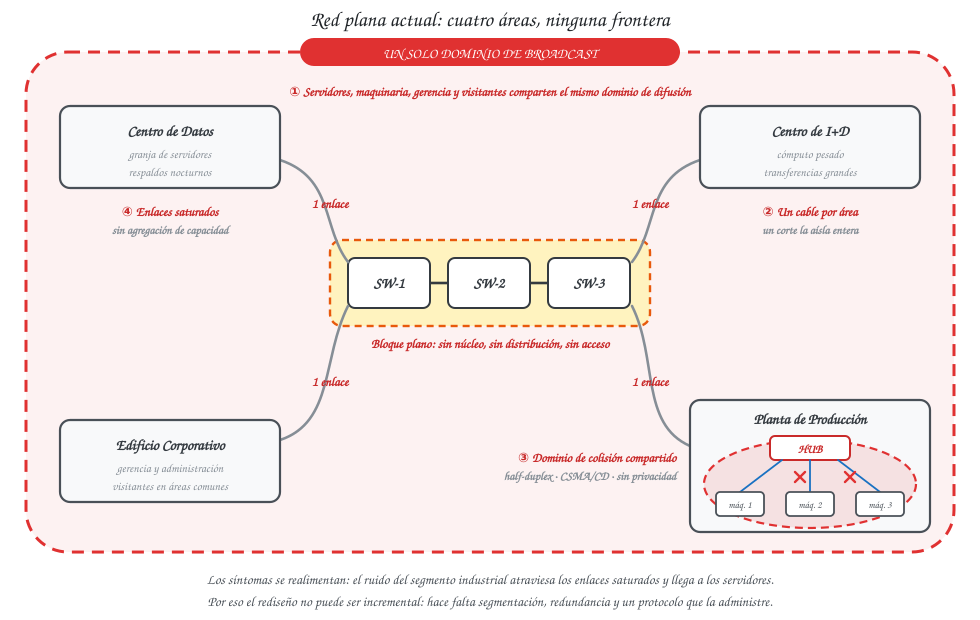

**Figura 1 — La red plana actual.**
<!-- EXCALIDRAW F1: las cuatro áreas colgando de un mismo bloque de switches sin jerarquía; una nube de broadcast que las envuelve a todas; el hub de la Planta con flechas de colisión; un solo cable por enlace marcado como punto único de falla. Rojo para el problema, gris para lo neutro. -->

| Síntoma en el campus | Causa en Capa 1/2 | Tecnología que lo resuelve | Sección |
|---|---|---|---|
| Tráfico administrativo mezclado con el de invitados | Un solo dominio de broadcast | VLANs | §4 |
| Colisiones continuas en el segmento industrial | Hub: dominio de colisión compartido | Switch de acceso + contención | §3, §21 |
| Enlaces saturados hacia servidores e I+D | Un solo enlace físico por trunk | EtherChannel | §7 |
| Caída total ante la falla de un cable o switch | Rutas únicas, sin redundancia | Topología redundante + STP | §6 |
| VLANs inconsistentes entre switches | Administración manual por equipo | VTP | §5 |

## 3. Dominios de colisión y dominios de broadcast

### 3.1 Dominio de colisión

Un **dominio de colisión** es el conjunto de dispositivos que comparten un mismo medio de transmisión: si dos de ellos transmiten al mismo tiempo, sus señales se superponen y ambas tramas se destruyen. Es un fenómeno de **Capa 1**, eléctrico, anterior a cualquier dirección MAC.

Ethernet resuelve ese conflicto con **CSMA/CD** (*Carrier Sense Multiple Access with Collision Detection*): la estación escucha el medio antes de transmitir, y si detecta una colisión mientras transmite, aborta, emite una señal de atasco y espera un tiempo aleatorio creciente (*backoff* exponencial) antes de reintentar. El mecanismo funciona, pero tiene un costo: el tiempo que el medio pasa en colisiones y en esperas es tiempo en el que nadie transmite datos útiles. A medida que crece el número de estaciones en el mismo dominio, el rendimiento efectivo cae mucho antes de alcanzar el ancho de banda nominal.

La diferencia decisiva la marca el modo de operación del enlace:

- **Half-duplex**: emisión y recepción comparten el canal, no pueden ocurrir a la vez, y CSMA/CD está activo. Es el modo de todo lo que cuelga de un hub.
- **Full-duplex**: emisión y recepción usan pares separados y simultáneos. Con un solo dispositivo al otro extremo del cable, **la colisión es imposible** y CSMA/CD se desactiva. Es el modo normal de un puerto de switch conectado a un PC.

De ahí la regla de conteo que se aplica en §15:

| Dispositivo | Qué hace con el dominio de colisión |
|---|---|
| **Hub** | Repite eléctricamente cada señal por todos sus puertos ⇒ **un único dominio compartido** para el hub, todos sus equipos y el puerto de switch que lo alimenta |
| **Switch** | Cada puerto es un segmento independiente ⇒ **un dominio de colisión por puerto con cable conectado** |
| **Router** | Separa dominios de colisión **y** de broadcast |
| **Punto de acceso (Wi-Fi)** | Medio inalámbrico compartido con CSMA/CA ⇒ **un dominio compartido** por todos los clientes asociados |

Conviene ser preciso con el caso del hub, porque es la fuente habitual de error: un hub con cuatro máquinas conectado a un puerto de switch **no añade cuatro dominios**, sino que ensancha el único dominio que ese puerto ya aportaba, elevándolo de dos miembros a seis. El hub no multiplica dominios: los agranda, que es exactamente lo contrario de lo que se busca.

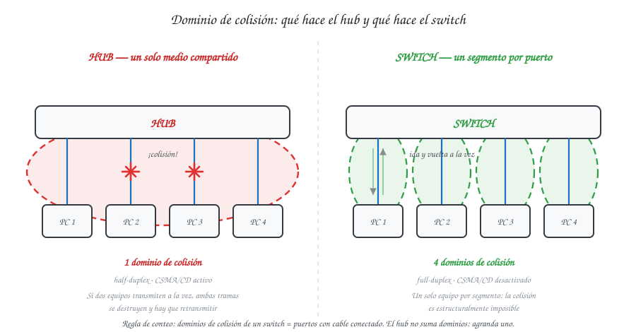

**Figura 2 — El hub comparte un dominio de colisión; el switch crea uno por puerto.**
<!-- EXCALIDRAW F2: dos escenas lado a lado. Izquierda: hub con 4 PCs, un solo óvalo rojo que abarca los 4 enlaces, rótulo "1 dominio de colisión · half-duplex · CSMA/CD". Derecha: switch con 4 PCs, cuatro óvalos verdes independientes, rótulo "4 dominios · full-duplex · sin colisiones". -->

### 3.2 Dominio de broadcast

Un **dominio de broadcast** es el alcance de una trama de difusión: el conjunto de dispositivos que recibirán una trama cuya MAC de destino es `FF:FF:FF:FF:FF:FF`. Es un fenómeno de **Capa 2**, y por eso se cuenta con una regla distinta a la del dominio de colisión.

El switch, que aprende direcciones MAC y conmuta el tráfico unicast sólo hacia el puerto correcto, **no puede hacer lo mismo con el broadcast**: por definición esa trama va dirigida a todos, así que el switch la **inunda** por todos sus puertos activos excepto el de entrada. Un enlace troncal no es una excepción; al contrario, propaga la inundación hacia el switch vecino. La consecuencia es contraintuitiva y es el corazón del problema del Tech Park:

> **Encadenar switches no reduce el broadcast: lo extiende.** Una red plana con *N* switches y cientos de puertos sigue siendo **un solo** dominio de broadcast.

Sólo dos cosas detienen una trama de difusión:

| Frontera | Capa | Cómo lo hace |
|---|---|---|
| **Router** | 3 | No reenvía broadcast de Capa 2 entre sus interfaces |
| **VLAN** | 2 | El switch inunda únicamente por los puertos que pertenecen a esa misma VLAN |

La VLAN es la herramienta de este proyecto, porque permite crear esas fronteras **sin comprar routers ni recablear**: es una partición lógica sobre la misma planta física (§4.1). Con VLANs la regla de conteo pasa a ser directa —**un dominio de broadcast por VLAN activa**, sin importar cuántos switches la transporten ni cuántos edificios cruce—, y de ahí sale la tabla de §16: las cinco VLANs del carné 201905884 producen cinco dominios independientes donde antes había uno.

Vale la pena fijar el corolario, porque se usa dos veces en la Parte II: dos switches distintos que comparten una VLAN forman **un** dominio, no dos (por eso el Ala A y el Ala B se comunican entre sí, §12.3); y dos puertos del **mismo** switch en VLANs distintas están en dominios **distintos**, aunque estén uno al lado del otro en el mismo chasis (por eso los visitantes quedan aislados, §12.3).

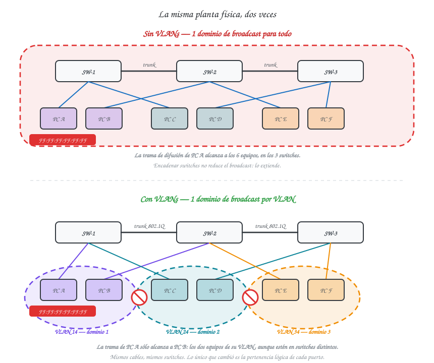

**Figura 3 — Un dominio de broadcast en la red plana; uno por VLAN tras la segmentación.**
<!-- EXCALIDRAW F3: arriba, tres switches encadenados con PCs de distinto color, una sola nube que los cubre a todos, rótulo "1 dominio de broadcast". Abajo, los mismos switches con las PCs agrupadas por color en nubes separadas, rótulo "1 dominio por VLAN". Dibujar la trama FF:FF:FF:FF:FF:FF propagándose en el primero y deteniéndose en el segundo. -->

### 3.3 Comparación

| Criterio | Dominio de colisión | Dominio de broadcast |
|---|---|---|
| Capa OSI | 1 (medio físico) | 2 (direccionamiento MAC) |
| Lo crea | Medio compartido (hub, half-duplex) | Alcance de una trama de difusión |
| Lo separa | Switch (por puerto), router | Router, VLAN |
| Cómo se cuenta | Puertos activos de switch + 1 por hub | Una por VLAN activa |

## 4. VLANs y enlaces troncales IEEE 802.1Q

### 4.1 Qué es una VLAN

Una **VLAN** (*Virtual Local Area Network*) es una partición lógica de un switch: un subconjunto de
puertos que el switch trata como si fueran una red independiente. Formalmente, **una VLAN es un
dominio de broadcast definido por configuración y no por cableado** (§3.2). El switch mantiene una
tabla de reenvío separada por VLAN y nunca entrega una trama de una VLAN a un puerto de otra, aunque
ambos puertos estén en el mismo chasis, a dos centímetros uno del otro.

Esa frase encierra el valor práctico de la tecnología: permite **rediseñar la topología lógica sin
tocar la topología física**. En el Tech Park, segmentar las cinco áreas con routers exigiría comprar
equipos y recablear; segmentarlas con VLANs es reasignar puertos por software sobre la planta que ya
existe. Y a la inversa, un equipo puede cambiar de dominio de broadcast sin moverse de lugar.

Las tres consecuencias que justifican su uso en este proyecto:

| Beneficio | Cómo se materializa en el campus |
|---|---|
| **Contención del broadcast** | Cinco dominios en lugar de uno: el ARP de un visitante deja de llegar a los servidores (§16) |
| **Seguridad por segmentación** | Un equipo sólo puede escuchar el tráfico de su propia VLAN. El aislamiento de Áreas Comunes es exactamente esto (§12.3) |
| **Agrupación por función, no por ubicación** | La VLAN 14 abarca las dos alas del Edificio Corporativo, que están en switches distintos; la 24 cruza los tres switches del anillo de I+D |

Conviene fijar desde ya el **límite honesto** de la tecnología, porque es lo primero que se pregunta
en una defensa: las VLANs **aíslan**, no comunican. Dos VLANs distintas no se hablan entre sí por
diseño, y hacer que lo hagan exige un dispositivo de Capa 3 —un router o un switch multicapa con
SVIs, lo que se conoce como *routing inter-VLAN*. Este proyecto es explícitamente de Capa 1 y 2, así
que el aislamiento inter-VLAN es el comportamiento **deseado** y se comprueba como tal: el ping
entre VLANs debe fallar al 100 %, y esa falla es una evidencia de éxito, no de error (§24, prueba 5).

### 4.2 Puertos de acceso y puertos troncales

Un switch segmentado necesita resolver un problema inmediato: si la VLAN 14 vive en dos switches,
¿cómo viaja su tráfico de uno a otro sin mezclarse con el de las otras cuatro VLANs? La respuesta
son los dos modos de puerto, que existen precisamente por esa pregunta.

| | **Puerto de acceso** | **Puerto troncal (trunk)** |
|---|---|---|
| Pertenece a | **Una** VLAN | **Varias** VLANs a la vez |
| Etiqueta las tramas | No | **Sí**, excepto las de la VLAN nativa |
| A qué se conecta | Equipos finales: PC, servidor, impresora, AP, hub | **Otro switch** (o un router) |
| Qué ve el equipo conectado | Ethernet normal: no sabe que existe la VLAN | — |
| Comando base | `switchport mode access` + `switchport access vlan N` | `switchport mode trunk` |

El punto clave, y el que más se confunde: **el equipo final nunca sabe en qué VLAN está**. Una PC
conectada a un puerto de acceso envía y recibe tramas Ethernet corrientes, sin etiqueta alguna. La
pertenencia a la VLAN 14 es una propiedad **del puerto del switch**, no del equipo ni de su tarjeta
de red. Por eso cambiar una PC de VLAN es un comando en el switch y no requiere tocar la PC.

El trunk hace el trabajo inverso: como por un solo cable van a viajar tramas de cinco VLANs
mezcladas, el switch emisor **marca** cada trama con el número de VLAN a la que pertenece antes de
ponerla en el cable, y el switch receptor lee esa marca para saber a qué puertos puede entregarla.
Sin esa marca, el switch receptor no tendría forma de distinguirlas y el aislamiento se perdería en
el primer salto.

En este campus se usan **13 enlaces troncales** (entre ellos los dos canales agregados Po1 y Po2) y
el resto son puertos de acceso; el detalle puerto por puerto está en §14.

**DTP: por qué el modo se fija a mano y no se negocia.** Un puerto de switch Cisco sin configurar no
está en modo access ni en modo trunk: está en **modo dinámico**, y usa **DTP** (*Dynamic Trunking
Protocol*, propietario de Cisco) para negociar con el equipo del otro extremo cuál de los dos será.
Es cómodo —conectas dos switches y el trunk aparece solo— y es precisamente el problema:

| Estado del puerto | Comando | Qué hace |
|---|---|---|
| `dynamic auto` | por defecto en muchos modelos | **Acepta** convertirse en trunk si el otro extremo lo propone, pero no lo propone él |
| `dynamic desirable` | por defecto en otros | **Propone activamente** formar un trunk |
| `access` | `switchport mode access` | Fijo. No negocia |
| `trunk` | `switchport mode trunk` | Fijo, pero **sigue enviando tramas DTP** salvo que se apague |
| — | `switchport nonegotiate` | **Apaga DTP** en ese puerto |

La consecuencia de seguridad es directa y se trata en §9.1: si un puerto de acceso queda en modo
dinámico, un atacante puede conectar un equipo que hable DTP, negociar un trunk y recibir **el
tráfico de todas las VLANs permitidas**. Por eso en este proyecto **todos los puertos llevan su modo
fijado explícitamente** —`switchport mode access` o `switchport mode trunk`, nunca dinámico— y los
trunks llevan además `switchport nonegotiate` para que no emitan DTP (§22).

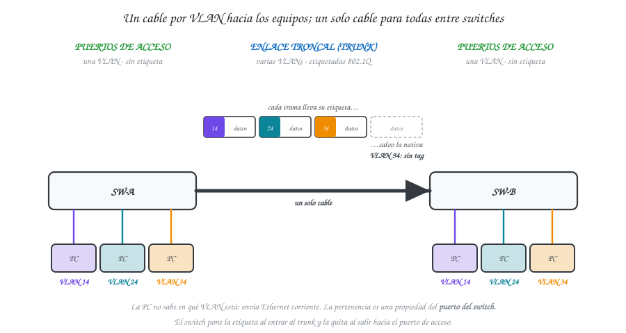

**Figura 4 — Un puerto access entrega una sola VLAN sin etiqueta; un trunk transporta varias etiquetadas.**
<!-- EXCALIDRAW F4: switch izquierdo con tres PCs de colores distintos en puertos access (tramas sin tag) y un enlace trunk al switch derecho por el que viajan las tres tramas, cada una con un rectángulo "TAG 14 / 24 / 34" adosado, más una cuarta sin tag rotulada "VLAN nativa 94". -->

### 4.3 Etiquetado 802.1Q y VLAN nativa

**IEEE 802.1Q** es el estándar que define *cómo* se marca una trama con su VLAN. No envuelve la
trama en otra ni la encapsula: **inserta 4 bytes** dentro de la trama Ethernet original, justo
después de la MAC de origen y antes del campo Tipo/Longitud. Como el contenido cambia, el switch
recalcula el FCS antes de transmitirla.

| Campo | Tamaño | Contenido |
|---|---|---|
| **TPID** (*Tag Protocol Identifier*) | 2 bytes | Valor fijo `0x8100`. Es la marca que le dice al receptor «esta trama lleva etiqueta» |
| **PCP** (*Priority Code Point*) | 3 bits | Prioridad 0–7 para calidad de servicio (802.1p). No se usa en este proyecto |
| **DEI** (*Drop Eligible Indicator*) | 1 bit | Marca la trama como descartable ante congestión |
| **VLAN ID** | **12 bits** | El número de VLAN. 12 bits ⇒ **4096 valores** (0–4095), de los cuales 1–4094 son utilizables |

De ese desglose sale un dato que conviene tener a mano: los **12 bits del VLAN ID** son la razón por
la que existen 4094 VLANs y no más, y también la razón por la que los identificadores del carné
(14, 24, 34, 44, 54, 94) son perfectamente válidos — están todos dentro del rango normal (1–1005).

Un efecto secundario que vale mencionar: los 4 bytes del tag elevan la trama máxima de 1518 a
**1522 bytes**. Un equipo que no entienda 802.1Q la descartaría como *giant*; por eso el tag sólo
viaja entre switches, nunca hacia un equipo final.

**La VLAN nativa.** Dentro de un trunk hay exactamente **una** VLAN cuyo tráfico viaja **sin
etiquetar**: la VLAN nativa. Existe por compatibilidad histórica —para que un dispositivo que no
entiende 802.1Q pudiera conectarse a un trunk y seguir funcionando— y por eso el tráfico de control
que el switch genera antes de negociar nada viaja en ella.

Aquí está el riesgo, y es la razón por la que el enunciado obliga a cambiarla:

> Por defecto, la VLAN nativa de todo trunk Cisco es la **VLAN 1**, que además es la VLAN por
> defecto de todos los puertos de acceso sin configurar. Un atacante conectado a un puerto de
> acceso en la VLAN 1 puede construir una trama con **dos** etiquetas: la externa con la VLAN
> nativa y la interna con la VLAN que quiere alcanzar. El primer switch quita la etiqueta externa
> —porque coincide con la nativa, que no se etiqueta— y reenvía por el trunk una trama que aún
> lleva la etiqueta interna. El segundo switch la lee y la entrega **en la VLAN de destino**. Es el
> ataque de **VLAN hopping por doble etiquetado** (§9.1), y es unidireccional pero suficiente para
> inyectar tráfico en una VLAN protegida.

Las dos contramedidas son directas y ambas se aplican en este proyecto: **mover la nativa a una VLAN
que no sea la 1** y **dejarla sin ningún puerto de acceso asignado**, de modo que ningún atacante
pueda originar tráfico dentro de ella. El enunciado fija la nativa en **VLAN 94** por carné, y este
diseño la deja deliberadamente vacía (§16).

Un último detalle operativo que causa muchos problemas en la práctica: **la VLAN nativa debe
coincidir en los dos extremos del trunk**. Si SW-CORE tiene la 94 y el switch vecino conserva la 1,
el tráfico no etiquetado de uno se interpreta como perteneciente a la VLAN equivocada en el otro.
Cisco lo reporta como *Native VLAN mismatch* vía CDP, pero el efecto es más grave que un aviso:
**puede producir bucles de STP**, porque las BPDU de una VLAN llegan a la instancia de otra. Por eso
el comando `switchport trunk native vlan 94` se aplica en **todos** los trunks, sin excepción, y se
verifica con `show interfaces trunk` (E6).

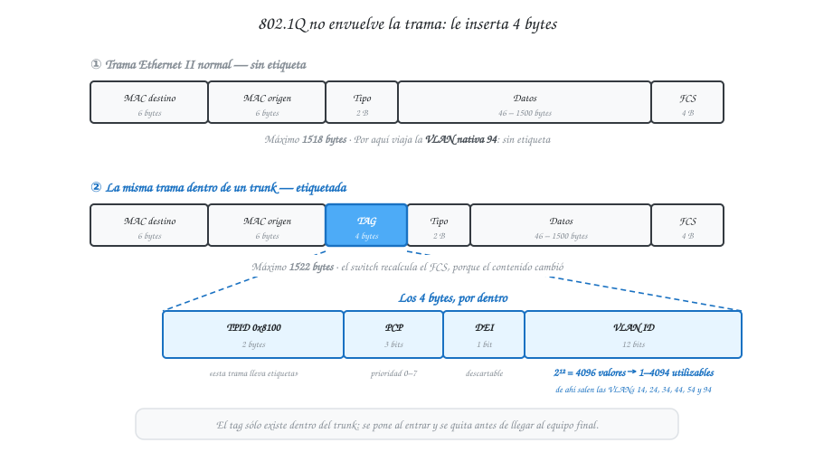

**Figura 5 — Inserción del tag 802.1Q de 4 bytes en la trama Ethernet.**
<!-- EXCALIDRAW F5: dos barras horizontales. Arriba, trama normal: MAC destino | MAC origen | Tipo | Datos | FCS. Abajo, la misma con el bloque de 4 bytes insertado tras MAC origen, desglosado en TPID 0x8100 (2 B) | PCP 3 b | DEI 1 b | VLAN ID 12 b. Anotar "12 bits → 4096 VLANs" y "la nativa viaja por la barra de arriba, sin tag". -->

## 5. VLAN Trunking Protocol (VTP)

### 5.1 Propósito y funcionamiento

Con las VLANs definidas (§4) aparece un problema de escala: **cada VLAN debe existir en todos los
switches que la transporten**. En este campus son 5 VLANs por 11 switches, es decir hasta 55
declaraciones manuales que además hay que repetir idénticas cada vez que se agrega o renombra una
VLAN. Un solo error de tipeo —`INVESTIGACION` en un switch, `INVESTIGACIN` en otro, o la VLAN 24
simplemente ausente— produce una falla silenciosa: el tráfico se descarta en el switch donde la VLAN
no existe, sin que ningún comando avise.

**VTP** (*VLAN Trunking Protocol*, propietario de Cisco) resuelve eso centralizando la
administración: las VLANs se crean **una sola vez** en un switch designado, y el protocolo las
propaga automáticamente al resto por los enlaces troncales. Cuatro precisiones sobre qué hace y qué
no hace, porque la confusión es habitual:

| VTP **sí** | VTP **no** |
|---|---|
| Propaga la **existencia** de las VLANs: su ID y su nombre | **No** asigna puertos a VLANs — eso es siempre manual, switch por switch (§14) |
| Sincroniza altas, bajas y renombrados | **No** transporta datos de usuario |
| Viaja **sólo por enlaces troncales** | **No** funciona sobre puertos de acceso |
| Requiere que todos compartan **dominio y contraseña** | **No** sustituye a 802.1Q: VTP anuncia, 802.1Q etiqueta |

Para que dos switches intercambien anuncios VTP deben coincidir en el **nombre de dominio** y, si se
configura, en la **contraseña**. El enunciado los fija por carné: dominio `Smart_8` y contraseña
`proyecto12S2026`. La contraseña no es decorativa — es lo que impide que un switch ajeno enchufado
al campus participe del dominio y, como se ve en §5.3, pueda destruirlo.

### 5.2 Modos Server, Client y Transparent

| Modo | Crea/borra VLANs | Adopta anuncios | Reenvía anuncios | Uso típico |
|---|---|---|---|---|
| Server | Sí | Sí | Sí | Núcleo que administra el dominio |
| Client | No | Sí | Sí | Distribución y acceso |
| Transparent | Solo localmente | No | Sí (v2) | Switch que debe aislarse de la administración |

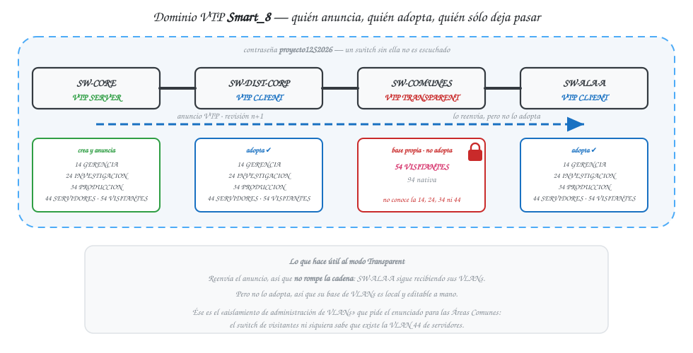

**Figura 6 — El Server anuncia, el Client adopta, el Transparent reenvía sin adoptar.**
<!-- EXCALIDRAW F6: cadena de cuatro switches. Server (crea VLANs) → Client (las adopta, marcado ✔) → Transparent (la flecha lo atraviesa pero su base de VLANs queda con candado y VLANs propias) → Client (vuelve a adoptar). Rotular el dominio "Smart_8" y la contraseña como un candado sobre los enlaces. -->

Las tres filas de la tabla describen tres papeles distintos, y la diferencia que importa está en la
columna «Adopta anuncios»:

- **Server** es el único que puede crear, borrar y renombrar VLANs para todo el dominio. Sus cambios
  se propagan. En este campus el Server es **SW-CORE**, por exigencia del enunciado y porque es el
  punto por el que pasan todos los trunks del campus: cualquier anuncio que emita alcanza a los
  tres edificios en un salto (§17).
- **Client** no puede crear VLANs localmente: sólo adopta lo que le llega y lo reenvía. Es el modo
  de los nueve switches de distribución y acceso. La ventaja operativa es directa — se crea la VLAN
  una vez en el Core y aparece en los nueve.
- **Transparent** es el caso interesante. **Reenvía** los anuncios por sus trunks (en VTPv2), de
  modo que no rompe la cadena hacia switches que estén más allá, pero **no los adopta**: mantiene su
  propia base de VLANs, local y editable a mano. Es, literalmente, un switch que participa del
  cableado del dominio sin participar de su administración.

**Por qué SW-COMUNES va en Transparent.** El enunciado pide que las Áreas Comunes tengan
«aislamiento total de tráfico **y de administración de VLANs**». La primera mitad la da la VLAN 54
(§4.1, §16); la segunda mitad la da precisamente este modo. En Transparent, el switch de visitantes
no recibe automáticamente las VLANs 14, 24, 34 y 44 del dominio: ni siquiera sabe que existen. Aunque
alguien lograse alcanzar ese switch, no encontraría en él la definición de la VLAN de servidores. Es
una reducción real de superficie de ataque, no una formalidad.

### 5.3 El número de revisión de configuración

Éste es el mecanismo que hace que VTP sea a la vez cómodo y peligroso, y es la pregunta clásica de
defensa.

Cada anuncio VTP lleva un **número de revisión de configuración**. El Server lo incrementa en 1 cada
vez que crea, borra o renombra una VLAN. Cuando un switch recibe un anuncio, compara:

| Revisión recibida | Qué hace el switch |
|---|---|
| **Menor o igual** que la suya | La ignora |
| **Mayor** que la suya | **Sobrescribe su base de VLANs completa** con la del anuncio |

La segunda fila no dice «fusiona»: dice **sobrescribe**. Y el criterio es únicamente el número, no
la antigüedad ni el modo del emisor. De ahí el escenario de desastre:

> Un switch viejo de laboratorio, que estuvo en el dominio `Smart_8` y acumuló una revisión de 47
> mientras se practicaba con él, se reconecta al campus como **Client** con apenas dos VLANs en su
> base. El Server de producción va en revisión 12. El switch de laboratorio emite su anuncio, todos
> ven un número mayor, y **todo el dominio adopta sus dos VLANs**, borrando las cinco reales. Un
> switch en modo Client, que «no puede crear VLANs», acaba de destruir la red entera.

Las tres mitigaciones, en orden de importancia:

| Mitigación | Cómo |
|---|---|
| **Poner en cero la revisión antes de conectar cualquier switch** | Cambiarlo a `vtp mode transparent` y de vuelta a `client`: eso resetea el contador a 0 |
| **Configurar la contraseña del dominio** | `vtp password proyecto12S2026` — un switch sin ella no es escuchado |
| **Verificar antes de enchufar** | `show vtp status` y leer *Configuration Revision* |

En este proyecto las tres aplican: la contraseña la fija el enunciado, y el procedimiento de puesta
a cero queda documentado como paso previo en §17 y en los scripts de `configs/`. Es también la razón
técnica por la que muchos diseños modernos prescinden de VTP o usan VTPv3 (que introduce un servidor
primario explícito); se documenta aquí porque el enunciado lo exige, no porque sea la única opción.

## 6. Spanning Tree Protocol y PVST+

### 6.1 El problema del bucle de Capa 2

El enunciado exige redundancia: el anillo de I+D debe sobrevivir a la caída de un switch y las alas
del Edificio Corporativo deben seguir comunicadas si cae la ruta al distribuidor (§12.2, §12.3).
Redundancia significa **más de un camino físico** entre dos switches. Y ahí aparece el problema que
STP existe para resolver.

**Ethernet no tiene TTL.** Un paquete IP lleva un campo *Time To Live* que se decrementa en cada
salto y acaba matando al paquete que circula sin rumbo. La trama Ethernet **no tiene nada
equivalente**: si un switch la reenvía a otro y ese la devuelve, la trama circula para siempre. Ésta
es la razón de fondo de toda la sección, y conviene poder enunciarla en una frase.

Con un camino redundante y sin ningún protocolo que lo controle, una sola trama de difusión produce
tres efectos simultáneos:

| Efecto | Qué ocurre |
|---|---|
| **Tormenta de broadcast** | Cada switch inunda la trama por todos sus puertos; en un triángulo, cada copia genera dos copias nuevas en cada vuelta. El crecimiento es exponencial y satura los enlaces y la CPU de los switches en segundos |
| **Inestabilidad de la tabla MAC** | La misma MAC de origen llega por puertos distintos en cada vuelta, así que el switch reescribe su tabla constantemente (*MAC flapping*) y deja de poder conmutar unicast correctamente |
| **Tramas duplicadas** | El destino recibe copias múltiples del mismo dato, lo que rompe protocolos de capas superiores |

El resultado práctico es una red caída, no degradada: la tormenta consume el ancho de banda de todos
los enlaces del dominio de broadcast y ni siquiera se puede acceder a los switches por la red para
apagar el bucle.

**La solución de STP** (*Spanning Tree Protocol*, IEEE 802.1D) es conceptualmente simple: los
switches intercambian mensajes de control llamados **BPDU** (*Bridge Protocol Data Unit*), se ponen
de acuerdo en una topología **sin ciclos** —un árbol de expansión— y **bloquean lógicamente** los
puertos sobrantes. El puerto bloqueado sigue físicamente conectado y sigue escuchando BPDU; lo que
no hace es reenviar tráfico de datos. Si el camino principal cae, ese puerto vuelve a Forwarding y
la red se recupera sola.

Es decir: **el cable redundante sigue ahí, pero sólo uno de los caminos está activo a la vez**. Ésa
es exactamente la propiedad que se demuestra en las pruebas de tolerancia a fallos (§24.2).

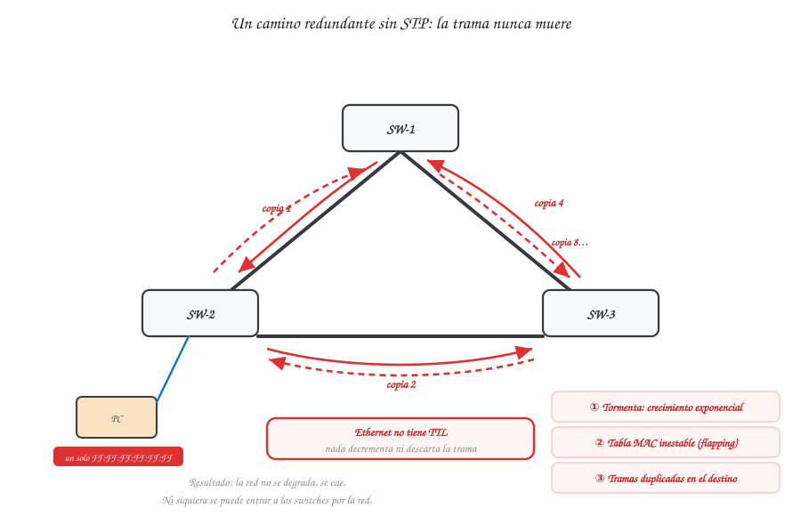

**Figura 7 — Sin STP, una sola trama de difusión circula indefinidamente y multiplica su copia.**
<!-- EXCALIDRAW F7: tres switches en triángulo, una PC emitiendo un broadcast; flechas curvas rojas girando en ambos sentidos con rótulos "copia 1, copia 2, copia 4…"; anotar los tres efectos: tormenta, inestabilidad de la tabla MAC y tramas duplicadas. Ethernet no tiene TTL: subrayarlo. -->

### 6.2 Elección del Root Bridge y cálculo de costos

STP construye el árbol en tres pasos, y cada uno tiene un criterio de desempate propio.

**Paso 1 — Se elige un Root Bridge: el switch con el Bridge ID más bajo.** El **Bridge ID** (BID)
es un valor de 8 bytes compuesto por:

```
BID = Prioridad (4 bits) + ID de sistema extendido (12 bits = VLAN) + Dirección MAC (6 bytes)
       ↑ configurable, múltiplos de 4096       ↑ lo pone PVST+        ↑ inmutable
       por defecto 32768
```

Todos los switches arrancan con prioridad **32768**, así que si no se configura nada **gana el de la
MAC más baja** — que suele ser el más viejo del campus, el que menos capacidad tiene y el peor
ubicado. Por eso la práctica obligada es **fijar el Root a mano**, y por eso la rúbrica pide
justificar la elección (§18).

**Paso 2 — Cada switch no raíz elige su Root Port: aquel con el menor costo acumulado hasta la
raíz.** El costo de cada enlace depende de su velocidad, y los costos se **suman** a lo largo del
camino:

| Velocidad del enlace | 10 Mbps | 100 Mbps | 1 Gbps | 10 Gbps |
|---|---|---|---|---|
| Costo STP por defecto | 100 | 19 | 4 | 2 |

Nótese que **menor costo significa mayor velocidad**: STP prefiere naturalmente los enlaces rápidos.
Un dato útil para §18: un EtherChannel presenta un costo **menor** que el de un enlace individual,
porque su ancho de banda agregado es mayor — otra razón por la que Po1 y Po2 se vuelven caminos
preferentes de forma automática.

Si dos caminos empatan en costo, el desempate sigue este orden: BID del vecino más bajo → ID de
puerto del vecino más bajo → ID de puerto local más bajo.

**Paso 3 — En cada segmento se elige un Designated Port y el resto se bloquea.** Los puertos que no
son ni Root Port ni Designated Port quedan en estado **Blocking** (en PVST+ se muestran como `BLK`,
con rol `Altn`). Ésos son los que aparecen con candado en la F19 y en la evidencia E4.

**Estados de puerto y por qué PVST+ tarda.** Un puerto que debe empezar a reenviar no lo hace de
golpe: atraviesa una secuencia de estados con temporizadores fijos.

| Estado | Duración típica | Qué hace |
|---|---|---|
| **Blocking** | — | Sólo escucha BPDU. No aprende MAC ni reenvía |
| **Listening** | 15 s (*forward delay*) | Procesa BPDU y participa de la elección. Aún no aprende MAC |
| **Learning** | 15 s (*forward delay*) | Aprende direcciones MAC. Todavía no reenvía datos |
| **Forwarding** | — | Reenvía tráfico normalmente |

De ahí salen los **30 segundos** de convergencia cuando un puerto bloqueado debe tomar el relevo, y
hasta **50 segundos** cuando primero hay que esperar a que expire el *max age* (20 s) por pérdida de
BPDU. Ese número es el que hay que contrastar contra el tiempo medido en las pruebas de falla
(§24.2): si el cronómetro da del orden de medio minuto, el comportamiento es el correcto y esperado,
no un defecto.

### 6.3 PVST+ frente a Rapid-PVST+

STP original (802.1D) calcula **un solo árbol** para toda la red, sin importar cuántas VLANs haya.
Eso tiene una consecuencia costosa: el mismo puerto queda bloqueado para todas las VLANs, de modo
que un enlace redundante no transporta nada aunque sobre capacidad.

**PVST+** (*Per-VLAN Spanning Tree Plus*, de Cisco) mantiene una **instancia independiente de STP
por cada VLAN**. Cada VLAN puede tener su propio Root Bridge y bloquear un puerto distinto, lo que
habilita **balanceo de carga por VLAN**: el enlace que está bloqueado para la VLAN 14 puede estar
reenviando para la VLAN 24. Es el mecanismo que permite las decisiones de §18.

Es también el motivo del **ID de sistema extendido** en el BID: los 12 bits que en 802.1D no se
usaban ahora llevan el número de VLAN, y por eso la prioridad efectiva de un switch para la VLAN 24
se lee como `32768 + 24 = 32792` en la salida de `show spanning-tree`. Conviene saberlo para no leer
mal la evidencia E3.

| | **PVST+** | **Rapid-PVST+** |
|---|---|---|
| Base | IEEE 802.1D | IEEE 802.1w |
| Instancias | Una por VLAN | Una por VLAN |
| Convergencia | **30–50 s** (temporizadores fijos) | **Segundos** (negociación *proposal/agreement*) |
| Estados de puerto | Blocking, Listening, Learning, Forwarding, Disabled | Discarding, Learning, Forwarding |
| Comando | `spanning-tree mode pvst` | `spanning-tree mode rapid-pvst` |

**El carné 201905884 termina en 4 (par), así que el enunciado asigna PVST+.** El comando es
explícito —`spanning-tree mode pvst`— y conviene recalcar un punto que suele escribirse mal en los
informes: **PVST+ no es «el modo por defecto» que se deja sin tocar**. Es un modo que se selecciona,
y el comando debe aparecer en la configuración y en la evidencia. Que Rapid-PVST+ converja mucho más
rápido es cierto y vale mencionarlo como mejora futura, pero usarlo aquí sería incumplir el
parámetro por carné, que penaliza del −50 % al −100 %.

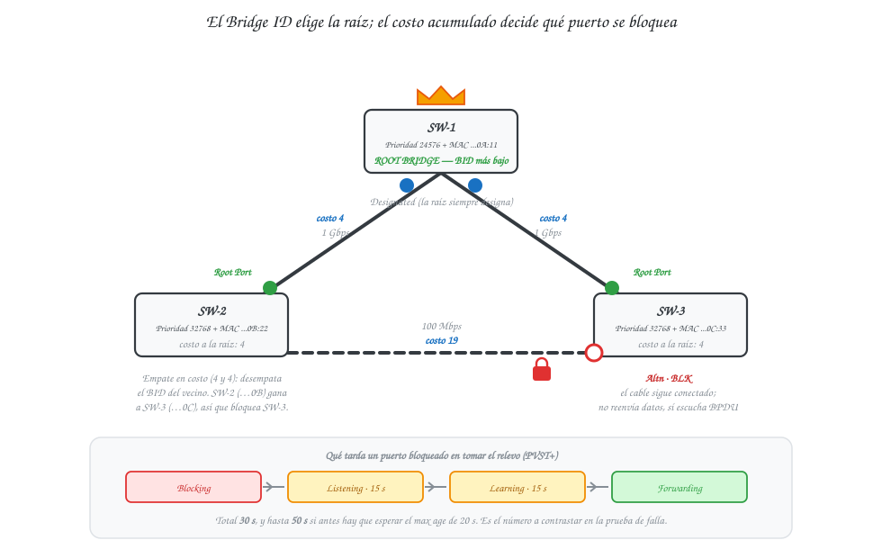

**Figura 8 — El Bridge ID elige la raíz; el costo acumulado decide qué puerto se bloquea.**
<!-- EXCALIDRAW F8: el mismo triángulo de la F7. Cada switch con su recuadro "Prioridad + MAC". El de menor BID coronado como Root. Cada enlace rotulado con su costo (4, 19). En cada switch no raíz, el Root Port marcado en verde y, en el enlace sobrante, un puerto con candado rojo "Altn BLK". Anotar los estados Blocking → Listening → Learning → Forwarding con sus tiempos. -->

> **Sobre los valores de costo.** La guía de configuración del Catalyst 2960 tabula hasta 1 Gbps
> (100 / 19 / 4). El valor **2** para 10 Gbps procede de la tabla ampliada de **IEEE 802.1D-2004**,
> pensada para enlaces por encima del Gigabit. En este campus sólo se usan los costos 4 (Gigabit) y
> 19 (FastEthernet), así que el valor de 10 Gbps es informativo.

## 7. EtherChannel y LACP

### 7.1 Agregación de enlaces: capacidad y tolerancia a fallos

STP resuelve el bucle bloqueando puertos (§6.1), pero esa solución tiene un costo que se vuelve
inaceptable cuando lo que se busca no es un camino alterno sino **más capacidad**. Si se tienden
cuatro cables de 1 Gbps entre dos switches para conseguir 4 Gbps, STP verá cuatro caminos paralelos,
declarará tres redundantes y los bloqueará: quedan **1 Gbps efectivos y 3 Gbps desperdiciados**.

**EtherChannel** resuelve exactamente eso: agrupa varios enlaces físicos en **una sola interfaz
lógica** —el *port-channel*, `Po1`, `Po2`— que el resto del sistema operativo trata como un único
puerto. STP ve un enlace, no cuatro, así que no bloquea nada; la tabla MAC asocia las direcciones al
canal, no a cada cable.

Los dos beneficios son simultáneos y ambos se exigen en este proyecto:

| Beneficio | Cómo funciona |
|---|---|
| **Capacidad agregada** | El ancho de banda del canal es la suma de sus miembros. El tráfico se reparte mediante un algoritmo de *hash* sobre direcciones MAC/IP, no por trama |
| **Tolerancia a fallos sin reconvergencia de STP** | Si cae un miembro, el canal **sigue arriba** con capacidad reducida. No hay elección de STP, no hay 30 segundos de espera: la recuperación es prácticamente inmediata |

La segunda fila merece subrayarse porque es la que se demuestra en la prueba de falla del Po1
(§24.2): el corte de un miembro de un EtherChannel **no** dispara una reconvergencia de STP, porque
desde el punto de vista de STP la topología no cambió —el enlace lógico sigue existiendo.

Un matiz honesto sobre el reparto de carga: el *hash* se calcula por conversación, no por trama, de
modo que **una única conversación entre dos equipos no supera la velocidad de un miembro**. Un canal
de 2 × 1 Gbps no da 2 Gbps a una sola transferencia; da 2 Gbps de capacidad total repartida entre
conversaciones distintas. Para la granja de servidores y para el trunk de I+D, que agregan muchos
flujos simultáneos, ése es justamente el escenario favorable.

**Requisito para que el canal se forme.** Todos los puertos miembros deben coincidir en velocidad,
dúplex, modo (access o trunk), VLAN nativa y lista de VLANs permitidas. Una discrepancia deja el
puerto fuera del canal y se ve en `show etherchannel summary` como un miembro que no llega al estado
`P` (*bundled in port-channel*).

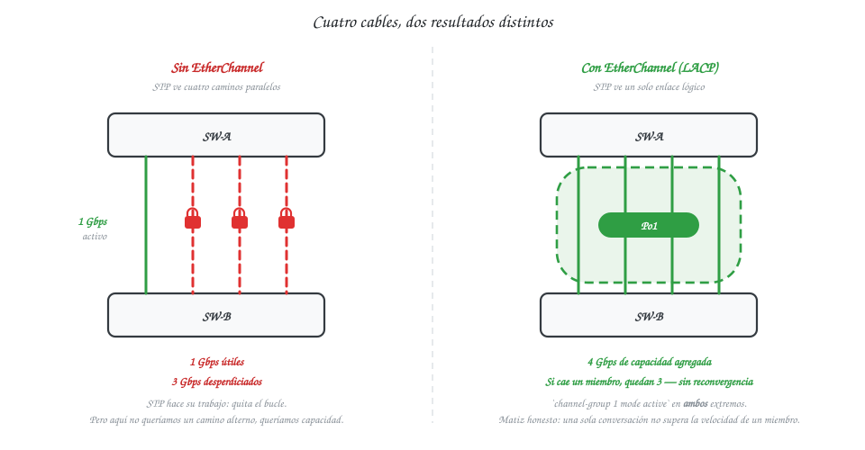

**Figura 9 — Cuatro enlaces físicos se presentan a STP como un único enlace lógico.**
<!-- EXCALIDRAW F9: izquierda, dos switches unidos por 4 cables donde STP bloquea 3 (candados rojos) y rotula "3 Gbps desperdiciados". Derecha, los mismos 4 cables envueltos en una cápsula "Po1" con un solo enlace lógico hacia STP, rótulo "4 Gbps · si cae un miembro, quedan 3". -->

### 7.2 LACP (IEEE 802.3ad) frente a PAgP

| | LACP | PAgP |
|---|---|---|
| Estándar | IEEE 802.3ad (abierto) | Propietario Cisco |
| Modos | active / passive | desirable / auto |
| Combinación que forma el canal | active–active, active–passive | desirable–desirable, desirable–auto |
| Combinación que **no** forma canal | passive–passive | auto–auto |
| Máx. puertos | 16 configurados, 8 activos | 8 |

Los dos protocolos cumplen la misma función —negociar dinámicamente la formación del canal y
verificar que ambos extremos estén de acuerdo— y la diferencia práctica es de interoperabilidad:
**LACP es un estándar abierto (IEEE 802.3ad)** y funciona entre fabricantes distintos, mientras que
PAgP sólo existe en equipos Cisco.

La fila que hay que entender es la de las combinaciones. `active` inicia la negociación; `passive`
sólo responde. Dos extremos en `passive` se quedan esperando el uno al otro y **el canal nunca se
forma** — es el error de configuración más común con LACP y produce un `show etherchannel summary`
donde el port-channel aparece pero sin miembros agrupados.

**El carné 201905884 es par, así que el enunciado asigna LACP.** En este proyecto ambos extremos de
Po1 y Po2 se configuran en **`channel-group N mode active`**: `active–active` es la combinación que
garantiza la formación sin depender de quién arranque primero, y deja la evidencia más limpia en
E5. Existe también el modo `on`, que fuerza el canal sin negociación alguna; se descarta
deliberadamente porque, al no verificar nada con el otro extremo, un error de cableado produce un
bucle en lugar de un canal que simplemente no sube.

### 7.3 Interacción con Spanning Tree

Es la propiedad que cierra el círculo entre §6 y §7, y conviene formularla con precisión:

> **STP ve el port-channel como un único enlace lógico, así que no bloquea a sus miembros.**

Tres consecuencias directas:

1. **Los cuatro cables reenvían a la vez.** No hay puertos en Blocking dentro del canal; el ancho de
   banda agregado está íntegramente disponible. Eso es lo que resuelve el desperdicio del §7.1.
2. **El canal tiene un costo STP menor** que el de un enlace individual, porque su ancho de banda es
   mayor (§6.2). Por eso Po1 y Po2 se convierten automáticamente en caminos preferentes del árbol,
   sin necesidad de forzar costos a mano.
3. **La caída de un miembro no es un evento de STP.** El canal sobrevive con menos capacidad y la
   topología lógica no cambia, así que no se dispara la secuencia Listening → Learning ni sus 30
   segundos. Ésta es la diferencia que la prueba de §24.2 debe hacer visible: la caída de un uplink
   de ala tarda ~30 s en recuperarse (STP); la caída de un miembro de Po1, no.

Un riesgo real que vale documentar: si el canal se configura **sólo en un extremo**, los enlaces
sobrantes dejan de estar protegidos por la abstracción y STP los ve como caminos paralelos
independientes. Con `mode on` eso produce directamente un bucle; con LACP, el canal simplemente no
sube y STP bloquea lo sobrante, que es el modo seguro de fallar. Es la razón práctica por la que
este diseño usa LACP y no `on`.

## 8. Medios de transmisión: cobre y fibra óptica

La elección del medio de cada enlace no es una preferencia de diseño: es el resultado de aplicar cuatro criterios en un orden de descarte fijo. Documentarlos así evita la justificación circular («se usó fibra porque es mejor») que la rúbrica penaliza.

| # | Criterio | Qué decide | Carácter |
|---|---|---|---|
| 1 | **Distancia** | Por encima de **100 m**, el cobre balanceado queda descartado | **Límite normativo** (ANSI/TIA-568: 90 m horizontal + 10 m de *patch cords*). No es un consejo: es atenuación y retardo de propagación |
| 2 | **Ancho de banda requerido** | Troncales agregados y enlaces de alto tráfico | 10 Gbps son alcanzables en Cat 6A a 100 m; por encima, fibra |
| 3 | **Inmunidad electromagnética** | Entornos con motores, variadores de frecuencia o soldadura | La fibra transporta luz: es **inmune por construcción**. Decide incluso en enlaces cortos |
| 4 | **Costo** | A igualdad de los tres anteriores, gana el cobre | La fibra encarece por los transceptores y la terminación, no tanto por el cable |

El primer criterio es eliminatorio y el cuarto sólo se aplica cuando los otros tres empatan. El tercero es el que suele olvidarse y el que, en este campus, decide el enlace hacia la Planta de Producción: 90 m están dentro del alcance del cobre, pero el entorno industrial impone fibra igual (§20).

| Medio | Alcance típico | Ancho de banda | Inmunidad EMI | Costo relativo | Uso recomendado en el campus |
|---|---|---|---|---|---|
| UTP Cat 6 | 100 m (1 Gbps) | 1 Gbps | Baja | Bajo | Horizontal dentro de cada edificio |
| UTP Cat 6A | 100 m (10 Gbps) | 10 Gbps | Media (F/UTP) | Medio | Troncales cortos intraedificio |
| Fibra multimodo OM3/OM4 | 300–550 m (10 Gbps) | 10–40 Gbps | Total | Alto (transceptores) | Troncales entre edificios |
| Fibra monomodo OS2 | 10 km+ | 10–100 Gbps | Total | Alto | Distancias largas |

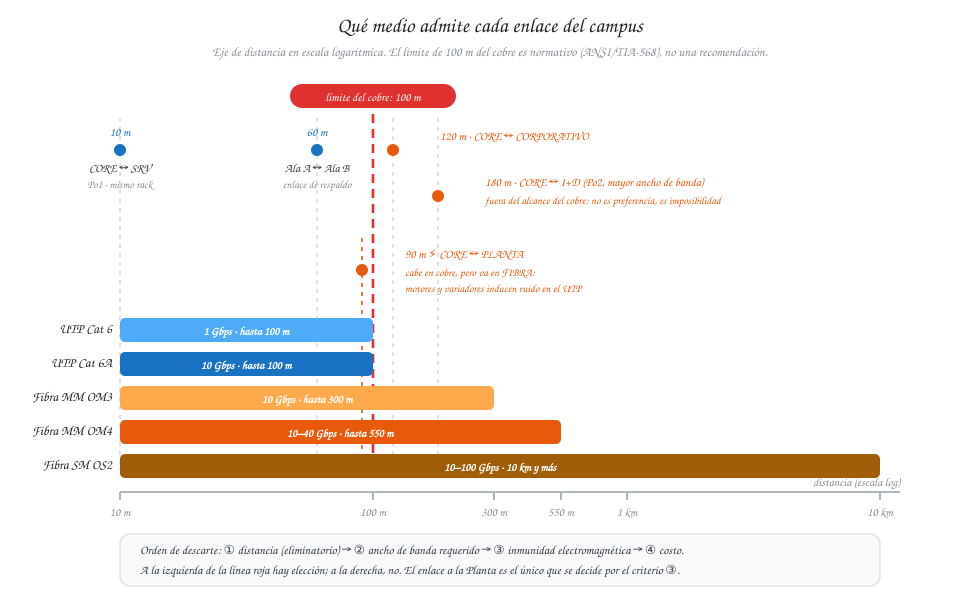

**Figura 10 — El límite de 100 m del cobre decide qué enlaces del campus van en fibra.**
<!-- EXCALIDRAW F10: eje horizontal de distancia (0 → 10 km) con las barras de UTP Cat 6/6A cortadas en 100 m, OM3/OM4 hasta 550 m y OS2 hasta 10 km. Encima, siluetas de los cuatro edificios con las distancias asumidas entre ellos, para que se vea cuáles caen fuera del alcance del cobre. Marcar el ícono de interferencia electromagnética sobre la Planta de Producción. -->

## 9. Seguridad básica en Capa 2

### 9.1 Superficie de ataque de un switch

Un switch recién sacado de la caja funciona: conecta equipos y conmuta tramas sin que nadie lo
configure. Ese comportamiento cómodo es precisamente el problema — **las opciones por defecto están
elegidas para que la red funcione, no para que sea segura**. Cuatro consecuencias concretas:

| Debilidad por defecto | Qué permite |
|---|---|
| **VLAN nativa = VLAN 1**, y todos los puertos de acceso también en la VLAN 1 | **VLAN hopping por doble etiquetado**: inyectar tráfico en una VLAN protegida desde un puerto de acceso corriente (§4.3) |
| **Tabla CAM de tamaño finito y aprendizaje ilimitado por puerto** | **MAC flooding**: llenar la tabla con MAC falsas para que el switch, al no encontrar el destino, **inunde todo por todos los puertos** y el atacante lea tráfico ajeno |
| **Sin límite de tráfico de difusión por puerto** | **Tormenta de broadcast**: una NIC defectuosa o un bucle accidental saturan el dominio entero (§6.1, §21.1) |
| **Puertos en modo dinámico, con DTP activo** | **Switch spoofing**: un atacante negocia un trunk desde un puerto de acceso corriente y recibe el tráfico de **todas** las VLANs permitidas (§4.2) |
| **Sin aviso legal en el acceso** | Un acceso no autorizado a la consola no encuentra advertencia alguna, lo que debilita la posición legal ante un incidente |

Los tres primeros merecen desarrollo. Los dos primeros son los que ilustran las figuras; el tercero
es el más fácil de ejecutar de todos y por eso se trata aquí con el mismo detalle.

**VLAN hopping por doble etiquetado.** El atacante, conectado a un puerto de acceso que está en la
misma VLAN que la nativa del trunk, construye una trama con **dos** etiquetas 802.1Q: la externa con
el ID de la VLAN nativa y la interna con la VLAN que quiere alcanzar (por ejemplo la 44, de
servidores). El primer switch quita la etiqueta externa —porque coincide con la nativa y la nativa
no se etiqueta— y reenvía por el trunk una trama que **todavía lleva la etiqueta interna**. El
segundo switch lee esa etiqueta y entrega la trama dentro de la VLAN 44. El ataque es
**unidireccional** (no hay camino de vuelta), pero basta para inyectar tráfico donde no se debería.
Se cierra con dos medidas combinadas: nativa distinta de la 1 **y** sin ningún puerto de acceso en
ella. Este diseño aplica ambas con la VLAN 94 (§16).

**MAC flooding.** El switch aprende direcciones MAC de origen y las guarda en su tabla CAM, que tiene
un tamaño finito. Si un atacante genera miles de tramas con MAC de origen inventadas, la tabla se
llena; a partir de ahí el switch ya no puede aprender direcciones legítimas y, al no encontrar el
destino de una trama unicast, **la inunda por todos los puertos de la VLAN**. El switch queda
funcionando, de hecho, como un hub: el atacante ve el tráfico de sus vecinos. La contramedida es
`port-security`, que limita cuántas MAC puede aprender cada puerto.

**Switch spoofing por DTP.** Es el más simple de los tres y no requiere fabricar tramas: basta con
que el puerto de acceso haya quedado en modo **dinámico** (§4.2). El atacante conecta un equipo que
hable DTP —un switch propio, o un PC con software que emule el protocolo—, propone formar un trunk,
y el switch víctima **acepta**. A partir de ese momento el atacante no está en una VLAN: está en
**todas** las que el trunk permita, y recibe su tráfico etiquetado.

Compárese con el doble etiquetado, porque la diferencia es la que justifica tratar los dos por
separado:

| | **VLAN hopping (doble tag)** | **Switch spoofing (DTP)** |
|---|---|---|
| Qué necesita el atacante | Fabricar una trama con dos etiquetas | Sólo hablar DTP |
| Alcance | **Una** VLAN de destino, elegida | **Todas** las VLANs permitidas en el trunk |
| Dirección | **Unidireccional**: no hay camino de vuelta | **Bidireccional**: es un trunk de verdad |
| Contramedida | Nativa fuera de la VLAN 1 **y** sin puertos de acceso en ella | `switchport mode access` fijo **y** `switchport nonegotiate` en los trunks |

Que el segundo sea más grave y más fácil, y aun así se mencione menos, es la razón de documentarlo
aquí. La contramedida no cuesta nada: **fijar el modo de todos los puertos explícitamente**. Un
puerto que nunca negocia no puede ser convencido de convertirse en trunk.

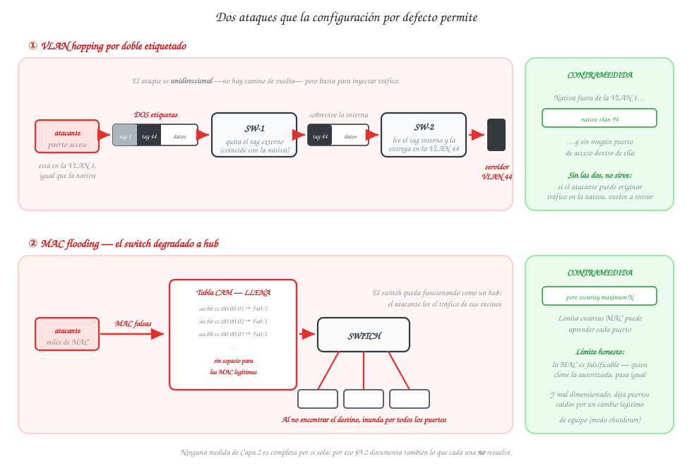

**Figura 11 — Dos ataques que la configuración por defecto permite.**
<!-- EXCALIDRAW F11: dos escenas. Arriba, VLAN hopping: atacante en la VLAN nativa envía una trama con dos tags (94 + 44); el primer switch quita el externo y el segundo la entrega en la VLAN 44 → flecha roja hasta el servidor. Abajo, MAC flooding: atacante generando MACs falsas hasta llenar la tabla CAM, y el switch inundando todo por todos los puertos. Al lado de cada una, la contramedida: "nativa 94 sin puertos access" y "port-security". -->

### 9.2 Medidas aplicables y qué mitiga cada una

La columna de la derecha es la que hace honesta esta tabla: **ninguna de estas medidas es una
solución completa**, y decir explícitamente qué deja fuera cada una vale más que enumerar features.

| Medida | Comando base | Qué ataque o falla mitiga | Qué NO resuelve |
|---|---|---|---|
| Banner MOTD | `banner motd` | Acceso sin aviso legal | **No impide el acceso**: es disuasorio y legal, no técnico |
| **Modo de puerto fijado a mano** | `switchport mode access` / `switchport mode trunk` | **Switch spoofing por DTP**: un puerto fijo no se deja convencer de volverse trunk | No protege contra un atacante que suplante a un equipo ya autorizado |
| **DTP apagado en los trunks** | `switchport nonegotiate` | Que el switch emita tramas DTP que revelen información o permitan negociación | Nada si el modo del puerto quedó dinámico: las dos medidas van juntas |
| VLAN nativa distinta de la 1 | `switchport trunk native vlan 94` | VLAN hopping por doble etiquetado | No sirve sola: hay que dejar además la nativa **sin puertos de acceso**. Y debe coincidir en ambos extremos, o produce bucles de STP (§4.3) |
| VLANs permitidas en el trunk | `switchport trunk allowed vlan` | Propagación innecesaria de broadcast; limita el alcance de un trunk comprometido | No cifra ni autentica el tráfico de las VLANs que **sí** permite |
| `port-security` | `switchport port-security` | MAC flooding, conexión de equipos no autorizados | La MAC es **falsificable**: un atacante que clone la MAC autorizada pasa igual. Y mal dimensionado deja puertos caídos por un cambio legítimo de equipo |
| `storm-control` | `storm-control broadcast level` | Tormentas de broadcast, incluidas las del segmento Legacy | **La colisión del hub** (§21): descarta el exceso de difusión, pero no convierte el medio compartido en conmutado |

Dos precisiones sobre `port-security`, porque es la medida que más se configura mal:

- El **modo de violación** decide qué pasa al detectar una MAC no autorizada. `shutdown` (por
  defecto) deja el puerto en *err-disabled* y exige intervención manual; `restrict` descarta y
  registra; `protect` sólo descarta. En un entorno industrial donde una parada no programada cuesta
  producción, `restrict` suele ser la elección razonable — y esa decisión hay que justificarla, no
  heredarla (§21.2).
- `switchport port-security mac-address sticky` hace que el switch aprenda y fije las MAC presentes
  en lugar de teclearlas una por una. Es cómodo, pero fija lo que haya conectado **en ese momento**:
  si se activa con un equipo intruso ya presente, lo autoriza.

### 9.3 Puertos no utilizados

Un puerto de switch sin configurar y sin cable no es inofensivo: está **administrativamente activo**
y, por defecto, en la **VLAN 1**. Cualquiera que enchufe un cable en él obtiene conectividad de Capa
2 inmediata, sin autenticación de ningún tipo. En un campus con áreas de acceso público —las Áreas
Comunes de este proyecto, por ejemplo— es una puerta abierta literal.

La buena práctica tiene dos partes, y conviene aplicar las dos:

| Medida | Comando | Por qué |
|---|---|---|
| **Apagado administrativo** | `shutdown` sobre el rango de puertos libres | Un cable enchufado no levanta el enlace |
| **Confinamiento a una VLAN muerta** | `switchport access vlan 999` (una VLAN creada sin ningún otro puerto ni salida) | Defensa en profundidad: si alguien reactiva el puerto, queda en una VLAN que no lleva a ninguna parte |

**Qué exige el enunciado y qué es valor agregado.** El enunciado pide explícitamente el banner MOTD
en los switches de distribución, la VLAN nativa 94 y las medidas de contención del segmento Legacy.
El apagado de puertos no utilizados **no** está entre los requisitos: se aplica en este diseño como
buena práctica documentada y se declara como tal, para no presentarlo como cumplimiento de algo que
no se pidió. Lo mismo vale para la VLAN 999 de confinamiento, que no forma parte del esquema por
carné y por eso se elige un ID fuera del rango 14–94 para que no se confunda con él.

---

# Parte II — Marco Práctico

## 10. Parámetros de diseño derivados del carné

Carné **201905884**: penúltimo dígito **8**, último dígito **4** (par).

| Parámetro | Regla del enunciado | Valor aplicado |
|---|---|---|
| VLANs | `1X` … `5X` con X = 4 | 14, 24, 34, 44, 54 |
| VLAN nativa de los trunks | `9X` | **94** |
| Dominio VTP | `Smart_#` | **Smart_8** |
| Contraseña VTP | fija | `proyecto12S2026` |
| EtherChannel | LACP si par | **LACP** |
| Spanning Tree | PVST si par | **PVST+** (`spanning-tree mode pvst`) |
| Banner MOTD (distribución) | `Acceso Restringido - TechPark_[Carné]` | `Acceso Restringido - TechPark_201905884` |
| Archivo | `Proyecto1_#carnet.pkt` | `Proyecto1_201905884.pkt` |

## 11. Topología general

El rediseño sustituye el bloque plano de switches (§2) por una **jerarquía de tres niveles**, que es
el modelo de campus que Cisco documenta y el que el enunciado describe en su §4.2. Cada nivel tiene
una responsabilidad distinta, y esa separación es la que permite que un cambio en un edificio no
obligue a tocar el resto.

| Nivel | Quién lo forma | Qué hace | Qué **no** hace |
|---|---|---|---|
| **Núcleo (Core)** | SW-CORE | Conmuta entre edificios a la mayor velocidad posible; concentra los cuatro enlaces troncales del campus; es el **VTP Server** del dominio `Smart_8` | No conecta equipos finales: ni una sola PC cuelga del Core |
| **Distribución** | SW-DIST-ID, SW-DIST-CORP | Agrega los switches de acceso de su edificio y le presenta al Core **un solo** enlace; aplica el banner MOTD y las políticas de VLAN del edificio | No conecta equipos finales (salvo el caso documentado de la Planta) |
| **Acceso** | SW-SRV, SW-ID-1/2/3, SW-ALA-A, SW-ALA-B, SW-COMUNES, SW-PLANTA | Conecta PCs, servidores, el AP y el hub Legacy; aquí viven **todos** los puertos en modo access y las medidas de `port-security` | No toma decisiones de agregación ni administra VLANs (son VTP Client) |

**Una excepción documentada.** La Planta de Producción no tiene switch de distribución propio:
SW-PLANTA cuelga directamente del Core. Es una decisión deliberada y no un olvido — la Planta tiene
un solo switch de acceso y un único segmento (VLAN 34), de modo que un nivel de distribución
intermedio no agregaría nada y sí añadiría un punto de falla y costo. La jerarquía se aplica donde
aporta, no como formalidad.

**Dónde está la redundancia.** El campus tiene exactamente tres zonas con camino alterno, y cada una
responde a un requisito explícito del enunciado:

| Zona | Forma de la redundancia | Qué la protege | Requisito |
|---|---|---|---|
| Core ↔ granja de servidores | **EtherChannel Po1** (2 enlaces) | Capacidad + caída de un miembro sin reconvergencia | «enlace de alto tráfico redundante» |
| Core ↔ Centro de I+D | **EtherChannel Po2** (2 enlaces, fibra OM4) | Ídem, y es el trunk de mayor ancho de banda | «trunk de mayor ancho de banda del campus» |
| Anillo de I+D · triángulo del Corporativo | **STP/PVST+** bloqueando el enlace sobrante | Caída de un switch o de un uplink | «la caída de uno no aísla a los demás» · «conectividad entre alas» |

Las dos primeras zonas se resuelven con agregación (§7): los enlaces trabajan **a la vez**. La
tercera se resuelve con Spanning Tree (§6): el enlace alterno está **bloqueado** hasta que hace
falta. Distinguir los dos mecanismos —y no llamar «redundancia» a ambos sin más— es parte de lo que
el manual debe demostrar.


**Figura 12 — Topología completa en Packet Tracer.**

<!-- PENDIENTE L2: tomar la captura con los medios etiquetados y escribir aquí dos líneas de lectura:
     los tres niveles visibles, los dos canales agregados y las cuatro áreas. -->

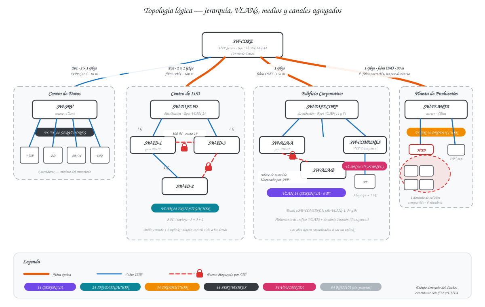

**Figura 13 — Topología lógica: jerarquía, VLANs por área y canales agregados.**
<!-- EXCALIDRAW F13: redibujo limpio de la F12 (la captura de Packet Tracer se lee mal impresa). Tres niveles marcados con bandas horizontales: Core, distribución, acceso. Cada enlace con su medio (fibra en naranja, UTP en azul) y su velocidad. Po1 y Po2 como cápsulas. Cada bloque de acceso rotulado con su VLAN. -->

### 11.1 Inventario de dispositivos

> **Borrador de la lección 1.** Las columnas *Modelo* y *Puertos activos* son el dimensionamiento
> previsto; se confirman contra el `.pkt` al cerrar la lección 2 y las discrepancias se corrigen aquí.

#### Switches

| Hostname | Modelo (PT) | Área | Rol | Modo VTP | Puertos activos previstos |
|---|---|---|---|---|---|
| SW-CORE | Switch-PT modular | Centro de Datos | Core / VTP Server | **Server** | 6 (2 Po1 + 2 Po2 + 2 trunks) |
| SW-SRV | 2960-24TT | Centro de Datos | Acceso granja de servidores | Client | 6 (2 Po1 + 4 servidores) |
| SW-DIST-ID | Switch-PT modular | Centro de I+D | Distribución | Client | 4 (2 Po2 + 2 al anillo) |
| SW-ID-1 | 2960-24TT | Centro de I+D | Acceso (anillo) | Client | 6 (1 uplink + 2 anillo + 3 PC) |
| SW-ID-2 | 2960-24TT | Centro de I+D | Acceso (anillo) | Client | 5 (2 anillo + 3 PC) |
| SW-ID-3 | 2960-24TT | Centro de I+D | Acceso (anillo) | Client | 5 (1 uplink + 2 anillo + 2 PC) |
| SW-DIST-CORP | Switch-PT modular | Edificio Corporativo | Distribución | Client | 4 (1 uplink + 3 acceso) |
| SW-ALA-A | 2960-24TT | Edificio Corporativo | Acceso Ala A | Client | 5 (1 uplink + 1 a Ala B + 3 PC) |
| SW-ALA-B | 2960-24TT | Edificio Corporativo | Acceso Ala B | Client | 5 (1 uplink + 1 a Ala A + 3 PC) |
| SW-COMUNES | 2960-24TT | Edificio Corporativo | Acceso visitantes | **Transparent** | 3 (1 uplink + 1 AP + 1 PC) |
| SW-PLANTA | Switch-PT modular | Planta de Producción | Acceso Legacy | Client | 4 (1 uplink + 1 hub + 2 PC) |

**Por qué cuatro chasis modulares.** El `2960-24TT` de Packet Tracer sólo ofrece puertos de cobre
(24 FastEthernet + 2 GigabitEthernet), y los enlaces entre edificios exigen fibra (§20). Los cuatro
switches que terminan un enlace de fibra —SW-CORE y los tres distribuidores/acceso de edificio—
van en chasis modular con módulos de fibra; el resto, en `2960-24TT`. SW-CORE necesita además
**seis** puertos de alta velocidad simultáneos (dos para Po1, dos para Po2 y dos trunks), por encima
de los dos GigabitEthernet de un `3560-24PS`, lo que refuerza la elección del chasis modular.

<!-- PENDIENTE L2: verificar en Packet Tracer que el chasis modular acepta `channel-group ... mode active`
     sobre los módulos de fibra. Si no lo soporta, Po2 se degrada a enlace de fibra simple y la
     redundancia del trunk de I+D se replantea. Es el riesgo técnico abierto de la lección 1. -->

#### Dispositivos finales y de medio compartido

| Dispositivo | Modelo (PT) | Cantidad | Área | VLAN | Nota |
|---|---|---|---|---|---|
| Servidores (Web, BD, Archivos, DNS) | Server-PT | 4 | Centro de Datos | 44 | Mínimo exigido por el enunciado |
| PC de investigación | PC-PT / Laptop-PT | 8 | Centro de I+D | 24 | Mínimo exigido por el enunciado |
| PC administrativas | PC-PT | 6 | Edificio Corporativo | 14 | 3 en Ala A, 3 en Ala B |
| HUB-LEGACY | Hub-PT | 1 | Planta de Producción | 34 | 4 máquinas + 1 uplink: **1 dominio de colisión compartido** (§15, §21) |
| Máquinas industriales | PC-PT | 4 | Planta de Producción | 34 | Cuelgan del hub |
| PC de supervisión de planta | PC-PT | 2 | Planta de Producción | 34 | Directas al switch, fuera del hub |
| AP-VISITANTES | AccessPoint-PT | 1 | Edificio Corporativo | 54 | Medio inalámbrico compartido (CSMA/CA) |
| Laptops de visitantes | Laptop-PT | 3 | Edificio Corporativo | 54 | Asociadas al AP |
| PC cableada de visitantes | PC-PT | 1 | Edificio Corporativo | 54 | En Áreas Comunes |

**Totales previstos:** 11 switches · 1 hub · 1 AP · 4 servidores · 24 equipos finales.

## 12. Diseño por área

Cada subsección sigue la misma estructura: captura del área → tabla *requisito del enunciado →
cómo se resolvió → justificación* → párrafo de lectura. Las cuatro capturas (F14–F17) están
pendientes del `.pkt`.

### 12.1 Centro de Datos (Core)


**Figura 14 — Centro de Datos.**

| Requisito del enunciado | Cómo se resolvió | Justificación (§) |
|---|---|---|
| VTP Server del dominio | **SW-CORE** en `vtp mode server`, dominio `Smart_8`, contraseña `proyecto12S2026` | §5.2 — es el punto por el que pasan los cuatro trunks del campus: un anuncio suyo alcanza los tres edificios en un salto, y ningún otro switch tiene esa posición |
| Trunks hacia los 3 edificios | Tres enlaces troncales desde SW-CORE: **Po2** (fibra OM4) al Centro de I+D, fibra OM3 al Edificio Corporativo y fibra OM3 a la Planta | §4.2, §8 — los tres exceden o rozan el límite del cobre (§20) |
| Granja de ≥ 4 servidores con enlace redundante de alto tráfico | **4 servidores** (Web, BD, Archivos, DNS) en VLAN 44 sobre SW-SRV, unido al Core por **Po1: EtherChannel LACP de 2 × 1 Gbps** | §7.1 — la agregación da capacidad **y** tolerancia a fallos sin reconvergencia de STP: si cae un miembro, el canal sigue arriba con 1 Gbps |

**Lectura del área.** El Core no tiene un solo equipo final conectado, y ésa es la señal de que la
jerarquía se respetó (§11). Los cuatro servidores no cuelgan del Core sino de un switch de acceso
dedicado, SW-SRV, lo que permite que el enlace entre ambos sea un canal agregado y no cuatro cables
sueltos. SW-CORE es además el **Root Bridge de las VLANs 34 y 44** y raíz secundaria de las demás
(§18).

### 12.2 Centro de I+D


**Figura 15 — Centro de I+D.**

| Requisito del enunciado | Cómo se resolvió | Justificación (§) |
|---|---|---|
| ≥ 3 switches interconectados; la caída de uno no aísla a los demás | **Anillo cerrado** SW-ID-1 ↔ SW-ID-2 ↔ SW-ID-3 ↔ SW-ID-1, **más dos uplinks** a SW-DIST-ID (desde ID-1 y desde ID-3) | §6.1 — el anillo solo no basta: con un único uplink, la caída de ese switch aislaría a los otros dos del Core. Con dos salidas, ningún switch es punto único de falla. STP bloquea el enlace sobrante y lo libera cuando hace falta |
| Trunk al Core de mayor ancho de banda del campus | **Po2**: EtherChannel LACP de **2 × 1 Gbps sobre fibra OM4** = 2 Gbps agregados. Ningún otro enlace del campus lo iguala | §7.1, §8 — la fibra es obligatoria por los 180 m (§20) y la agregación es lo que lo convierte en el de mayor capacidad |
| ≥ 8 PCs/laptops | **8 equipos**: 3 en SW-ID-1, 3 en SW-ID-2, 2 en SW-ID-3, todos en VLAN 24 | — |

**Lectura del área.** El anillo se cierra con el enlace SW-ID-1 ↔ SW-ID-3 sobre **FastEthernet
(100 Mbps)**, mientras los otros dos lados del anillo y los dos uplinks van sobre GigabitEthernet.
No es una limitación aceptada a regañadientes: el `2960-24TT` tiene sólo dos puertos Gigabit, y poner
el enlace más lento justo en la *cuerda* del anillo hace que su **costo STP sea 19 frente a 4**
(§6.2), de modo que es el candidato natural a quedar bloqueado. El resultado es predecible y
explicable en lugar de depender de qué MAC salió más baja. SW-DIST-ID es el **Root Bridge de la
VLAN 24** (§18).

### 12.3 Edificio Corporativo


**Figura 16 — Edificio Corporativo.**

| Requisito del enunciado | Cómo se resolvió | Justificación (§) |
|---|---|---|
| Dos alas, cada una con su switch de acceso | **SW-ALA-A** y **SW-ALA-B**, 3 PC de gerencia cada uno en VLAN 14, colgando de SW-DIST-CORP | — |
| Conectividad entre alas que sobreviva a la caída de la ruta al distribuidor | **Enlace directo SW-ALA-A ↔ SW-ALA-B**, que cierra un triángulo con el distribuidor. En operación normal STP lo mantiene **bloqueado**; si cae un uplink, pasa a Forwarding y las alas siguen comunicadas | §6.1, §6.2 — el Root Bridge de la VLAN 14 se fija en **SW-DIST-CORP** precisamente para que el puerto bloqueado caiga en el enlace directo y no en un uplink. Véase §18 |
| Áreas Comunes: aislamiento de tráfico y de administración de VLANs | **SW-COMUNES** en **VLAN 54** (aislamiento de tráfico), en **VTP Transparent** (aislamiento de administración) y con el trunk restringido a `allowed vlan 1,54,94` | §4.1, §5.2 — son tres medidas que atacan tres cosas distintas: la VLAN separa el broadcast, el modo Transparent impide que el switch conozca siquiera las otras VLANs, y la lista `allowed` impide que el trunk las transporte |
| Access Point para laptops de visitantes | **AP-VISITANTES** en un puerto access de la VLAN 54, con 3 laptops asociadas | — |

**Lectura del área.** Éste es el edificio donde se ven las dos formas de redundancia en contraste
(§11): el triángulo se resuelve con STP —un enlace activo, uno bloqueado— y no con agregación,
porque lo que se busca aquí es un **camino alterno**, no más capacidad. El precio es el tiempo de
convergencia: la recuperación tarda del orden de **30 segundos** con PVST+ (§6.2), y ése es el
número que hay que medir y contrastar en §24.2.

Sobre el aislamiento de visitantes hay un matiz que conviene declarar: es **de Capa 2**. Impide que
un visitante alcance las VLANs internas, pero este proyecto no incluye Capa 3, así que no hay
filtrado por ACL ni control de lo que un visitante haga **dentro** de la VLAN 54, donde sí ve a los
otros visitantes. Documentarlo es más honesto que presentar el aislamiento como total.

### 12.4 Planta de Producción


**Figura 17 — Planta de Producción.**

| Requisito del enunciado | Cómo se resolvió | Justificación (§) |
|---|---|---|
| Hub con las máquinas industriales sobre un switch de acceso | **HUB-LEGACY** con 4 máquinas industriales, conectado a **un único puerto access** de SW-PLANTA en VLAN 34 | §3.1 — un solo puerto mantiene el dominio de colisión confinado a ese segmento; repartir el hub en varios puertos no lo dividiría, sólo crearía un bucle |
| Dominio de colisión compartido visible y documentado | El hub y sus 4 máquinas forman **1 dominio de colisión de 6 miembros**, contabilizado una sola vez en §15 y dibujado en la F1 y la F2 | §21.1 |
| Medidas de contención en el switch | En el puerto del hub: `storm-control broadcast level 20`, `switchport port-security maximum 5` con violación en modo `restrict`, y confinamiento a la VLAN 34. En el trunk al Core: `allowed vlan 1,34,94` | §9.2, §21.2 — cada una ataca algo distinto, y ninguna elimina la colisión: eso sólo se lograría quitando el hub |

**Lectura del área.** La Planta es la única parte del campus donde queda tecnología de medio
compartido, y está ahí por exigencia del enunciado: representa la maquinaria Legacy que no se puede
sustituir. El diseño no la esconde, la **acota**. Las dos PC de supervisión se conectan
directamente a SW-PLANTA y no al hub, de modo que el personal que opera la planta no comparte el
medio degradado con las máquinas.

Nótese que SW-PLANTA cuelga del Core sin switch de distribución intermedio (§11), y que su enlace va
en **fibra pese a medir 90 m** — el único enlace del campus cuyo medio no lo decide la distancia sino
la interferencia electromagnética del entorno industrial (§20).

## 13. Tabla de VLANs

Los identificadores salen del carné **201905884** (último dígito 4) y **no son negociables**: el
enunciado penaliza del −50 % al −100 % un ID mal puesto (§10).

| VLAN ID | Nombre | Ubicación física | Dispositivos finales | Switches que la transportan |
|---|---|---|---|---|
| **14** | `GERENCIA` | Edificio Corporativo (Ala A y Ala B) | 6 PC administrativas (3 + 3) | SW-ALA-A, SW-ALA-B, SW-DIST-CORP, SW-CORE |
| **24** | `INVESTIGACION` | Centro de I+D | 8 PC/laptops (3 + 3 + 2) | SW-ID-1/2/3, SW-DIST-ID, SW-CORE |
| **34** | `PRODUCCION` | Planta de Producción | 4 máquinas vía hub + 2 PC de supervisión | SW-PLANTA, SW-CORE |
| **44** | `SERVIDORES` | Centro de Datos | 4 servidores (Web, BD, Archivos, DNS) | SW-SRV, SW-CORE |
| **54** | `VISITANTES` | Edificio Corporativo (Áreas Comunes) | 3 laptops vía AP + 1 PC cableada | SW-COMUNES, SW-DIST-CORP |
| **94** | `NATIVA` | Todos los trunks | **Ninguno, a propósito** | Todos |
| *999* | `SIN-USO` | — | Ninguno | Todos (puertos apagados) |

**Sobre los nombres en mayúsculas.** El enunciado es ambiguo: la tabla de parámetros los escribe
como `Gerencia`, pero el ejemplo dice «exactamente `GERENCIA`». Ante la duda se adopta la forma
**en mayúsculas**, que es la que el ejemplo declara literal, y además es la convención habitual de
Cisco. Queda registrado como duda abierta para el tutor.

**Las dos VLANs sin usuarios.** La **94** es la nativa de todos los trunks y se deja deliberadamente
sin ningún puerto de acceso: es lo que cierra el vector de VLAN hopping (§4.3, §9.1). La **999** es
una VLAN muerta donde se confinan los puertos no utilizados, además de apagarlos (§9.3); su ID se
elige fuera del rango 14–94 para que no se confunda con el esquema del carné. La 999 **no** es
requisito del enunciado: se documenta como buena práctica añadida.

## 14. Asignación de puertos por switch

> **Nota sobre la numeración de interfaces.** Los switches `2960-24TT` tienen `Fa0/1–Fa0/24` y
> `Gi0/1–Gi0/2`, así que sus nombres de interfaz son exactos. En los cuatro **chasis modulares**
> (SW-CORE, SW-DIST-ID, SW-DIST-CORP, SW-PLANTA) el nombre depende de la ranura en que se instale
> cada módulo, de modo que la notación `Gi1/1`, `Gi2/1`… es la **prevista**: se confirma contra el
> `.pkt` al armar la topología y se corrige aquí si difiere. Los **roles** de cada puerto, que es lo
> que importa para la calificación, sí son definitivos.

**Convención de las listas `allowed vlan`.** Cada trunk transporta sólo las VLANs que necesita
(§9.2). La VLAN 1 se mantiene en todas las listas porque es la VLAN de gestión sobre la que viajan
CDP, DTP y los anuncios VTP; **no** tiene ningún puerto de acceso asignado, así que no transporta
tráfico de usuario. Es una elección conservadora para el simulador: en IOS real el tráfico de
control sigue circulando aunque se retire la VLAN 1 de la lista.

### 14.1 SW-CORE — Core · VTP Server · Root de las VLANs 34 y 44

| Puerto | Modo | VLAN(s) | Conecta a | Medio |
|---|---|---|---|---|
| Gi1/1, Gi1/2 | trunk — miembros de **Po1** | `allowed 1,44,94` · nativa 94 | SW-SRV | UTP Cat 6, 10 m |
| Gi2/1, Gi2/2 | trunk — miembros de **Po2** | `allowed 1,24,94` · nativa 94 | SW-DIST-ID | Fibra OM4, 180 m |
| Gi3/1 | trunk | `allowed 1,14,54,94` · nativa 94 | SW-DIST-CORP | Fibra OM3, 120 m |
| Gi4/1 | trunk | `allowed 1,34,94` · nativa 94 | SW-PLANTA | Fibra OM3, 90 m |

### 14.2 SW-SRV — acceso a la granja de servidores

| Puerto | Modo | VLAN(s) | Conecta a | Medio |
|---|---|---|---|---|
| Gi0/1, Gi0/2 | trunk — miembros de **Po1** | `allowed 1,44,94` · nativa 94 | SW-CORE | UTP Cat 6, 10 m |
| Fa0/1 | access | 44 | SRV-WEB | UTP Cat 6 |
| Fa0/2 | access | 44 | SRV-BD | UTP Cat 6 |
| Fa0/3 | access | 44 | SRV-ARCHIVOS | UTP Cat 6 |
| Fa0/4 | access | 44 | SRV-DNS | UTP Cat 6 |
| Fa0/5 – Fa0/24 | access + `shutdown` | 999 | — | — |

### 14.3 SW-DIST-ID — distribución del Centro de I+D · Root de la VLAN 24

| Puerto | Modo | VLAN(s) | Conecta a | Medio |
|---|---|---|---|---|
| Gi1/1, Gi1/2 | trunk — miembros de **Po2** | `allowed 1,24,94` · nativa 94 | SW-CORE | Fibra OM4, 180 m |
| Gi2/1 | trunk | `allowed 1,24,94` · nativa 94 | SW-ID-1 | UTP Cat 6, < 100 m |
| Gi3/1 | trunk | `allowed 1,24,94` · nativa 94 | SW-ID-3 | UTP Cat 6, < 100 m |

### 14.4 SW-ID-1 — acceso I+D (raíz secundaria de la VLAN 24)

| Puerto | Modo | VLAN(s) | Conecta a | Medio |
|---|---|---|---|---|
| Gi0/1 | trunk | `allowed 1,24,94` · nativa 94 | SW-DIST-ID | UTP Cat 6, 1 Gbps |
| Gi0/2 | trunk | `allowed 1,24,94` · nativa 94 | SW-ID-2 | UTP Cat 6, 1 Gbps |
| Fa0/24 | trunk | `allowed 1,24,94` · nativa 94 | SW-ID-3 (cierre del anillo) | UTP Cat 6, **100 Mbps** |
| Fa0/1 – Fa0/3 | access | 24 | PC-ID-1, PC-ID-2, PC-ID-3 | UTP Cat 6 |
| Fa0/4 – Fa0/23 | access + `shutdown` | 999 | — | — |

### 14.5 SW-ID-2 — acceso I+D

| Puerto | Modo | VLAN(s) | Conecta a | Medio |
|---|---|---|---|---|
| Gi0/1 | trunk | `allowed 1,24,94` · nativa 94 | SW-ID-1 | UTP Cat 6, 1 Gbps |
| Gi0/2 | trunk | `allowed 1,24,94` · nativa 94 | SW-ID-3 | UTP Cat 6, 1 Gbps |
| Fa0/1 – Fa0/3 | access | 24 | PC-ID-4, PC-ID-5, PC-ID-6 | UTP Cat 6 |
| Fa0/4 – Fa0/24 | access + `shutdown` | 999 | — | — |

### 14.6 SW-ID-3 — acceso I+D

| Puerto | Modo | VLAN(s) | Conecta a | Medio |
|---|---|---|---|---|
| Gi0/1 | trunk | `allowed 1,24,94` · nativa 94 | SW-DIST-ID | UTP Cat 6, 1 Gbps |
| Gi0/2 | trunk | `allowed 1,24,94` · nativa 94 | SW-ID-2 | UTP Cat 6, 1 Gbps |
| Fa0/24 | trunk | `allowed 1,24,94` · nativa 94 | SW-ID-1 (cierre del anillo) | UTP Cat 6, **100 Mbps** |
| Fa0/1 – Fa0/2 | access | 24 | PC-ID-7, PC-ID-8 | UTP Cat 6 |
| Fa0/3 – Fa0/23 | access + `shutdown` | 999 | — | — |

### 14.7 SW-DIST-CORP — distribución del Corporativo · Root de las VLANs 14 y 54

| Puerto | Modo | VLAN(s) | Conecta a | Medio |
|---|---|---|---|---|
| Gi1/1 | trunk | `allowed 1,14,54,94` · nativa 94 | SW-CORE | Fibra OM3, 120 m |
| Gi2/1 | trunk | `allowed 1,14,94` · nativa 94 | SW-ALA-A | UTP Cat 6 |
| Gi3/1 | trunk | `allowed 1,14,94` · nativa 94 | SW-ALA-B | UTP Cat 6 |
| Gi4/1 | trunk | **`allowed 1,54,94`** · nativa 94 | SW-COMUNES | UTP Cat 6 |

### 14.8 SW-ALA-A — acceso Ala A (raíz secundaria de la VLAN 14)

| Puerto | Modo | VLAN(s) | Conecta a | Medio |
|---|---|---|---|---|
| Gi0/1 | trunk | `allowed 1,14,94` · nativa 94 | SW-DIST-CORP | UTP Cat 6 |
| Gi0/2 | trunk | `allowed 1,14,94` · nativa 94 | SW-ALA-B (enlace de respaldo) | UTP Cat 6, 60 m |
| Fa0/1 – Fa0/3 | access | 14 | PC-GER-1, PC-GER-2, PC-GER-3 | UTP Cat 6 |
| Fa0/4 – Fa0/24 | access + `shutdown` | 999 | — | — |

### 14.9 SW-ALA-B — acceso Ala B

| Puerto | Modo | VLAN(s) | Conecta a | Medio |
|---|---|---|---|---|
| Gi0/1 | trunk | `allowed 1,14,94` · nativa 94 | SW-DIST-CORP | UTP Cat 6 |
| Gi0/2 | trunk | `allowed 1,14,94` · nativa 94 | SW-ALA-A — **puerto bloqueado por STP** en operación normal | UTP Cat 6, 60 m |
| Fa0/1 – Fa0/3 | access | 14 | PC-GER-4, PC-GER-5, PC-GER-6 | UTP Cat 6 |
| Fa0/4 – Fa0/24 | access + `shutdown` | 999 | — | — |

### 14.10 SW-COMUNES — acceso visitantes · **VTP Transparent**

| Puerto | Modo | VLAN(s) | Conecta a | Medio |
|---|---|---|---|---|
| Gi0/1 | trunk | **`allowed 1,54,94`** · nativa 94 | SW-DIST-CORP | UTP Cat 6 |
| Fa0/1 | access | 54 | AP-VISITANTES | UTP Cat 6 |
| Fa0/2 | access | 54 | PC-VIS-1 (cableada) | UTP Cat 6 |
| Fa0/3 – Fa0/24 | access + `shutdown` | 999 | — | — |

### 14.11 SW-PLANTA — acceso Legacy

| Puerto | Modo | VLAN(s) | Conecta a | Medio |
|---|---|---|---|---|
| Gi1/1 | trunk | **`allowed 1,34,94`** · nativa 94 | SW-CORE | Fibra OM3, 90 m |
| Fa2/1 | access + `storm-control` + `port-security` | 34 | **HUB-LEGACY** (4 máquinas) | UTP Cat 6 |
| Fa2/2, Fa2/3 | access | 34 | PC-SUP-1, PC-SUP-2 | UTP Cat 6 |
| Puertos libres | access + `shutdown` | 999 | — | — |

**Resumen: 13 enlaces troncales** (15 puertos físicos, porque Po1 y Po2 agrupan dos cada uno) — Po1, Po2, Core ↔
Corporativo, Core ↔ Planta, DIST-ID ↔ ID-1, DIST-ID ↔ ID-3, ID-1 ↔ ID-2, ID-2 ↔ ID-3, ID-1 ↔ ID-3,
DIST-CORP ↔ ALA-A, DIST-CORP ↔ ALA-B, DIST-CORP ↔ COMUNES, ALA-A ↔ ALA-B. Todos con **nativa 94** y
lista `allowed` explícita.

## 15. Dominios de colisión de la red

Regla aplicada (§3.1): **un dominio de colisión por puerto de switch con cable conectado**. El hub y
todo lo que cuelga de él forman **un único** dominio compartido, que es el mismo que aportaría el
puerto de SW-PLANTA al que está conectado — por eso ese puerto se descuenta de la fila de SW-PLANTA
y se contabiliza una sola vez en la fila de HUB-LEGACY, para no duplicarlo.

> **Borrador de la lección 1.** Cifras previstas sobre el dimensionamiento de §11.1. Se verifican
> contra el `.pkt` al cerrar la lección 2.

| Dispositivo | Puertos activos | Dominios de colisión que genera | Observación |
|---|---|---|---|
| SW-CORE | 6 | **6** | Po1 y Po2 son 2 enlaces físicos cada uno: 2 dominios cada canal, aunque STP los vea como uno |
| SW-SRV | 6 | **6** | 2 del Po1 + 4 servidores, uno por servidor |
| SW-DIST-ID | 4 | **4** | 2 del Po2 + 2 bajadas al anillo |
| SW-ID-1 | 6 | **6** | 1 uplink + 2 del anillo + 3 PC |
| SW-ID-2 | 5 | **5** | 2 del anillo + 3 PC |
| SW-ID-3 | 5 | **5** | 1 uplink + 2 del anillo + 2 PC |
| SW-DIST-CORP | 4 | **4** | 1 uplink al Core + 3 bajadas de acceso |
| SW-ALA-A | 5 | **5** | Incluye el enlace directo al Ala B (bloqueado por STP, pero cableado) |
| SW-ALA-B | 5 | **5** | Ídem |
| SW-COMUNES | 3 | **3** | 1 uplink + 1 al AP + 1 PC cableada |
| SW-PLANTA | 4 | **3** | 1 uplink + 2 PC de supervisión. El 4.º puerto va al hub y su dominio se cuenta abajo |
| HUB-LEGACY | 4 máquinas + 1 uplink | **1 (compartido)** | Half-duplex, CSMA/CD, 6 miembros en un solo medio. Segmento Legacy, véase §21 |
| AP-VISITANTES | 3 laptops asociadas | **1 (compartido)** | Medio inalámbrico: CSMA/CA, también un dominio compartido |
| **Total** | | **54** | **53 cableados + 1 inalámbrico** |

**Lectura de la tabla.** Los 54 dominios se reparten de forma muy desigual: 52 de ellos son
punto a punto en full-duplex, donde la colisión es estructuralmente imposible y el dominio existe
sólo a efectos del conteo. Los dos que importan son los **compartidos**: el del hub, con seis
miembros en half-duplex disputándose el medio con CSMA/CD, y el del AP, con tres laptops bajo
CSMA/CA. Ése es el argumento del rediseño: la red conmutada no elimina el concepto de dominio de
colisión, lo **reduce a uno por enlace**, y deja aislado en un solo punto —la Planta— el único
segmento donde la colisión sigue siendo un fenómeno real y medible (§21.1).

Un detalle a defender: un EtherChannel de dos enlaces aporta **dos** dominios de colisión, no uno.
La agregación es una abstracción de Capa 2 (STP y la tabla MAC ven un solo puerto lógico), pero en
Capa 1 siguen siendo dos cables con dos segmentos eléctricos independientes — y es precisamente esa
independencia física la que da la tolerancia a fallos del §7.1.

## 16. Dominios de broadcast de la red

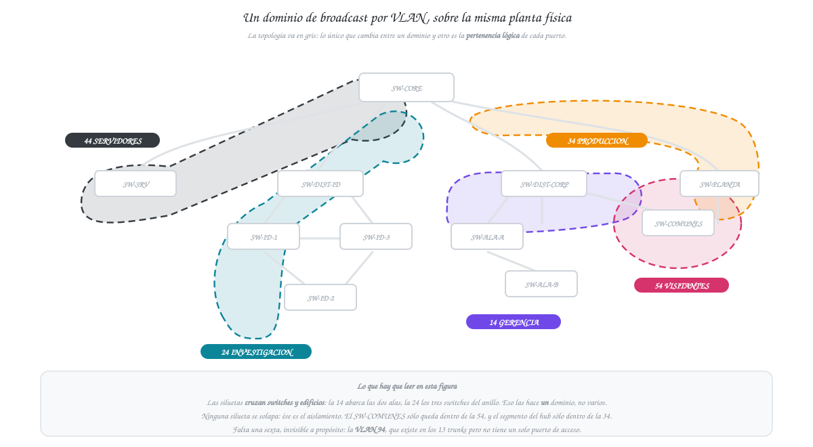

**Figura 18 — Cada VLAN es un dominio de broadcast independiente sobre la misma planta física.**
<!-- EXCALIDRAW F18: la topología lógica de la F13 en gris tenue de fondo, y encima cinco siluetas de color —14, 24, 34, 44, 54— que abarcan solo los puertos de su VLAN, cruzando edificios cuando corresponde. Es el mismo dibujo de la F3 aplicado al campus real. -->

Regla aplicada (§3.2): **un dominio de broadcast por VLAN activa**, sin importar cuántos switches la
transporten. Donde la red plana tenía **1** dominio para todo el campus, el diseño segmentado tiene
**5 dominios con usuarios**, más la VLAN nativa de control sin equipos asignados.

> **Borrador de la lección 1.** El alcance definitivo depende de la lista `allowed vlan` de cada
> trunk, que se fija en la lección 3 (§14) y se verifica con `show interfaces trunk` (E6).

| Dominio | VLAN | Alcance (quién está dentro) | Switches que la transportan |
|---|---|---|---|
| 1 | **14 GERENCIA** | 6 PC administrativas del Edificio Corporativo, repartidas 3 + 3 entre Ala A y Ala B | SW-ALA-A, SW-ALA-B, SW-DIST-CORP, SW-CORE |
| 2 | **24 INVESTIGACION** | 8 PC/laptops del Centro de I+D sobre los tres switches del anillo | SW-ID-1, SW-ID-2, SW-ID-3, SW-DIST-ID, SW-CORE |
| 3 | **34 PRODUCCION** | 4 máquinas industriales tras el hub + 2 PC de supervisión | SW-PLANTA, SW-CORE |
| 4 | **44 SERVIDORES** | 4 servidores de la granja (Web, BD, Archivos, DNS) | SW-SRV, SW-CORE |
| 5 | **54 VISITANTES** | 3 laptops por Wi-Fi + 1 PC cableada en Áreas Comunes | SW-COMUNES, SW-DIST-CORP |
| 6 | **94 (nativa)** | **Sin equipos asignados**: sólo transporta el tráfico no etiquetado de los trunks | Todos los trunks del campus |
| — | *(1 default)* | **Sin uso**: ningún puerto queda en la VLAN 1 | — |

**Tres puntos que esta tabla tiene que poder defender.**

**Un dominio puede cruzar switches y edificios.** La VLAN 14 vive en dos switches de acceso
distintos (Ala A y Ala B) y sigue siendo **un solo** dominio: el trunk que los une transporta la 14
y, por tanto, propaga su broadcast. Eso es un requisito, no un efecto colateral — es lo que permite
que las dos alas se comuniquen entre sí aunque caiga la ruta al distribuidor (§12.3). Lo mismo
ocurre con la 24 sobre los tres switches del anillo de I+D.

**El aislamiento de los visitantes es lógico, no físico.** La VLAN 54 no queda aislada por tener su
propio switch, sino por ser una VLAN distinta: SW-COMUNES inunda su broadcast sólo por los puertos
de la 54, y su trunk hacia SW-DIST-CORP permite exclusivamente las VLANs 54 y 94. Si un puerto de
Áreas Comunes se reasignara a la 14, el aislamiento se perdería sin haber tocado un solo cable. A
eso se suma el aislamiento **de administración**, que da el modo VTP Transparent (§5.2, §17).

**La VLAN 94 se cuenta, pero está vacía a propósito.** Es un dominio de broadcast técnicamente
existente —el tráfico no etiquetado de los trunks viaja en ella—, pero no tiene ningún puerto de
acceso asignado. Ésa es exactamente la buena práctica que exige el enunciado al fijar la nativa en
94: sacarla de la VLAN 1 por defecto y dejarla sin usuarios cierra el vector de *VLAN hopping* por
doble etiquetado (§9.1, §4.3).

## 17. VTP: servidor, modos y propagación

| Parámetro | Valor | Origen |
|---|---|---|
| Dominio VTP | **`Smart_8`** | Carné 201905884, penúltimo dígito 8 (§10) |
| Contraseña | **`proyecto12S2026`** | Fija por el enunciado |
| Versión | 2 | Necesaria para que el modo Transparent **reenvíe** los anuncios (§5.2) |

**Asignación de modos.**

| Modo | Switches | Por qué |
|---|---|---|
| **Server** | SW-CORE | Es el único punto por el que pasan los cuatro trunks del campus: un anuncio suyo llega a los tres edificios en un salto. Además el enunciado lo exige explícitamente para el Centro de Datos |
| **Client** | SW-SRV, SW-DIST-ID, SW-ID-1/2/3, SW-DIST-CORP, SW-ALA-A, SW-ALA-B, SW-PLANTA (9 switches) | No necesitan crear VLANs: las reciben. Reduce el riesgo de que una edición local desincronice el dominio |
| **Transparent** | **SW-COMUNES** | Aislamiento de administración de VLANs para las Áreas Comunes (§5.2, §12.3). Mantiene una base local con la 54 y la 94, y **no conoce** las VLANs 14, 24, 34 ni 44 |

**Procedimiento obligatorio antes de conectar cualquier switch.** Un switch con un número de
revisión más alto sobrescribe el dominio entero, aunque esté en modo Client (§5.3). Por eso, antes
de integrar cada equipo:

```
Switch(config)# vtp mode transparent     ! pone la revisión en 0
Switch(config)# vtp mode client
Switch# show vtp status                  ! verificar: Configuration Revision = 0
```

Este paso no es opcional ni «por si acaso»: es la única defensa real contra el escenario descrito en
§5.3, y es lo primero que se comprueba si las VLANs desaparecen del dominio.

**Qué debe mostrar la evidencia.**

| Evidencia | Comando | Dispositivo | Qué debe verse |
|---|---|---|---|
| **E1** | `show vtp status` | SW-CORE | `VTP Operating Mode: Server`, `VTP Domain Name: Smart_8`, `VTP Version: 2` |
| **E2** | `show vlan brief` | un switch Client (p. ej. SW-ALA-A) | Las VLANs 14, 24, 34, 44, 54 y 94 **presentes sin haberlas creado ahí** — ésa es la prueba de que VTP propagó |
| — | `show vtp status` | SW-COMUNES | `VTP Operating Mode: Transparent` y una base de VLANs que **no** incluye la 44 |

> **Pendiente.** Las capturas E1 y E2 se toman en Packet Tracer. Hasta entonces, esta sección
> describe la configuración prevista y el criterio de verificación, no un resultado medido.


## 18. STP: Root Bridge por VLAN

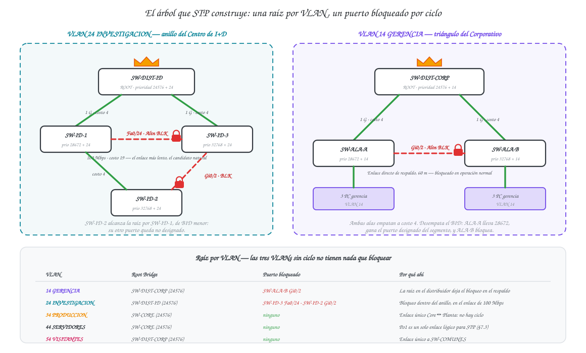

**Figura 19 — Root Bridge por VLAN y puertos bloqueados en el anillo de I+D y el triángulo de alas.**
<!-- EXCALIDRAW F19: la topología con los enlaces redundantes; corona sobre el switch raíz de cada VLAN (usar el color de la VLAN) y candado rojo sobre cada puerto en Blocking, con el nombre exacto de la interfaz. Debe coincidir con lo que muestren las evidencias E3 y E4. -->

**Modo:** `spanning-tree mode pvst` en los 11 switches — PVST+, asignado por carné par (§6.3). No es
el modo heredado por defecto: es un comando que debe aparecer en la configuración.

**El criterio que ordena toda la tabla.** El Root Bridge de cada VLAN se coloca **donde está la
redundancia de esa VLAN**, no en el switch más importante del campus. La razón es concreta: el
puerto que STP bloquea es el que queda más lejos de la raíz, así que situando la raíz en el
distribuidor del edificio se consigue que **el enlace bloqueado sea el de respaldo**, y no un
uplink que se usa a diario.

| VLAN | Root Bridge (prioridad) | Raíz secundaria (prioridad) | Justificación |
|---|---|---|---|
| **14** GERENCIA | **SW-DIST-CORP** (24576) | SW-ALA-A (28672) | Su redundancia es el triángulo distribuidor–Ala A–Ala B. Con la raíz en el distribuidor, ambos uplinks quedan en Forwarding y el puerto bloqueado cae en el **enlace directo Ala A ↔ Ala B**, que es exactamente el que debe actuar sólo como respaldo (§12.3). Poner la raíz en el Core habría dejado el bloqueo en un lugar arbitrario |
| **24** INVESTIGACION | **SW-DIST-ID** (24576) | SW-ID-1 (28672) | Su redundancia es el anillo de I+D. Con la raíz en el distribuidor, los dos uplinks quedan activos y el bloqueo cae dentro del anillo — preferentemente en el enlace de 100 Mbps, que tiene costo 19 frente a 4 (§12.2) |
| **34** PRODUCCION | **SW-CORE** (24576) | — | La VLAN 34 sólo existe en SW-PLANTA y SW-CORE, unidos por un enlace único: **no hay ciclo y no hay nada que bloquear**. La raíz se fija igualmente en el Core para que el resultado sea determinista y no dependa de qué MAC salió más baja |
| **44** SERVIDORES | **SW-CORE** (24576) | — | Igual que la 34: sólo SW-SRV y SW-CORE, y el enlace entre ambos es **Po1**, que STP ve como un único enlace lógico (§7.3). Sin ciclo, sin bloqueo |
| **54** VISITANTES | **SW-DIST-CORP** (24576) | — | Sólo SW-COMUNES y SW-DIST-CORP, enlace único. La raíz en el distribuidor mantiene la coherencia con la VLAN 14 del mismo edificio |

**Esto sustituye a la propuesta inicial.** Al arrancar el proyecto se había anotado «Root Bridge =
Core para las VLANs 14/34/44/54». Se descarta para las VLANs 14 y 54 por el criterio de arriba:
poner la raíz en el Core no produce un error, pero deja el puerto bloqueado del triángulo del
Corporativo determinado por las MAC en lugar de por el diseño, y puede bloquear un uplink en vez del
enlace de respaldo. La decisión se documenta con su cambio porque la justificación es lo que se
califica.

**Puertos que se espera ver bloqueados.** Para que el resultado no dependa del azar de las MAC, se
fijan prioridades secundarias que hacen determinista el desempate por Bridge ID (§6.2):

| VLAN | Puerto previsto en Blocking | Por qué |
|---|---|---|
| 14 | **SW-ALA-B Gi0/2** (hacia SW-ALA-A) | Ambas alas están a costo 4 de la raíz; empatan. Desempata el BID: SW-ALA-A lleva prioridad 28672 y SW-ALA-B la de defecto 32768, así que ALA-A gana el puerto designado del segmento y ALA-B bloquea |
| 24 | **SW-ID-3 Fa0/24** (cierre del anillo, 100 Mbps) y **SW-ID-2 Gi0/2** (hacia SW-ID-3) | SW-ID-1 lleva prioridad 28672: gana el designado del enlace de cierre, así que bloquea SW-ID-3. Y SW-ID-2 alcanza la raíz por SW-ID-1 (BID menor), de modo que su otro puerto queda no designado |

> **Pendiente de verificación.** Esta tabla es una **predicción** derivada del diseño, no una lectura
> del simulador. Se contrasta contra `show spanning-tree` (E3) y la vista del puerto bloqueado (E4);
> si el resultado difiere, se corrige **esta tabla** y se documenta la causa, no al revés.

## 19. EtherChannel implementados

**Protocolo:** LACP (IEEE 802.3ad), asignado por carné par (§10). Ambos extremos de ambos canales en
**`mode active`** — la combinación `active–active` forma el canal sin depender de quién arranque, a
diferencia de `passive–passive`, que no lo forma nunca (§7.2).

| Port-channel | Extremo A | Extremo B | Puertos miembros | Medio y capacidad | Protocolo | Propósito |
|---|---|---|---|---|---|---|
| **Po1** | SW-CORE | SW-SRV | `Gi1/1`, `Gi1/2` ↔ `Gi0/1`, `Gi0/2` | UTP Cat 6 · 2 × 1 Gbps = **2 Gbps** | LACP `active`/`active` | Enlace de alto tráfico redundante hacia la granja de servidores |
| **Po2** | SW-CORE | SW-DIST-ID | `Gi2/1`, `Gi2/2` ↔ `Gi1/1`, `Gi1/2` | Fibra OM4 · 2 × 1 Gbps = **2 Gbps** | LACP `active`/`active` | **Trunk de mayor ancho de banda del campus**, hacia el Centro de I+D |

Ambos canales se configuran como **trunk** con nativa 94 y lista `allowed` restringida (§14). Todos
los puertos miembros de un canal deben coincidir en velocidad, dúplex, modo, nativa y lista de VLANs
permitidas; una discrepancia deja el puerto fuera y se ve en la salida como un miembro que no llega
al estado `P` (§7.1).

**Por qué `active` y no `on`.** El modo `on` fuerza el canal sin negociar nada con el otro extremo.
Si el cableado está mal o el otro lado no tiene canal configurado, `on` produce directamente un
**bucle de Capa 2**; LACP, en cambio, simplemente no levanta el canal y deja que STP bloquee lo
sobrante. Es la diferencia entre fallar de forma segura y fallar de forma catastrófica (§7.3).

**Qué debe mostrar la evidencia E5** (`show etherchannel summary`):

```
Flags:  D - down        P - bundled in port-channel
        S - Layer2      U - in use
...
Group  Port-channel  Protocol    Ports
------+-------------+-----------+---------------------------
1      Po1(SU)          LACP      Gi1/1(P)   Gi1/2(P)
2      Po2(SU)          LACP      Gi2/1(P)   Gi2/2(P)
```

Las tres marcas que hay que leer: **`S`** (canal de Capa 2), **`U`** (*in use*, el canal está
operativo) y **`(P)`** en cada miembro (*bundled*, el puerto está efectivamente agrupado). Un
miembro en `(I)` —*stand-alone / independent*— significa que LACP no negoció y ese cable está
trabajando suelto.

> **Pendiente.** El bloque de arriba es el formato de salida esperado, no una transcripción del
> simulador. La salida real va en `capturas/evidencias/` y en §24.

## 20. Medios de transmisión por segmento

Cada fila aplica los cuatro criterios de §8 en su orden de descarte. Las distancias son **asumidas**
para el campus y se rotulan sobre cada enlace en el `.pkt`, como exige el enunciado.

> **Borrador de la lección 1.** Los medios quedan decididos aquí; el etiquetado en Packet Tracer y
> su captura se hacen en la lección 2.

| Enlace | Medio | Distancia asumida | Criterio que decide | Justificación |
|---|---|---|---|---|
| SW-CORE ↔ SW-DIST-ID (**Po2**, 2 enlaces) | **Fibra multimodo OM4**, 2 × 1 Gbps | **180 m** | 1 — Distancia | Excede el límite de 100 m del cobre: no es una preferencia, el enlace en UTP no funcionaría. Se elige OM4 sobre OM3 porque es el **trunk de mayor ancho de banda del campus** (requisito del enunciado) y deja margen para 10 Gbps sin retender fibra |
| SW-CORE ↔ SW-DIST-CORP | **Fibra multimodo OM3**, 1 Gbps | **120 m** | 1 — Distancia | También excede los 100 m. OM3 basta: el Edificio Corporativo agrega sólo tráfico ofimático de 6 PC y 4 clientes de visitantes |
| SW-CORE ↔ SW-PLANTA | **Fibra multimodo OM3**, 1 Gbps | **90 m** | 3 — Inmunidad EMI | **Está dentro del alcance del cobre y aun así va en fibra.** Los motores, variadores de frecuencia y equipos de soldadura de la Planta inducen ruido que degrada el UTP y provoca errores de trama. La fibra transporta luz: es inmune por construcción. Además aísla galvánicamente ambos edificios, eliminando lazos de tierra |
| SW-CORE ↔ SW-SRV (**Po1**, 2 enlaces) | **UTP Cat 6**, 2 × 1 Gbps | **10 m** (mismo rack) | 4 — Costo | Los tres primeros criterios empatan a favor del cobre: distancia mínima, 2 Gbps agregados suficientes para la granja y entorno de centro de datos sin EMI. Poner fibra aquí sería pagar transceptores sin ganancia |
| Uplinks a SW-DIST-ID y lados SW-ID-1 ↔ 2 ↔ 3 del anillo | **UTP Cat 6**, 1 Gbps | **< 100 m** | 1 y 4 | Dentro del mismo edificio y bajo el límite normativo; el cobre es lo apropiado |
| Cierre del anillo SW-ID-1 ↔ SW-ID-3 | **UTP Cat 6**, **100 Mbps** | **< 100 m** | — (restricción de puertos) | El `2960-24TT` sólo tiene 2 puertos Gigabit, ya ocupados por el uplink y un lado del anillo. Lejos de ser un compromiso a la fuerza, colocar el enlace lento en la *cuerda* del anillo le da **costo STP 19 frente a 4** y lo convierte en el candidato natural al bloqueo (§12.2, §18) |
| SW-ALA-A ↔ SW-ALA-B (enlace directo) | **UTP Cat 6**, 1 Gbps | **60 m** | 1 y 4 | Mismo edificio, distinta ala. Es el enlace de respaldo que sobrevive a la caída del distribuidor (§12.3); su medio no necesita ser distinto del resto |
| Bajadas de distribución a acceso (intraedificio) | **UTP Cat 6**, 1 Gbps | **< 100 m** | 1 y 4 | Cableado vertical dentro de un mismo edificio |
| Cableado horizontal a PC, servidores, AP y hub | **UTP Cat 6** | **< 90 m** | 4 — Costo | Cableado horizontal estándar; 90 m es el máximo normativo antes de los *patch cords* |

**El enlace que sostiene la justificación completa.** Si hubiera que defender una sola fila, sería la
de SW-CORE ↔ SW-PLANTA: es la única donde el criterio ganador **no** es la distancia. Los otros dos
enlaces de fibra se explican solos (180 m y 120 m están fuera del alcance del cobre y no hay
decisión que tomar), pero los 90 m hacia la Planta sí admitían UTP y se descartó por el criterio 3.
Demuestra que el medio se eligió aplicando los cuatro criterios de §8 y no por regla de pulgar.

<!-- PENDIENTE L2: rotular cada enlace en Packet Tracer con medio y distancia, y capturar la vista
     con las etiquetas visibles para esta sección. -->

**Presupuesto asociado:** los 3 enlaces de fibra requieren **8 transceptores/módulos** (2 extremos ×
1 enlace OM3 a Corporativo + 2 × 1 OM3 a Planta + 2 × 2 OM4 del Po2 = 2 + 2 + 4). Ese conteo
alimenta §26.

## 21. Segmento Legacy: impacto y contención

### 21.1 Impacto del dominio de colisión compartido

El segmento Legacy es el único punto del campus donde sobrevive un medio compartido: **HUB-LEGACY,
sus 4 máquinas industriales y el puerto `Fa2/1` de SW-PLANTA forman un solo dominio de colisión de 6
miembros** (§15). Las consecuencias son medibles y conviene enunciarlas sin suavizar.

| Impacto | Causa técnica | Efecto en la Planta |
|---|---|---|
| **Ancho de banda efectivo muy por debajo del nominal** | El medio es half-duplex y CSMA/CD obliga a escuchar antes de transmitir. El tiempo gastado en colisiones y en *backoff* exponencial es tiempo sin datos útiles | Los 100 Mbps nominales del segmento se reparten entre 4 máquinas y caen mucho antes de saturarse, típicamente por debajo del 40 % con tráfico sostenido |
| **Latencia variable e impredecible** | El *backoff* es aleatorio y creciente: la segunda colisión espera más que la primera | Un protocolo industrial sensible al tiempo no tiene garantía de entrega dentro de una ventana fija |
| **Ausencia de privacidad** | El hub repite cada señal por todos sus puertos | Cada máquina recibe físicamente el tráfico de las otras tres. Cualquier equipo conectado al hub puede capturarlo |
| **Propagación de fallas** | Una NIC defectuosa que transmita sin respetar CSMA/CD degrada el medio entero | Una sola máquina averiada deja inservible el segmento completo |
| **Sin escalabilidad** | Cada equipo nuevo se suma al mismo dominio | Agregar una quinta máquina empeora a las cuatro existentes |

El contraste con el resto del campus es el argumento del rediseño: los otros 52 dominios de colisión
son punto a punto en full-duplex, donde la colisión es estructuralmente imposible (§15).

### 21.2 Medidas de contención en el switch de acceso

El enunciado pide contener el segmento **sin quitar el hub** — la maquinaria Legacy no se puede
sustituir. Todo lo que sigue se aplica en SW-PLANTA, no en el hub, que no es configurable.

| Medida | Comando | Qué contiene |
|---|---|---|
| **Un único puerto access para el hub** | `interface Fa2/1` · `switchport mode access` | Mantiene el dominio de colisión confinado a ese puerto. Repartir el hub en varios puertos del switch no lo dividiría: crearía un **bucle** |
| **Confinamiento a la VLAN 34** | `switchport access vlan 34` | El broadcast del segmento no sale de la VLAN 34: no llega a servidores, gerencia ni visitantes |
| **Restricción del trunk al Core** | `switchport trunk allowed vlan 1,34,94` | Ni siquiera el cable hacia el Core transporta las otras VLANs, así que un equipo del hub no puede verlas aunque lo intente |
| **Control de tormentas** | `storm-control broadcast level 20` · `storm-control action trap` | Si el tráfico de difusión supera el 20 % del ancho de banda del puerto, el switch descarta el exceso y emite una trampa SNMP. Contiene la tormenta de una NIC averiada dentro del segmento |
| **Seguridad de puerto** | `switchport port-security` · `maximum 5` · `violation restrict` · `mac-address sticky` | Limita a 5 las MAC aprendidas en ese puerto (4 máquinas + margen). Impide conectar equipos no autorizados al hub y mitiga el MAC flooding (§9.1) |

**Por qué `restrict` y no `shutdown`.** El modo por defecto de `port-security` deja el puerto en
*err-disabled* ante una violación, lo que exige intervención manual. En una planta de producción eso
convierte un incidente de red en una **parada no programada**. `restrict` descarta las tramas
infractoras y registra el evento, manteniendo operativas a las máquinas legítimas. Es una decisión
de compromiso entre seguridad y disponibilidad, y se documenta como tal.

**Lo que estas medidas NO resuelven — y hay que decirlo.**

| No resuelve | Por qué |
|---|---|
| **La colisión en sí** | El hub es half-duplex por construcción. `storm-control` limita el broadcast; no convierte el medio compartido en conmutado. Las 4 máquinas siguen disputándose el mismo canal |
| **La falta de privacidad dentro del segmento** | Las máquinas siguen viendo el tráfico de las otras. Eso sólo se elimina sustituyendo el hub por un switch |
| **La suplantación de MAC** | `port-security` se basa en la MAC de origen, que es falsificable: quien clone una MAC autorizada pasa igual (§9.2) |

**La única solución completa** sería reemplazar HUB-LEGACY por un switch de acceso, con lo que los 6
miembros pasarían de 1 dominio de colisión compartido a 5 dominios punto a punto. Queda anotado como
recomendación de evolución en §28; el enunciado pide explícitamente conservar el hub para que el
fenómeno sea visible y documentable.

## 22. Seguridad básica aplicada

Resumen de lo que se configuró en el campus, con el alcance exacto de cada medida. Las que no
resuelve cada una están en §9.2; aquí se documenta **dónde** se aplicó y **por qué ahí**.

| Medida | Dónde se aplicó | Alcance | Exigida por el enunciado |
|---|---|---|---|
| **Banner MOTD** `Acceso Restringido - TechPark_201905884` | **SW-DIST-ID** y **SW-DIST-CORP** | Los dos switches de distribución. Se replica además en SW-CORE por coherencia | **Sí**, en distribución. El texto es literal por carné (§10) |
| **VLAN nativa 94** | Los **13 enlaces troncales**, en ambos extremos | Todo el campus | **Sí** |
| **Modo de puerto fijado explícitamente** | **Todos** los puertos de los 11 switches | Ningún puerto queda en modo dinámico: cierra el *switch spoofing* (§9.1) | No — buena práctica añadida |
| **`switchport nonegotiate`** | Los 15 puertos troncales físicos | Los trunks dejan de emitir DTP | No — buena práctica añadida |
| **Listas `allowed vlan` explícitas** | Los 13 trunks | Cada trunk transporta sólo las VLANs que necesita (§14) | No — buena práctica añadida |
| **`port-security`** | `Fa2/1` de SW-PLANTA (hub Legacy) | Máx. 5 MAC, violación `restrict`, aprendizaje `sticky` | **Sí**, como medida de contención del Legacy |
| **`storm-control broadcast level 20`** | `Fa2/1` de SW-PLANTA | Contiene tormentas dentro del segmento Legacy | **Sí** |
| **Puertos no utilizados apagados y en VLAN 999** | Todos los switches de acceso | ~110 puertos | No — buena práctica añadida (§9.3) |
| **VTP Transparent en SW-COMUNES** | Edificio Corporativo, Áreas Comunes | Aislamiento de administración de VLANs | **Sí** |
| **Contraseña de dominio VTP** | Los 10 switches del dominio `Smart_8` | Impide que un switch ajeno participe | **Sí** (valor fijo por enunciado) |

**El banner es la medida más incomprendida del conjunto**, así que conviene dejar dicho qué hace: es
un **aviso legal**, no un control de acceso. Su valor está en que un acceso no autorizado no puede
alegar desconocimiento, lo que importa en un procedimiento disciplinario o judicial. No cifra, no
autentica y no impide entrar. Se configura con delimitador, y el texto debe ser **exactamente** el
del carné:

```
banner motd #Acceso Restringido - TechPark_201905884#
```

**Lo que este proyecto deja fuera, y por qué.** No hay contraseñas de consola ni de `enable`, ni SSH,
ni DHCP snooping, ni BPDU Guard, ni ACLs. Las cuatro primeras quedan fuera porque el enunciado no las
pide y el alcance es Capa 1 y 2; las ACLs, porque son de Capa 3 y este diseño no incluye routing
inter-VLAN (§4.1). **BPDU Guard** en los puertos de acceso sería la adición más valiosa —impide que
alguien conecte un switch no autorizado y altere el árbol STP— y se anota como recomendación en §28
en lugar de presentarla como implementada.

**Qué debe mostrar la evidencia.**

| Evidencia | Comando | Qué debe verse |
|---|---|---|
| **E6** | `show interfaces trunk` | Columna `Native vlan` = **94** en todos los trunks, y la lista `allowed` de cada uno |
| **E7** | Entrar por consola a SW-DIST-CORP | El banner exacto antes del prompt |
| **E8** | `show port-security interface Fa2/1` en SW-PLANTA | `Maximum MAC Addresses: 5`, `Violation Mode: Restrict` |

## 23. Comandos de configuración por dispositivo

Los bloques siguientes son los **scripts de configuración** listos para pegar en la CLI de cada
dispositivo, en el orden en que deben ejecutarse. Los mismos archivos están en
[`configs/`](configs/) para copiarlos sin formato. La configuración completa resultante
(`show running-config`) se vuelca en `configs/<hostname>.txt` una vez aplicada en el simulador.

**Tres notas antes de empezar.**

1. **Orden obligatorio.** VTP **antes** que las VLANs y antes que los trunks: las VLANs se crean sólo
   en el Server y llegan al resto por los trunks, así que si se configura al revés, los switches
   Client rechazan la asignación de puertos a VLANs que todavía no conocen.
2. **Puesta a cero de la revisión VTP** en cada Client antes de integrarlo (§5.3, §17). Va incluida
   en cada bloque.
3. **`switchport trunk encapsulation dot1q`.** El `2960-24TT` no admite ese comando porque sólo
   soporta 802.1Q; los switches **multicapa** (3560/3650) sí lo exigen antes de `switchport mode
   trunk`. En los bloques de abajo va comentado: se descomenta únicamente si el chasis elegido lo
   pide.
4. **`switchport nonegotiate`** va en los **puertos físicos** de trunk, nunca en la interfaz lógica
   `Port-channel`: DTP es un protocolo de enlace físico. Si algún chasis de Packet Tracer rechaza el
   comando, se retira y se anota — la protección principal contra el *switch spoofing* la da el modo
   fijado a mano (§9.1), y `nonegotiate` es el refuerzo.

### 23.1 SW-CORE — Core · VTP Server · Root de las VLANs 34 y 44

```
enable
configure terminal
 hostname SW-CORE
 no ip domain-lookup
 banner motd #Acceso Restringido - TechPark_201905884#
!
! ---- Spanning Tree: PVST+ (carné par) ----
 spanning-tree mode pvst
 spanning-tree vlan 34,44  priority 24576      ! raíz primaria
 spanning-tree vlan 14,24,54 priority 28672    ! raíz secundaria
!
! ---- VTP: servidor del dominio Smart_8 ----
 vtp domain Smart_8
 vtp password proyecto12S2026
 vtp version 2
 vtp mode server
!
! ---- VLANs: se crean SOLO aquí y se propagan al resto ----
 vlan 14
  name GERENCIA
 vlan 24
  name INVESTIGACION
 vlan 34
  name PRODUCCION
 vlan 44
  name SERVIDORES
 vlan 54
  name VISITANTES
 vlan 94
  name NATIVA
 vlan 999
  name SIN-USO
 exit
!
! ---- Po1: EtherChannel LACP hacia la granja de servidores ----
 interface range GigabitEthernet1/1-2
  description Miembro de Po1 -> SW-SRV
  ! switchport trunk encapsulation dot1q
  switchport mode trunk
  switchport trunk native vlan 94
  switchport trunk allowed vlan 1,44,94
  switchport nonegotiate
  channel-group 1 mode active                  ! LACP (carné par)
  no shutdown
 exit
 interface Port-channel1
  description Po1 -> SW-SRV · 2x1G UTP Cat6 · 10 m
  switchport mode trunk
  switchport trunk native vlan 94
  switchport trunk allowed vlan 1,44,94
 exit
!
! ---- Po2: EtherChannel LACP hacia el Centro de I+D (fibra OM4) ----
 interface range GigabitEthernet2/1-2
  description Miembro de Po2 -> SW-DIST-ID
  ! switchport trunk encapsulation dot1q
  switchport mode trunk
  switchport trunk native vlan 94
  switchport trunk allowed vlan 1,24,94
  switchport nonegotiate
  channel-group 2 mode active
  no shutdown
 exit
 interface Port-channel2
  description Po2 -> SW-DIST-ID · 2x1G fibra OM4 · 180 m · mayor ancho de banda del campus
  switchport mode trunk
  switchport trunk native vlan 94
  switchport trunk allowed vlan 1,24,94
 exit
!
! ---- Trunk al Edificio Corporativo ----
 interface GigabitEthernet3/1
  description -> SW-DIST-CORP · fibra OM3 · 120 m
  switchport mode trunk
  switchport trunk native vlan 94
  switchport trunk allowed vlan 1,14,54,94
  switchport nonegotiate
  no shutdown
 exit
!
! ---- Trunk a la Planta de Producción ----
 interface GigabitEthernet4/1
  description -> SW-PLANTA · fibra OM3 · 90 m · fibra por EMI, no por distancia
  switchport mode trunk
  switchport trunk native vlan 94
  switchport trunk allowed vlan 1,34,94
  switchport nonegotiate
  no shutdown
 exit
end
write memory
```

### 23.2 SW-SRV — acceso a la granja de servidores

```
enable
configure terminal
 hostname SW-SRV
 no ip domain-lookup
 spanning-tree mode pvst
!
! ---- VTP: poner la revisión en 0 ANTES de integrarlo (§5.3) ----
 vtp mode transparent
 vtp mode client
 vtp domain Smart_8
 vtp password proyecto12S2026
 vtp version 2
!
! ---- Po1 hacia el Core ----
 interface range GigabitEthernet0/1-2
  description Miembro de Po1 -> SW-CORE
  switchport mode trunk
  switchport trunk native vlan 94
  switchport trunk allowed vlan 1,44,94
  switchport nonegotiate
  channel-group 1 mode active
  no shutdown
 exit
 interface Port-channel1
  description Po1 -> SW-CORE · 2x1G UTP Cat6
  switchport mode trunk
  switchport trunk native vlan 94
  switchport trunk allowed vlan 1,44,94
 exit
!
! ---- Granja de servidores: 4 puertos access en la VLAN 44 ----
 interface range FastEthernet0/1-4
  description Granja de servidores (Web, BD, Archivos, DNS)
  switchport mode access
  switchport access vlan 44
  no shutdown
 exit
!
! ---- Puertos no utilizados: VLAN muerta + apagados (§9.3) ----
 interface range FastEthernet0/5-24
  switchport mode access
  switchport access vlan 999
  shutdown
 exit
end
write memory
```

### 23.3 SW-DIST-ID — distribución I+D · Root de la VLAN 24

```
enable
configure terminal
 hostname SW-DIST-ID
 no ip domain-lookup
 banner motd #Acceso Restringido - TechPark_201905884#
 spanning-tree mode pvst
 spanning-tree vlan 24 priority 24576          ! raíz primaria de la VLAN 24
!
 vtp mode transparent
 vtp mode client
 vtp domain Smart_8
 vtp password proyecto12S2026
 vtp version 2
!
! ---- Po2 hacia el Core (fibra OM4) ----
 interface range GigabitEthernet1/1-2
  description Miembro de Po2 -> SW-CORE
  switchport mode trunk
  switchport trunk native vlan 94
  switchport trunk allowed vlan 1,24,94
  switchport nonegotiate
  channel-group 2 mode active
  no shutdown
 exit
 interface Port-channel2
  description Po2 -> SW-CORE · 2x1G fibra OM4 · 180 m
  switchport mode trunk
  switchport trunk native vlan 94
  switchport trunk allowed vlan 1,24,94
 exit
!
! ---- Dos bajadas al anillo: ningún switch del anillo es punto único de falla ----
 interface GigabitEthernet2/1
  description -> SW-ID-1 · UTP Cat6 1G
  switchport mode trunk
  switchport trunk native vlan 94
  switchport trunk allowed vlan 1,24,94
  switchport nonegotiate
  no shutdown
 exit
 interface GigabitEthernet3/1
  description -> SW-ID-3 · UTP Cat6 1G
  switchport mode trunk
  switchport trunk native vlan 94
  switchport trunk allowed vlan 1,24,94
  switchport nonegotiate
  no shutdown
 exit
end
write memory
```

### 23.4 SW-ID-1 — acceso I+D · raíz secundaria de la VLAN 24

```
enable
configure terminal
 hostname SW-ID-1
 no ip domain-lookup
 spanning-tree mode pvst
 spanning-tree vlan 24 priority 28672          ! hace determinista el bloqueo del anillo (§18)
!
 vtp mode transparent
 vtp mode client
 vtp domain Smart_8
 vtp password proyecto12S2026
 vtp version 2
!
 interface GigabitEthernet0/1
  description -> SW-DIST-ID (uplink)
  switchport mode trunk
  switchport trunk native vlan 94
  switchport trunk allowed vlan 1,24,94
  switchport nonegotiate
  no shutdown
 exit
 interface GigabitEthernet0/2
  description -> SW-ID-2 (anillo)
  switchport mode trunk
  switchport trunk native vlan 94
  switchport trunk allowed vlan 1,24,94
  switchport nonegotiate
  no shutdown
 exit
 interface FastEthernet0/24
  description -> SW-ID-3 (cierre del anillo, 100 Mbps, costo STP 19)
  switchport mode trunk
  switchport trunk native vlan 94
  switchport trunk allowed vlan 1,24,94
  switchport nonegotiate
  no shutdown
 exit
!
 interface range FastEthernet0/1-3
  description PC de investigacion
  switchport mode access
  switchport access vlan 24
  no shutdown
 exit
 interface range FastEthernet0/4-23
  switchport mode access
  switchport access vlan 999
  shutdown
 exit
end
write memory
```

### 23.5 SW-ID-2 — acceso I+D

```
enable
configure terminal
 hostname SW-ID-2
 no ip domain-lookup
 spanning-tree mode pvst
!
 vtp mode transparent
 vtp mode client
 vtp domain Smart_8
 vtp password proyecto12S2026
 vtp version 2
!
 interface range GigabitEthernet0/1-2
  description Anillo I+D -> SW-ID-1 (Gi0/1) y SW-ID-3 (Gi0/2)
  switchport mode trunk
  switchport trunk native vlan 94
  switchport trunk allowed vlan 1,24,94
  switchport nonegotiate
  no shutdown
 exit
 interface range FastEthernet0/1-3
  description PC de investigacion
  switchport mode access
  switchport access vlan 24
  no shutdown
 exit
 interface range FastEthernet0/4-24
  switchport mode access
  switchport access vlan 999
  shutdown
 exit
end
write memory
```

### 23.6 SW-ID-3 — acceso I+D

```
enable
configure terminal
 hostname SW-ID-3
 no ip domain-lookup
 spanning-tree mode pvst
!
 vtp mode transparent
 vtp mode client
 vtp domain Smart_8
 vtp password proyecto12S2026
 vtp version 2
!
 interface GigabitEthernet0/1
  description -> SW-DIST-ID (uplink)
  switchport mode trunk
  switchport trunk native vlan 94
  switchport trunk allowed vlan 1,24,94
  switchport nonegotiate
  no shutdown
 exit
 interface GigabitEthernet0/2
  description -> SW-ID-2 (anillo)
  switchport mode trunk
  switchport trunk native vlan 94
  switchport trunk allowed vlan 1,24,94
  switchport nonegotiate
  no shutdown
 exit
 interface FastEthernet0/24
  description -> SW-ID-1 (cierre del anillo) · se espera BLOQUEADO por STP
  switchport mode trunk
  switchport trunk native vlan 94
  switchport trunk allowed vlan 1,24,94
  switchport nonegotiate
  no shutdown
 exit
!
 interface range FastEthernet0/1-2
  description PC de investigacion
  switchport mode access
  switchport access vlan 24
  no shutdown
 exit
 interface range FastEthernet0/3-23
  switchport mode access
  switchport access vlan 999
  shutdown
 exit
end
write memory
```

### 23.7 SW-DIST-CORP — distribución Corporativo · Root de las VLANs 14 y 54

```
enable
configure terminal
 hostname SW-DIST-CORP
 no ip domain-lookup
 banner motd #Acceso Restringido - TechPark_201905884#
 spanning-tree mode pvst
 spanning-tree vlan 14,54 priority 24576       ! raíz primaria: deja el bloqueo en el enlace Ala A <-> Ala B
!
 vtp mode transparent
 vtp mode client
 vtp domain Smart_8
 vtp password proyecto12S2026
 vtp version 2
!
 interface GigabitEthernet1/1
  description -> SW-CORE · fibra OM3 · 120 m
  switchport mode trunk
  switchport trunk native vlan 94
  switchport trunk allowed vlan 1,14,54,94
  switchport nonegotiate
  no shutdown
 exit
 interface GigabitEthernet2/1
  description -> SW-ALA-A
  switchport mode trunk
  switchport trunk native vlan 94
  switchport trunk allowed vlan 1,14,94
  switchport nonegotiate
  no shutdown
 exit
 interface GigabitEthernet3/1
  description -> SW-ALA-B
  switchport mode trunk
  switchport trunk native vlan 94
  switchport trunk allowed vlan 1,14,94
  switchport nonegotiate
  no shutdown
 exit
 interface GigabitEthernet4/1
  description -> SW-COMUNES · SOLO la VLAN 54: aislamiento de visitantes
  switchport mode trunk
  switchport trunk native vlan 94
  switchport trunk allowed vlan 1,54,94
  switchport nonegotiate
  no shutdown
 exit
end
write memory
```

### 23.8 SW-ALA-A — acceso Ala A · raíz secundaria de la VLAN 14

```
enable
configure terminal
 hostname SW-ALA-A
 no ip domain-lookup
 spanning-tree mode pvst
 spanning-tree vlan 14 priority 28672          ! desempata el enlace Ala A <-> Ala B a favor de A (§18)
!
 vtp mode transparent
 vtp mode client
 vtp domain Smart_8
 vtp password proyecto12S2026
 vtp version 2
!
 interface GigabitEthernet0/1
  description -> SW-DIST-CORP (uplink)
  switchport mode trunk
  switchport trunk native vlan 94
  switchport trunk allowed vlan 1,14,94
  switchport nonegotiate
  no shutdown
 exit
 interface GigabitEthernet0/2
  description -> SW-ALA-B · enlace directo de respaldo · 60 m
  switchport mode trunk
  switchport trunk native vlan 94
  switchport trunk allowed vlan 1,14,94
  switchport nonegotiate
  no shutdown
 exit
 interface range FastEthernet0/1-3
  description PC de gerencia
  switchport mode access
  switchport access vlan 14
  no shutdown
 exit
 interface range FastEthernet0/4-24
  switchport mode access
  switchport access vlan 999
  shutdown
 exit
end
write memory
```

### 23.9 SW-ALA-B — acceso Ala B

```
enable
configure terminal
 hostname SW-ALA-B
 no ip domain-lookup
 spanning-tree mode pvst
!
 vtp mode transparent
 vtp mode client
 vtp domain Smart_8
 vtp password proyecto12S2026
 vtp version 2
!
 interface GigabitEthernet0/1
  description -> SW-DIST-CORP (uplink)
  switchport mode trunk
  switchport trunk native vlan 94
  switchport trunk allowed vlan 1,14,94
  switchport nonegotiate
  no shutdown
 exit
 interface GigabitEthernet0/2
  description -> SW-ALA-A · se espera BLOQUEADO por STP en operacion normal
  switchport mode trunk
  switchport trunk native vlan 94
  switchport trunk allowed vlan 1,14,94
  switchport nonegotiate
  no shutdown
 exit
 interface range FastEthernet0/1-3
  description PC de gerencia
  switchport mode access
  switchport access vlan 14
  no shutdown
 exit
 interface range FastEthernet0/4-24
  switchport mode access
  switchport access vlan 999
  shutdown
 exit
end
write memory
```

### 23.10 SW-COMUNES — acceso visitantes · **VTP Transparent**

```
enable
configure terminal
 hostname SW-COMUNES
 no ip domain-lookup
 spanning-tree mode pvst
!
! ---- VTP Transparent: aislamiento de ADMINISTRACION de VLANs (§5.2) ----
 vtp mode transparent
 vtp domain Smart_8
 vtp version 2
!
! ---- En Transparent las VLANs se crean a mano: solo las que este switch necesita ----
 vlan 54
  name VISITANTES
 vlan 94
  name NATIVA
 vlan 999
  name SIN-USO
 exit
!
 interface GigabitEthernet0/1
  description -> SW-DIST-CORP · solo VLAN 54 permitida
  switchport mode trunk
  switchport trunk native vlan 94
  switchport trunk allowed vlan 1,54,94
  switchport nonegotiate
  no shutdown
 exit
 interface FastEthernet0/1
  description -> AP-VISITANTES
  switchport mode access
  switchport access vlan 54
  no shutdown
 exit
 interface FastEthernet0/2
  description -> PC-VIS-1 (cableada)
  switchport mode access
  switchport access vlan 54
  no shutdown
 exit
 interface range FastEthernet0/3-24
  switchport mode access
  switchport access vlan 999
  shutdown
 exit
end
write memory
```

### 23.11 SW-PLANTA — acceso Legacy · contención del hub

```
enable
configure terminal
 hostname SW-PLANTA
 no ip domain-lookup
 spanning-tree mode pvst
!
 vtp mode transparent
 vtp mode client
 vtp domain Smart_8
 vtp password proyecto12S2026
 vtp version 2
!
 interface GigabitEthernet1/1
  description -> SW-CORE · fibra OM3 · 90 m · fibra por EMI industrial
  switchport mode trunk
  switchport trunk native vlan 94
  switchport trunk allowed vlan 1,34,94
  switchport nonegotiate
  no shutdown
 exit
!
! ---- Puerto del HUB Legacy: un solo puerto + contencion (§21.2) ----
 interface FastEthernet2/1
  description -> HUB-LEGACY · 4 maquinas · dominio de colision compartido
  switchport mode access
  switchport access vlan 34
  storm-control broadcast level 20
  storm-control action trap
  switchport port-security
  switchport port-security maximum 5
  switchport port-security violation restrict   ! NO shutdown: evita paradas de produccion
  switchport port-security mac-address sticky
  no shutdown
 exit
!
! ---- PC de supervision: fuera del hub, para no compartir el medio degradado ----
 interface range FastEthernet2/2-3
  description PC de supervision de planta
  switchport mode access
  switchport access vlan 34
  no shutdown
 exit
end
write memory
```

### 23.12 Comandos de verificación (se ejecutan en todos)

```
show vtp status                    ! dominio Smart_8, modo, revision
show vlan brief                    ! las 5 VLANs + 94 + 999
show interfaces trunk              ! nativa 94 y lista allowed  -> E6
show spanning-tree                 ! raiz por VLAN y puertos BLK -> E3, E4
show etherchannel summary          ! Po1 y Po2 en SU con miembros (P) -> E5
show port-security interface Fa2/1 ! solo SW-PLANTA -> E8
show running-config                ! volcado a configs/<hostname>.txt
```

## 24. Evidencia de pruebas

> ## ⚠ Estado de esta sección
>
> **El plan de pruebas está completo; los resultados no están tomados.** Las nueve pruebas de abajo
> tienen definidos el dispositivo, el comando exacto y el criterio de aprobación, de modo que
> ejecutarlas es mecánico. Lo que falta es el tiempo de simulador: el `.pkt` todavía no está armado.
>
> La columna **«Resultado obtenido»** se rellena **transcribiendo** la salida, nunca anticipándola.
> Si un resultado no coincide con el esperado, se documenta la causa y la corrección — un resultado
> que falla y se explica vale más que una tabla de ✅ sin evidencia detrás.

| # | Prueba | Dispositivo | Comando | Resultado esperado | Evidencia |
|---|---|---|---|---|---|
| 1 | Árbol STP por VLAN | SW-DIST-CORP, SW-DIST-ID, SW-CORE | `show spanning-tree` | `This bridge is the root` en el switch previsto para cada VLAN (§18) | **E3** |
| 2 | Puerto bloqueado | SW-ALA-B, SW-ID-3 | `show spanning-tree vlan 14` / `vlan 24` | `Gi0/2` y `Fa0/24` en rol `Altn`, estado `BLK` | **E4** |
| 3 | Canales agregados | SW-CORE | `show etherchannel summary` | `Po1(SU)` y `Po2(SU)`, los cuatro miembros en `(P)` | **E5** |
| 4 | Trunks y VLAN nativa | SW-CORE, SW-DIST-CORP | `show interfaces trunk` | `Native vlan 94` en todos, y la lista `allowed` de §14 | **E6** |
| 5 | Conectividad intra-VLAN | PC-GER-1 (Ala A) → PC-GER-4 (Ala B) | `ping` | **0 % de pérdida** — misma VLAN 14 en switches distintos | **E9** |
| 6 | Aislamiento inter-VLAN | PC-GER-1 (VLAN 14) → SRV-BD (VLAN 44) | `ping` | **100 % de pérdida** — es el comportamiento **correcto** (§4.1), no un error | **E10** |
| 7 | Aislamiento de visitantes | PC-VIS-1 (VLAN 54) → SRV-BD (VLAN 44) | `ping` | **100 % de pérdida** | **E11** |
| 8 | Propagación VTP | SW-ALA-A (Client) | `show vlan brief` | Las VLANs 14, 24, 34, 44, 54 y 94 presentes **sin haberlas creado ahí** | **E2** |
| 9 | Contención del Legacy | SW-PLANTA | `show port-security interface Fa2/1` | `Maximum: 5`, `Violation Mode: Restrict` | **E8** |

### 24.1 Detalle de cada prueba

<!-- Una ficha por prueba, con la misma estructura. El resultado OBTENIDO se transcribe del simulador, no se anticipa: si no coincide con el esperado, se documenta la causa y la corrección. -->

#### Prueba N — <título>

| Campo | Contenido |
|---|---|
| **Objetivo** | Qué propiedad del diseño se está comprobando |
| **Escenario** | Dispositivo de origen, destino y estado previo de la red |
| **Procedimiento** | Comandos exactos ejecutados, en orden |
| **Resultado esperado** | |
| **Resultado obtenido** | <!-- transcripción literal de la salida --> |
| **Veredicto** | ✅ pasa / ❌ falla — y qué se corrigió |
| **Evidencia** | `capturas/evidencias/NN-<dispositivo>-<comando>.png` |

### 24.2 Pruebas de tolerancia a fallos

<!-- Las dos que el enunciado exige explícitamente. Documentar los tres momentos: antes (topología normal, qué puerto está en BLK), durante (interfaz apagada) y después (el puerto bloqueado pasa a FWD y el ping se recupera). Anotar el tiempo de convergencia observado y contrastarlo con los 30–50 s teóricos de PVST+ (§6.3). -->

| # | Falla inducida | Qué debe sobrevivir | Puerto que pasa a Forwarding | Tiempo esperado | Tiempo medido | Veredicto | Evidencia |
|---|---|---|---|---|---|---|---|
| **F-1** | Apagar **SW-ID-2** | SW-ID-1 y SW-ID-3 siguen conectados entre sí y con el Core | `Fa0/24` de SW-ID-3 (cierre del anillo) | **30–50 s** (PVST+) | | | **E12** |
| **F-2** | Apagar el uplink `Gi0/1` de **SW-ALA-B** | Ala A ↔ Ala B por el enlace directo | `Gi0/2` de SW-ALA-B | **30–50 s** | | | **E13** |
| **F-3** | Apagar `Gi1/1` de **SW-CORE** (un miembro de Po1) | El canal sigue activo con 1 Gbps | **Ninguno** — no hay reconvergencia de STP | **≈ inmediato** | | | **E14** |

**La prueba F-3 es la que mejor demuestra la diferencia entre agregación y redundancia por STP**
(§7.3). Si el tiempo medido en F-3 es del orden de 30 s como en F-1 y F-2, algo está mal: significa
que el canal no se formó y STP está tratando los dos cables como enlaces paralelos. Si es
prácticamente instantáneo, el EtherChannel funciona como debe.

**Los tres momentos que hay que capturar en cada prueba:**

| Momento | Qué documentar |
|---|---|
| **Antes** | `show spanning-tree` con la topología normal: qué puerto está en `BLK` |
| **Durante** | La interfaz apagada (`shutdown`) y el ping en curso perdiendo paquetes |
| **Después** | El puerto que estaba en `BLK` ahora en `FWD`, y el ping recuperado |

### 24.3 Resumen de resultados

| Pruebas ejecutadas | Aprobadas | Falladas y corregidas | Pendientes |
|---|---|---|---|
| | | | |

## 25. Parte física: laboratorio

> ## ⚠ Estado de esta sección
>
> **Bloqueada por falta de fecha de laboratorio y de confirmación de pareja.** Es la única sección
> del manual que no depende de trabajo propio: requiere acceso a dos switches reales y a la persona
> con quien se realiza. Consta como duda abierta al tutor.

El procedimiento está preparado para ejecutarse en una sola sesión de laboratorio. Sólo necesita la
teoría de las lecciones 3 y 4 (VLANs/trunks y VTP), que ya está cerrada.

**Montaje previsto**

| Elemento | Detalle |
|---|---|
| Switch 1 | **VTP Server** del dominio `Smart_8`, contraseña `proyecto12S2026` |
| Switch 2 | **VTP Client** del mismo dominio |
| Enlace entre ambos | **Trunk** 802.1Q con **VLAN nativa 94** |
| Puertos de acceso | Al menos uno por VLAN hacia PCs, en cada switch |
| VLANs | Las del carné: 14, 24, 34, 44, 54 — creadas **sólo** en el Server |

**Procedimiento**

```
! ---- Switch 1 (Server) ----
vtp domain Smart_8
vtp password proyecto12S2026
vtp version 2
vtp mode server
vlan 14
 name GERENCIA
vlan 24
 name INVESTIGACION
vlan 34
 name PRODUCCION
vlan 44
 name SERVIDORES
vlan 54
 name VISITANTES
exit
interface GigabitEthernet0/1
 switchport mode trunk
 switchport trunk native vlan 94
exit

! ---- Switch 2 (Client) ----
vtp mode transparent        ! revision a 0 ANTES de integrarlo
vtp mode client
vtp domain Smart_8
vtp password proyecto12S2026
interface GigabitEthernet0/1
 switchport mode trunk
 switchport trunk native vlan 94
exit
show vlan brief             ! deben aparecer las 5 VLANs SIN haberlas creado aquí
```

**Evidencias a capturar**

| Evidencia | Contenido |
|---|---|
| **L1** | Foto del montaje físico: los dos switches, el trunk y las PCs |
| **L2** | `show vtp status` en el Switch 1 → `Server`, dominio `Smart_8` |
| **L3** | `show vlan brief` en el Switch 2 → las 5 VLANs propagadas |
| **L4** | `show interfaces trunk` → `Native vlan 94` en el enlace entre ambos |

**Datos por completar:** pareja de laboratorio · fecha de la sesión · modelo real de los switches.

## 26. Presupuesto estimado

Las **cantidades** se derivan directamente del diseño (§11.1, §14, §20) y son definitivas. Los
**precios no se inventan**: la columna queda para completar con cotización, y abajo se indica de
dónde sacarlos.

### 26.1 Equipo activo

| Ítem | Descripción | Cantidad | De dónde sale la cantidad | Precio unit. (USD) | Subtotal |
|---|---|---|---|---|---|
| Switch de acceso 24 puertos + 2 Gigabit | Clase `2960-24TT` | **7** | SW-SRV, SW-ID-1/2/3, SW-ALA-A/B, SW-COMUNES (§11.1) | | |
| Switch modular con ranuras para fibra | Chasis para SW-CORE y los tres switches que terminan fibra | **4** | SW-CORE, SW-DIST-ID, SW-DIST-CORP, SW-PLANTA (§11.1) | | |
| Transceptor / módulo de fibra Gigabit | 4 para OM4 (Po2) + 2 para el Corporativo + 2 para la Planta | **8** | 2 extremos × cada uno de los 4 enlaces de fibra (§20) | | |
| Módulo de cobre Gigabit para chasis modular | Po1 (2) + bajadas de DIST-ID (2), DIST-CORP (3) y acceso de PLANTA (3) | **10** | §14. Puede reducirse a 0 si el chasis elegido trae puertos de base suficientes | | |
| Punto de acceso inalámbrico | AP-VISITANTES, VLAN 54 | **1** | §12.3 | | |
| Hub 8 puertos (Legacy) | **No se compra**: es el equipo existente que el enunciado obliga a conservar | 0 | §21 | — | — |

### 26.2 Cableado

| Ítem | Cantidad | Cómo se calculó | Precio unit. (USD) | Subtotal |
|---|---|---|---|---|
| Fibra multimodo **OM4** | **≈ 415 m** | 2 enlaces del Po2 × 180 m = 360 m, + 15 % de holgura para tendido y terminación | | |
| Fibra multimodo **OM3** | **≈ 242 m** | 120 m (Corporativo) + 90 m (Planta) = 210 m, + 15 % | | |
| **UTP Cat 6** | **≈ 1 350 m** | Po1 20 m · anillo y uplinks de I+D ≈ 250 m · Ala A↔Ala B 60 m · bajadas del Corporativo 120 m · horizontal de 24 equipos ≈ 720 m, + 15 % | | |
| *Patch cords* Cat 6 (2 m) | **≈ 40** | Uno por equipo final y por puerto de switch en rack | | |
| Terminación de fibra (conectorización, 2 por extremo) | **16** | 8 extremos × 2 hilos (TX/RX) | | |
| Paneles de parcheo, canaleta, herrajes | Global | Estimación por edificio | | |

**Total** — *pendiente de cotización*

### 26.3 De dónde sacar los precios

| Rubro | Fuente recomendada |
|---|---|
| Switches y transceptores | Lista de precios pública del fabricante o cotización de distribuidor local (Guatemala) |
| Fibra y UTP | Cotización por metro de proveedor de cableado estructurado |
| Mano de obra de tendido y certificación | Cotización de instalador; suele calcularse por punto de red, no por metro |

> **Límite honesto.** Este manual no incluye precios porque no se cotizaron. Poner cifras
> plausibles pero sin origen sería presentar una suposición como dato, y el presupuesto perdería
> exactamente el valor que debería tener. Las cantidades, que son la parte que depende del diseño y
> no del mercado, sí están completas y son verificables contra §14 y §20.

**Dos observaciones de costo que sí se pueden hacer sin precios:**

1. **La fibra concentra el costo en los transceptores, no en el cable.** Son 8 módulos para apenas
   657 m de fibra; el cable es barato comparado con la electrónica de los extremos. Por eso el
   criterio 4 de §8 descarta la fibra en enlaces cortos como el Po1.
2. **Los 4 chasis modulares son el mayor sobrecosto del diseño**, y existen únicamente porque tres
   enlaces requieren fibra. Si se reubicaran los edificios para que todos los enlaces cayeran bajo
   100 m —cosa que no está en nuestras manos— se ahorrarían 4 chasis y 8 transceptores.

## 27. Análisis de PDUs en Modo Simulación (opcional)

Sección **opcional** según el enunciado. Se documenta el procedimiento para que pueda ejecutarse si
queda tiempo tras cerrar las pruebas obligatorias de §24.

| PDU a capturar | Dónde | Qué campos señalar | Qué demuestra |
|---|---|---|---|
| **BPDU** | Cualquier trunk, con el filtro `STP` en Modo Simulación | `Root ID` (prioridad + MAC de la raíz), `Bridge ID` (del emisor) y `Root Path Cost` | Que la raíz elegida es la de §18, y que el costo acumulado crece al alejarse de ella (§6.2) |
| **PDU VTP** | Trunk desde SW-CORE, filtro `VTP`, tras crear o renombrar una VLAN | `Management Domain Name` = `Smart_8` y `Configuration Revision Number` | Que el número de revisión **se incrementa** con cada cambio, que es el mecanismo descrito en §5.3 |
| **Trama 802.1Q** | Trunk, filtro `ICMP`, haciendo ping entre dos PC de la misma VLAN en switches distintos | El campo `VLAN ID` del tag | Que el etiquetado de §4.3 ocurre de verdad, y que la trama sale sin tag por el puerto de acceso |

La tercera es la más didáctica de las tres: permite ver la misma trama **con** etiqueta dentro del
trunk y **sin** ella al salir hacia la PC, que es exactamente lo que ilustran la F4 y la F5.

> **Pendiente.** No ejecutada. Requiere el `.pkt` armado.

## 28. Conclusiones

**1. El problema del Tech Park no era de cableado, era de fronteras.** La red plana tenía un solo
dominio de broadcast para todo el campus y, sobre él, cuatro síntomas que se realimentaban (§2).
Ninguno se resolvía tendiendo más cable: encadenar switches **extiende** el broadcast en lugar de
contenerlo (§3.2). El rediseño consistió, esencialmente, en introducir dos tipos de frontera que no
existían —la VLAN en Capa 2 y la jerarquía Core/distribución/acceso en la topología— y en administrar
la redundancia que hasta entonces no se podía tener.

**2. Cinco dominios de broadcast donde había uno, y 54 dominios de colisión de los que sólo dos son
compartidos.** Ése es el resultado cuantificable del trabajo (§15, §16). De los 54, **52 son punto a
punto en full-duplex**, donde la colisión es estructuralmente imposible; los dos compartidos son el
hub de la Planta y el medio inalámbrico del AP, y ambos están ahí por requisito, no por descuido.

**3. Redundancia y agregación no son lo mismo, y el diseño usa cada una donde corresponde.** Donde
hacía falta **capacidad** —la granja de servidores y el trunk de I+D— se usó EtherChannel LACP, con
los enlaces trabajando a la vez y recuperación inmediata ante la caída de un miembro. Donde hacía
falta un **camino alterno** —el anillo de I+D y el triángulo del Corporativo— se usó STP/PVST+, con
el enlace de respaldo bloqueado hasta que hace falta y un costo de ~30 s de convergencia (§6.2,
§7.1). Confundir ambas habría llevado a bloquear enlaces que debían sumar, o a crear bucles donde
sólo hacía falta un respaldo.

**4. La decisión de diseño más instructiva fue la del medio hacia la Planta.** Tres de los cuatro
enlaces de fibra del campus se explican solos: 180 m y 120 m están fuera del alcance normativo del
cobre y no hay elección que tomar. El de la Planta mide **90 m, cabe en cobre, y aun así va en
fibra** por la interferencia electromagnética del entorno industrial (§20). Es el único que demuestra
que los cuatro criterios de §8 se aplicaron de verdad y no como regla de pulgar.

**5. Ubicar el Root Bridge donde está la redundancia, y no en el switch más importante.** La
propuesta inicial era poner el Core como raíz de casi todas las VLANs. Se cambió tras entender que
el puerto que STP bloquea es el más alejado de la raíz: situando la raíz en el distribuidor de cada
edificio, el bloqueo cae sobre el **enlace de respaldo** y no sobre un uplink de uso diario (§18).
Además se fijaron prioridades secundarias para que el desempate no dependa de qué MAC salió más baja.

**6. Ninguna medida de seguridad de Capa 2 es completa por sí sola.** La nativa 94 no sirve si queda
algún puerto de acceso dentro de ella; `port-security` se basa en una MAC falsificable;
`storm-control` contiene la tormenta pero no elimina la colisión; el banner MOTD no impide el acceso
(§9.2, §21.2). Documentar qué **no** resuelve cada medida resultó más útil que enumerar lo que hace.

**7. Lo que este diseño deja pendiente, con nombre y apellido.**

| Pendiente | Por qué quedó fuera | Qué aportaría |
|---|---|---|
| **Sustituir HUB-LEGACY por un switch** | El enunciado obliga a conservarlo | Convertiría 1 dominio de colisión de 6 miembros en 5 punto a punto (§21.2) |
| **Rapid-PVST+** en lugar de PVST+ | El carné par asigna PVST+ y cambiarlo penaliza | Bajaría la convergencia de ~30 s a segundos (§6.3) |
| **BPDU Guard** en los puertos de acceso | No lo pide el enunciado | Impediría que un switch no autorizado altere el árbol STP (§22) |
| **Routing inter-VLAN** | Fuera del alcance: el proyecto es de Capa 1 y 2 | Permitiría comunicación controlada entre VLANs mediante ACL |
| **VTPv3** o prescindir de VTP | El enunciado fija VTP con dominio y contraseña | Eliminaría el riesgo del número de revisión (§5.3) |

**8. Balance del método.** El manual se escribió en dos marcos, teoría antes que implementación, y
cada decisión práctica cita la sección teórica que la respalda. El beneficio concreto: las
justificaciones no se inventaron al final. El costo: la parte medida —las evidencias del simulador y
el laboratorio físico— depende de tiempo de máquina que el calendario del proyecto no siempre
concede, y en este manual queda explícitamente marcado qué está verificado y qué es previsión.

## 29. Referencias

**Normas técnicas**

1. IEEE 802.1Q — *Bridges and Bridged Networks* (etiquetado de VLAN; tag de 4 bytes y VLAN ID de 12 bits, §4.3).
2. IEEE 802.1D — *Spanning Tree Protocol* (elección de raíz, costos y estados de puerto, §6.2).
3. IEEE 802.1w — *Rapid Spanning Tree Protocol* (base de Rapid-PVST+, citado como comparación en §6.3).
4. IEEE 802.3ad — *Link Aggregation* (LACP, §7.2).
5. ANSI/TIA-568 — *Commercial Building Telecommunications Cabling Standard*: límite de **100 m** del cableado balanceado (90 m horizontal + 10 m de *patch cords*), base del criterio 1 de §8.

**Documentación oficial**

6. Cisco. *Configure VLAN Trunks* (Catalyst 9000). <https://www.cisco.com/c/en/us/td/docs/switches/lan/c9000/lyr2-fwd/vlan/vlan-configuration-guide/configure-vlan-trunks.html>
7. Cisco. *Understanding VLAN Trunk Protocol (VTP)*, documento 10558. <https://www.cisco.com/c/en/us/support/docs/lan-switching/vtp/10558-21.html>
8. Cisco. *Configuring STP* (Catalyst 2960, IOS 12.2(53)SE). <https://www.cisco.com/c/en/us/td/docs/switches/lan/catalyst2960/software/release/12-2_53_se/configuration/guide/2960scg/swstp.html>
9. Cisco. *Configuring EtherChannels* (Catalyst 2960, IOS 12.2(53)SE). <https://www.cisco.com/c/en/us/td/docs/switches/lan/catalyst2960/software/release/12-2_53_se/configuration/guide/2960scg/swethchl.html>

**Bibliografía del curso**

10. Odom, Wendell. 2019. *CCNA 200-301 Official Cert Guide*, Vol. 1. Indianápolis: Cisco Press.
11. Cisco Networking Academy. *Switching, Routing, and Wireless Essentials*. <https://www.netacad.com/>
