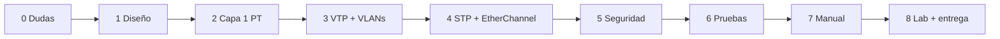

# Plan de trabajo — Proyecto 1

El enunciado promete una metodología en §6 pero la sección viene **vacía**, así que esta es la propia. Orden pensado para evitar "errores de configuración en cascada": primero lo que otros dependen, después lo que depende de ello.

**Estado al 2026-09-16.** Queda **1 día**: la elaboración cierra el **17/09/2026**. El calendario se
corrió dos veces y conviene dejarlo a la vista en vez de maquillarlo: el plan original (7 al 17, una
fase por día) no se ejecutó, el replan del 14/09 (fases 1-8 en tres días) tampoco —el 15/09 no hubo
sesión—, y el **16/09 se recuperó toda la redacción de una vez**.

El resultado es un desfase **asimétrico**: las fases de documentación van adelantadas y las que
dependen de Packet Tracer siguen en cero. **El cuello de botella ya no es escribir, es el
simulador**, y por eso el `.pkt` y las capturas se harán en otra máquina por MCP ([[HANDOFF-PACKETTRACER]]).

> [!note] Esta nota es el **calendario**, no la secuencia de clases
> Hay dos vistas del mismo trabajo y conviene no confundirlas. Acá van las **fases con fecha meta**, para saber si vamos a tiempo. La **secuencia didáctica** —qué teoría se explica junto a qué implementación— está en [[PROTOCOLO-CATEDRA]], ahora con **9 lecciones**, y el progreso real en [[AVANCE]]. La correspondencia está al final de esta nota.

## Fases (replanificadas)
| Fase | Qué | Por qué en este orden | Meta | Estado |
|---|---|---|---|---|
| 0 · Cierre de dudas | Pedir PDF completo, preguntar nombre de VLAN, **fecha de lab** | Cambian decisiones de diseño y prioridades | vencida el 08/09 | ❌ **sigue sin hacer** — la duda 3 bloquea la §25 y la entrega es mañana |
| 1 · Diseño en papel | Inventario por área, rol y modo VTP de cada switch, medios por enlace | Con [[Requerimientos por área]] cerrado, configurar es mecánico | 14/09 mañana | ✅ **hecha el 16/09** — §11.1, §14, §20 y `configs/topologia.yaml` |
| 2 · Capa 1 en Packet Tracer | Colocar dispositivos, cablear, etiquetar medios, hub Legacy, AP | Sin topología física no hay nada que configurar | 14/09 tarde | ⬜ **pendiente** — es el cuello de botella; spec lista en `configs/topologia.yaml` |
| 3 · VTP + VLANs | Core Server (`Smart_8`), demás Client/Transparent, las 5 VLANs, trunks con nativa 94, access por puerto | VTP primero: si se crean VLANs en Clients, no se puede; si el revision number sube en el lado equivocado, borra todo ([[VTP]]) | 14–15/09 | 🟡 **scripts escritos** (`configs/scripts/`), sin aplicar |
| 4 · Redundancia | EtherChannel LACP (servidores, I+D), STP PVST con Root Bridge por VLAN, puertos bloqueados | Necesita trunks ya funcionando | 15/09 | 🟡 **decidida y justificada** (§18, §19) · **riesgo abierto**: ¿acepta el chasis modular LACP sobre fibra? |
| 5 · Seguridad y Legacy | Banner, `storm-control`, `port-security`, impacto del hub | Va sobre la topología ya estable | 15/09 | ✅ **redactada** (§9, §21, §22) — incluye DTP/switch spoofing y `nonegotiate` |
| 6 · Pruebas y evidencia | Los tres `show`, pings intra/inter-VLAN, pruebas de falla, las 14 evidencias | Son las evidencias que pide la rúbrica | 16/09 mañana | 🟡 **plan completo** (§24 + `capturas/EVIDENCIAS.md`), **sin ejecutar** |
| 7 · Manual + figuras | Cerrar §26, §28, §29; terminar las figuras; borrar las guías `<!-- -->` | Se escribe con todo funcionando y capturado | 16/09 tarde | ✅ **hecha** — 29 secciones y **14 de 14 figuras**; faltan precios del §26 y borrar las guías |
| 8 · Lab físico + entrega | Switches reales Server/Client con la pareja; subir a repo y UEDI | Depende del calendario del lab | ≤ 17/09 | ⛔ **bloqueada** (lab) · la entrega del repo depende de la fase 2 |

**Lo que queda, en orden:** probar el riesgo del EtherChannel → construir el `.pkt` → aplicar los 11
scripts → 5 capturas → 14 evidencias → volcar resultados a §24 y corregir §18/§19 y las figuras
F13/F18/F19 si el simulador dice otra cosa. El runbook detallado está en [[HANDOFF-PACKETTRACER]].

Aparte, la **calificación es el 18–19/09**: el guion de defensa está en [[PREPARACION-AUXILIAR]].

## Reglas de trabajo
- Cada comando que se ejecute se **copia al README en el momento**, por dispositivo; reconstruirlos después cuesta el doble.
- Guardar el `.pkt` con versión al final de cada fase (`Proyecto1_201905884_f3.pkt` en local; solo el final se sube con el nombre oficial).
- Antes de cada `show vlan brief`, comparar contra [[Parámetros por carné 201905884]].
- Toda decisión de diseño se anota **con su porqué** en el momento en que se toma; la rúbrica califica la justificación, no solo el resultado.

## Flujo

## Correspondencia con las 9 lecciones de [[PROTOCOLO-CATEDRA]]

| Fase (calendario) | Lección de clase |
|---|---|
| 0 · Dudas | previo; no es una lección |
| 1 · Diseño en papel | 1 · Dominios y medios |
| 2 · Capa 1 en Packet Tracer | 2 · Topología |
| 3 · VTP + VLANs | 3 · VLANs y trunks · 4 · VTP |
| 4 · Redundancia | 5 · STP y EtherChannel |
| 5 · Seguridad y Legacy | 6 · Seguridad de Capa 2 |
| 6 · Pruebas y evidencia | 7 · Verificación |
| 7 · Manual + figuras | 8 · Redacción y cierre |
| 8 · Lab + entrega | 9 · Parte física |

Volver a [[Proyecto 1 - SmartCity Tech Park]].

> 📚 Fuente: propia, a partir de §4.3, §4.5 y §7 del enunciado.
