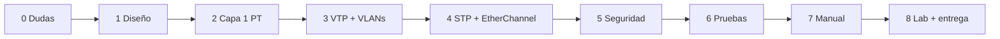

# Plan de trabajo — Proyecto 1

El enunciado promete una metodología en §6 pero la sección viene **vacía**, así que esta es la propia. Orden pensado para evitar "errores de configuración en cascada": primero lo que otros dependen, después lo que depende de ello.

**Replanificado el 2026-09-14.** Quedan **3 días**: la elaboración cierra el **17/09/2026**. El plan
original (7 al 17 de septiembre, una fase por día) **no se ejecutó**: entre el 7 y el 13 se trabajó el
material —cerebro, plantilla del Manual, figuras nombradas— pero **nada en Packet Tracer**. Lo que
sigue es el calendario real, comprimido, y se anota así para que el desfase quede a la vista y no se
repita.

> [!note] Esta nota es el **calendario**, no la secuencia de clases
> Hay dos vistas del mismo trabajo y conviene no confundirlas. Acá van las **fases con fecha meta**, para saber si vamos a tiempo. La **secuencia didáctica** —qué teoría se explica junto a qué implementación— está en [[PROTOCOLO-CATEDRA]], ahora con **9 lecciones**, y el progreso real en [[AVANCE]]. La correspondencia está al final de esta nota.

## Fases (replanificadas)
| Fase | Qué | Por qué en este orden | Meta | Estado |
|---|---|---|---|---|
| 0 · Cierre de dudas | Pedir PDF completo, preguntar nombre de VLAN, **fecha de lab** | Cambian decisiones de diseño y prioridades | vencida el 08/09 | ❌ sin hacer — la duda 3 es urgente |
| 1 · Diseño en papel | Inventario por área, rol y modo VTP de cada switch, medios por enlace | Con [[Requerimientos por área]] cerrado, configurar es mecánico | 14/09 mañana | ⬜ lección 1 |
| 2 · Capa 1 en Packet Tracer | Colocar dispositivos, cablear, etiquetar medios, hub Legacy, AP | Sin topología física no hay nada que configurar | 14/09 tarde | ⬜ lección 2 |
| 3 · VTP + VLANs | Core Server (`Smart_8`), demás Client/Transparent, las 5 VLANs, trunks con nativa 94, access por puerto | VTP primero: si se crean VLANs en Clients, no se puede; si el revision number sube en el lado equivocado, borra todo ([[VTP]]) | 14–15/09 | ⬜ lecciones 3-4 |
| 4 · Redundancia | EtherChannel LACP (servidores, I+D), STP PVST con Root Bridge por VLAN, puertos bloqueados | Necesita trunks ya funcionando | 15/09 | ⬜ lección 5 |
| 5 · Seguridad y Legacy | Banner, `storm-control`, `port-security`, impacto del hub | Va sobre la topología ya estable | 15/09 | ⬜ lección 6 |
| 6 · Pruebas y evidencia | Los tres `show`, pings intra/inter-VLAN, pruebas de falla, las 14 evidencias | Son las evidencias que pide la rúbrica | 16/09 mañana | ⬜ lección 7 |
| 7 · Manual + figuras | Cerrar §26, §28, §29; terminar las figuras de Excalidraw; borrar las guías `<!-- -->` | Se escribe con todo funcionando y capturado | 16/09 tarde | ⬜ lección 8 |
| 8 · Lab físico + entrega | Switches reales Server/Client con la pareja; subir a repo y UEDI | Depende del calendario del lab | ≤ 17/09 | ⬜ lección 9 |

**Carga estimada:** ≈16 h efectivas — 6.5 h el 14/09, 5 h el 15/09, 4.5 h el 16/09. Las figuras
(≈2.5 h en total) están repartidas **dentro** de cada lección, no acumuladas al final.

## Reglas de trabajo
- Cada comando que se ejecute se **copia al README en el momento**, por dispositivo; reconstruirlos después cuesta el doble.
- Guardar el `.pkt` con versión al final de cada fase (`Proyecto1_201905884_f3.pkt` en local; solo el final se sube con el nombre oficial).
- Antes de cada `show vlan brief`, comparar contra [[Parámetros por carné 201905884]].
- Toda decisión de diseño se anota **con su porqué** en el momento en que se toma; la rúbrica califica la justificación, no solo el resultado.

## Flujo

## Correspondencia con las 9 lecciones de [[PROTOCOLO-CATEDRA]]

| Fase (calendario) | Lección de clase |
|---|---|
| 0 · Dudas | previo; no es una lección |
| 1 · Diseño en papel | 1 · Dominios y medios |
| 2 · Capa 1 en Packet Tracer | 2 · Topología |
| 3 · VTP + VLANs | 3 · VLANs y trunks · 4 · VTP |
| 4 · Redundancia | 5 · STP y EtherChannel |
| 5 · Seguridad y Legacy | 6 · Seguridad de Capa 2 |
| 6 · Pruebas y evidencia | 7 · Verificación |
| 7 · Manual + figuras | 8 · Redacción y cierre |
| 8 · Lab + entrega | 9 · Parte física |

Volver a [[Proyecto 1 - SmartCity Tech Park]].

> 📚 Fuente: propia, a partir de §4.3, §4.5 y §7 del enunciado.
